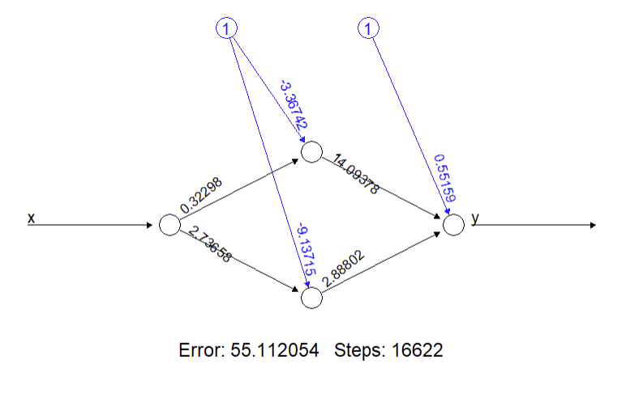
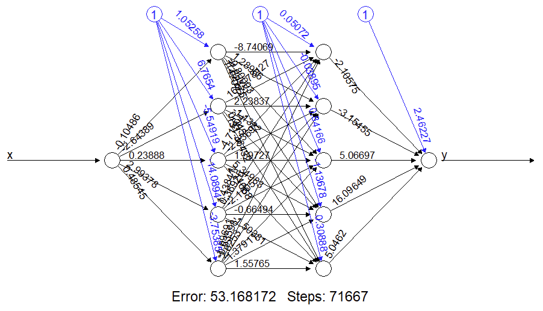

<!-- README.md is generated from README.Rmd. Please edit that file -->

```{r, include = FALSE}
knitr::opts_chunk$set(
  cache = TRUE,
  collapse = TRUE,
  comment = "#>",
  echo = FALSE
)
```

```{r include=FALSE}
library(cowplot) # Streamlined Plot Theme and Plot Annotations for 'ggplot2'
library(dplyr) # A Grammar of Data Manipulation
library(ggplot2) # Create Elegant Data Visualisations Using the Grammar of Graphics
library(magick) # Advanced Graphics and Image-Processing in R
library(neuralnet) # Training of Neural Networks
```

# An AI is haunting campus^[Karl Marx wrote about a "spectre...haunting Europe--the spectre of communism"; GenAI looks awfully like the shade of the spectre of unregulated surveillance capitalism.]: Some considerations about the use of AI for teaching and learning in post-secondary education

<!-- badges: start -->

<!-- badges: end -->

By: Antonio Páez (paezha@mcmaster.ca)

Disclaimer: _All opinions expressed here are mine and any resemblance to those of my employer(s) is purely coincidental_. _No generative AI tool was used to research or write this essay_.

---  


## Contents

- [Background](#background)  
- [The university's mission](#the-mission)  
- [What do AIs do?](#what-do-ais-do)  
- [A note on the terms of the conversation](#terms-of-debate)  
- [But really, what do AIs do?](#really-what-do-they-do)  
- [AI in teaching and learning](#ai-in-teaching-and-learning)  
- [What can GenAI tools do for students?](#what-can-ais-do-for-students)  
- [What do GenAI tools do to students?](#what-can-ais-do-to-students)  
- [What do GenAIs do for the mega-corporations pushing these tools?](#what-do-ais-to-corporations)  
- [What do GenAIs to to everyone else?](#what-do-ais-do-to-everyone-else)  


---  


## Background {#background}

> Mission Statement: Our organization seeks to level up on all matters related.  
> -- An Organization Run by its Marketing Department

On November 30, 2022, OpenAI released what became its flagship product, [ChatGPT](https://en.wikipedia.org/wiki/ChatGPT), a chatbot based on [Large Language Models](https://en.wikipedia.org/wiki/Large_language_model) (LLMs) designed and trained to mimic natural language. The launch of the chatbot was an impressive feat of marketing [@cowen_chatgpt_2023], and it took less than two weeks for the hype to reach stratospheric levels: by early December, ChatGPT was being panned as "the best artificial intelligence chatbot ever released to the general public" [@roose_brilliance_2023], and a tool able to generate "impressively detailed" and "human-like" text, leading some to wonder whether it could "replace humans" [@lock_what_2022]. 

Universities, much like every other organization dealing with information, had to respond in a compressed span of time to the rapid release of generative AI (GenAI) tools like ChatGPT, most of them created and unleashed in the wild by a handful of large American corporations including [Meta](https://en.wikipedia.org/wiki/Meta_Platforms) (or were we to deadname it, facebook), [OpenAI](https://en.wikipedia.org/wiki/OpenAI), [Google](https://en.wikipedia.org/wiki/Alphabet_Inc.), and [Microsoft](https://en.wikipedia.org/wiki/Microsoft). 

GenAI was announced as nothing short of revolutionary. McMaster, for example, [stated](https://provost.mcmaster.ca/office-of-the-provost-2/generative-artificial-intelligence-2/generative-ai-for-staff/provisional-guidelines-on-the-use-of-generative-ai-in-operational-excellence/) that:

> [u]nderstanding how generative AI works, and how it can support work within organizations represents an ongoing area of exploration and innovation. The opportunities of generative AI are exciting: creating workplace efficiencies to allow for different kinds of work, adding capabilities for individuals and teams, and offering personalized uses.

AI was quickly painted as an _innovative_ and _exciting_ technology, that moreover can lead to _efficiencies_^["Efficiencies", to be clear, is the day's euphemism for cutting costs [@oconnell_let_2012, p. 64]. Cost-cutting is usually implemented by finding "redundancies" rather than finding other things for people to do.]. It seemed inevitable that universities _had to do something_ with it, at the risk of being let behind.

The fear of missing out, combined with a modicum of concern for the ethical implications of GenAIs^[Ethical concerns for the most part have had to do with policing academic dishonesty among students], has led to institutional responses that have been less than coherent. A case in point is Emory University, where the university gave a $10,000 prize to a group of students who proposed developing an AI tool for an Entrepreneurship Summit, only for the students to be subsequently suspended by the school's Honor Council for the potential of their tool for cheating^[There was no evidence that cheating had happened.] [@koebler__university_2024].

For its part, McMaster was a leader in responding to the rapid, and disruptive, release of these _revolutionary_ tools, and its provisional [guidelines](https://provost.mcmaster.ca/office-of-the-provost-2/generative-artificial-intelligence-2/generative-ai-for-staff/provisional-guidelines-on-the-use-of-generative-ai-in-operational-excellence/) (released under a Creative Commons Licence) have since inspired those of other post-secondary institutions in Canada, including the University of Guelph [-@office_of_teaching_and_learning_provisional_2023] and Trent University [-@trent_university_generative_2024].

The aim of the provisional guidelines was to inform the university community about the use of AI in "operational excellence". As we approach the Fall Term of 2024, with almost two years of cohabitation experience with AI for the masses at our backs, the time has come to update these guidelines. Pertinently, the institution, via its Office of the Provost, [launched a committee](#ai-committee-announced) to explore the use of AI across campus. This committee is composed of three sub-committees tasked with examining the use of AI in 1) teaching and learning, 2) research, and 3) operational excellence in "our work".

The sub-committees, in turn, convened panels to [provide recommendations]({#ai-panel-tasks}) on updates to the [Provisional Guidelines](https://provost.mcmaster.ca/office-of-the-provost-2/generative-artificial-intelligence-2/generative-ai-for-staff/provisional-guidelines-on-the-use-of-generative-ai-in-operational-excellence/). Participants in the panel were told that they would help to shape the guidelines for teaching and learning at McMaster, a consequential task "for how educators take up generative AI in their course and assessment design and how students approach the use of this technology"^[I have been unable to find the terms of reference of the panels. Who will decide which recommendations of the panel are adopted and which are ignored?].

According to the announcement of this AI Committee at McMaster:

> AI is a powerful tool and I believe that universities have an important role to play in its adoption.  
> -- Susan Tighe, Provost

Notice that this statement (like the definition of the work before the panels above), takes for granted that 1) AIs are powerful tools, and 2) universities can be leading players in their adoption. This attitude is almost fatalistic^[In the sense of "fated to"] in its enthusiasm, and perfectly consistent with the hype observed around AI this time^[The pattern of cyclical hypes around AI even has a name: [AI winters](https://en.wikipedia.org/wiki/AI_winter); the current one with chatbots in the pole position is just the most recent of several hype cycles [see @siegel_ai_2023]] [@angwin_press_2024]. 

To put things in perspective, hammers are powerful tools. Word processors are powerful tools. Lasers are powerful tools. And yet we do not have high-level university committees for each and every tool that is used at the institution. What is it about AIs that, unlike many other tools, requires a pan-university consultation on an "_ethical approach to shaping policies and developing new ways of using AI to ensure a responsible and beneficial integration where it makes sense_"?

(The last sentence in the statement above carries quite a bit of weight here: where does adoption of AI make sense? Presumably this is what the Committee on AI will try to answer.)

To understand why many organizations, including McMaster University, have decided to spend considerable resources studying the adoption and responsible use of AIs, it is essential to have a working understanding of what the technology claims to do that sets it apart from other tools. 

In doing this, it is essential that we remain alert to the fact that technologies are _never_ politically neutral, and therefore it is important to ask two questions when considering their adoption:

- What does a specific technology do for whom?

- And what does it do to whom?

We also need to understand the goals of the organization that considers using the technology. When does it make sense for a university like McMaster to "integrate" AIs as part of the core mission of the organization, accounting for what the technology does for some people and what it does to others?

Let us begin with the mission of McMaster as an institution of higher education.

## The university's mission {#the-mission}

McMaster's [mission](https://president.mcmaster.ca/mission-vision/) is "the discovery, communication and preservation of knowledge," accomplished with a commitment to "creativity, innovation and excellence". These aspirations must respond to some underlying values, and indeed, the university explicitly values "integrity, quality, inclusiveness and teamwork". Ultimately, the university aims to "inspire critical thinking, personal growth, and a passion for lifelong learning" and to serve "the social, cultural, and economic needs of our community and our society."

A mission statement is like an onion, and one needs to peel multiple layers to try to understand the core principles enunciated there. Why are things like "integrity" and "critical thought" valued? Or, what happens when "integrity", "quality", and/or "excellence" clash with "the economic needs of our society" (say, a mandate by democratically elected governments to spend as little as possible in post-secondary education^[Between 2000-2020, Ontario had the lowest spending on post-secondary education of all provinces in Canada, relative to its share of spending [@caut_provincial]. Public funding of universities in Ontario as percent of revenue fell from 45.6% in 2001/2 to 35.5% in 2019/20 [@statistics_canada_college_2022]. As noted by @usher_state_2023, Ontario is "a province where underfunding [higher-education] institutions is a pan-partisan affair". Is it any wonder that universities in the province are pushed to find "efficiencies"?])?

Clearly, there is some tension implicit in the mission of a university. But being generous, we can take the mission statement at face value and assume that the highest priorities are those related to knowledge obtained, preserved, and communicated with integrity and quality.

## What do AIs do?{#what-do-ais-do}

At this point, we might as well ask "what do AIs _not_ do"? 

A key reason why many organizations have decided to spend substantial resources considering the adoption of AIs is that, unlike most other tools, they are seen as _everything tools_. While hammers are understood to have a limited range of uses having to do with concentrating force, and word processors are mostly used to record words, the release of GenAIs to the masses was accompanied by innumerable lofty promises^[Quite a few of them made by entities and individuals that had a stake in the adoption of the technology, ranging from "AI is inevitable, and I will sell it to you" to "AI is inevitable, and for a consulting fee I will tell you how to level up with it".].

The public was promised that GenAI would "accelerate sustainability" [@nakagawa_accelerating_2023]; that LLMs would transform sectors as diverse as health care, finance, human resources, insurance, "and beyond" by "automating customer self-service, accelerating response times on an increasing number of tasks as well as providing greater accuracy, enhanced routing and intelligent context gathering" [@ibm_what_2023]; according to Allerin^[Curiously, Allerin is not identified as an artificial intelligence company in @joshi_5_2022 but only in the much later article by @garsten_what_2024.], AI-powered self-driving cars would reduce accidents, car ownership, pollution and noise, and would automate logistics and make parking tickets obsolete [@joshi_5_2022; @garsten_what_2024]. But there is no reason to stop at self-driving vehicles: McMaster University's Canada Excellence Research Chair Laureate Ali Emadi "hopes to help revolutionize and influence everything from personal travel to city planning" by putting AI directly into our transportation systems [@dorey_driving_2023]. In mental health care, chatbots could complement human therapists "via comprehensive data access and [analysis of] behavioral patterns" to "mimic practitioner questions and subsequently make recommendations based on a user’s inputs" [@silva_4_2023].

AI would even write code, perhaps helping itself to some self-programming along the way: AIs that write themselves, or AI self-help?

Figure @\ref(fig:ai-writing-code)

```{r ai-writing-code, out.width="50%", fig.cap="\\label{fig:ai-bug-fix}Figure X. An example of Atlassian AI writing code"}

```

The list of promises about what AI will do has grown to encompass pretty much everything, from saving the planet from ourselves, all the way down to micromanaging intimate facets of individual lives, for example by revolutionizing dating through the use of chatbots to help "people connect and find potential partners" (who presumably also use chatbots to do the same) [@khalatian_matchmaking_2023].

Higher-education has not spared the onslaught of promises.

@power_3_2024,^[Rhett Power is a motivational speaker and executive coach] for example, presents three innovative use cases for AI in higher education. First, AI could take over manual tasks and improve the budget by releasing administrative staff^[Probably to work on something else, and not for the university, hence leading to "efficiencies"]. AI could evaluate applications for admissions, including assessing traits like the "grit" and "empathy" of applicants. AI could also personalize the experience of consumers (also called students) by predicting their final grade with 60-70% accuracy, and by providing corrective and instructive feedback.
<!--release them in a very literal sense, as one advantage is to do _more_ with limited resources (which in the current fiscal environment means laying people off). The cases discussed by Mr. Power are questionable: there are already non-AI systems that deploy paperwork; the kind of information needed to identify students at risk of dropping out is probably quite invasive, and therefore impractical or unethical to collect; I very much doubt that it is legal to use AI in hiring and admissions. --> Mr. Power's message to the higher-education sector? It is time for institutions to "level up": jump on the bandwagon, fellas, don't let it let you behind!

In another instance, @hie_how_2023^[Anthony Hié is Chief Innovation and Digital officer at [Excelia](https://www.excelia-group.com/about-excelia/our-schools/excelia-business-school). Claire Thouary is the founder of [QACE UP](http://qace-up.fr), a consulting firm that supports higher-education institutions in their quest for "quality excellence", whatever that means.] argue that AIs will likely be the primary way to access information in the future. For this reason, institutions must equip students with the skills needed to use AI competently, in particular to perfect the art of _prompt engineering_, that is, the ability to craft effective queries that prompt a GenAI to provide the most useful outputs. Universities will use AIs to improve learning and challenge the critical thinking of students. Faculty will also benefit from AI: it will be used to evaluate their students^[A task of dubious legality, and clearly a way to cheat students of a learning experience], and will handle repetitive tasks like writing course syllabi^[In my 20+ years of experience as an educator, writing syllabi has been essential to understand my own courses; automating the task is another way of cheapening the quality of the learning experience for students].

@hie_how_2023 warn that "AI is here to stay"^[Writing in 2022, Mr. Hié predicted that the metaverse would be a [revolution in higher education](https://www.linkedin.com/pulse/metaverse-dedicated-pedagogy-revolution-higher-education-anthony-hi%C3%A9). On February, 2023, Microsoft [disbanded](https://www.theinformation.com/articles/microsoft-kills-its-industrial-metaverse-team-after-4-months) its Industrial Metaverse Core Team scantly four months after launching it. Meta, the main cheerleader of the eponymous metaverse, [slashed its own metaverse team](https://www.reuters.com/technology/meta-lay-off-employees-metaverse-silicon-unit-wednesday-2023-10-03/) in October, 2023.], that "[faculty] might not be able to stop the AI trend from growing", and so they might as well get on with the program and try to shape it as best they can.

@contact_north_five_2024^[teachonline.ca by [Contact North/Contact Nord](https://teachonline.ca), is "a resource for post-secondary faculty and instructors...to find the latest information on new technology and new developments in online learning, as well as practical tools and resources to help them integrate technology in their teaching in a way that improves the learning experience for their students". Contact North/Contact Nord is a not-for-profit corporation funded by the Government of Ontario, the province that has underfunded its post-secondary education sector for decades [@usher_state_2023].] **MORE HYPE**

## A note on the terms of the conversation {#terms-of-debate}

A benefit of portraying AI as an _everything tool_ (for the proponents of the technology, at least), is that conversations around it quickly turn into a [Gish Gallop](https://en.wikipedia.org/wiki/Gish_gallop), a rhetorical device where a party makes an overwhelming number of arguments with little regard to their accuracy or strength. In the case of AI, critics are forced to respond to every single propounded use case with in-depth analysis, which usually is much more time consuming than making all sorts of claims to begin with^[This communication strategy is what Trump's erstwhile and possibly future advisor Steve Bannon termed [flooding the zone with shit](https://www.vox.com/policy-and-politics/2020/1/16/20991816/impeachment-trial-trump-bannon-misinformation). Perhaps not coincidentally, AI is now a major vector of disinformation, flooding the zone at a rate that humans cannot possibly match [@maiberg__google_2024].]. 

A second discoursive device deployed by proponents of AI is an informal fallacy known as [The False Dilemma](https://en.wikipedia.org/wiki/False_dilemma): adopt AI or fail to level up.

In what follows, I do not plan to confront every single possible use case of AI as doing so plays into the intent of the Gish Gallop^[I have already spent close to 50 hours working on this essay, and it is still nowhere near an exhaustive apology or indictment of AI.], which is to defeat criticism by flooding the zone. As well, I reject the dilemma posed by the purveyors of hype, and I remain convinced that there are multiple other ways for teaching and learning to be excellent that do not require AI, and do not require the moral, environmental, social compromises demanded by AI[^Most discussions of AI as an everything tool acknowledge ].

## But really, what do AIs do? {#really-what-do-they-do}

GenAIs are _deep learning models_ [@ibm_what_2021], so called because they are neural networks with _depth_, meaning many, many hidden layers. As an example, Large Language Models (such as those behind OpenAI's ChatGPT, Microsoft's Copilot, Google's Gemini, and facebook's LLaMA) are models built with multiple layers of neural networks trained on _very_ large amounts of textual data [@ibm_what_2023].

But, what are [neural](https://en.wikipedia.org/wiki/Large_language_model#Further_reading) [networks](https://medium.com/@asifurrahmanaust/lesson-3-neural-network-is-nothing-but-a-linear-regression-e05a328a0f23)?

Behind all the jargon, the neural networks that underpin GenAI are models designed to produce "statistically probable outputs" when prompted [@ibm_what_2021]. In more conventional terms, neural networks are regression models--much more sophisticated and powerful than linear regression to be sure, but regression models nonetheless [@ripley_neural_1994]. Here, it is important to note that the term regression refers to [regression to the mean](https://en.wikipedia.org/wiki/Regression_toward_the_mean)--regressing a prompt to a "statistically probable" outcome.

A regression model takes data as inputs, typically a "dependent" variable $y$ (observations of an outcome of interest) and "independent" variables $x$ (observations of things thought to correlate with the dependent variable). With these inputs, the model finds a conditional mean for the output $\hat{y}$ (i.e., a mean value conditional on the values of the dependent variables). The process of finding that conditional mean is to satisfy some criterion (e.g., that the conditional mean minimizes the error of the model--the distance between $y$ and $\hat{y}$).

Below is an example of the simplest regression model with only one independent variable (i.e., a bivariate model). The plot shows the pairs of $y$ and $x$ values, and the line is the model, the conditional mean $\hat{y}$. This model needs only two parameters: an intercept (the value of &\hat{y}$ when $x = 0$), and the slope of the line, in other words, the rate of change of $\hat{y}$ with respect to $x$. Each additional independent variable uses one additional parameter to describe the slope of the model with respect to that variable.
```{r simulate-simple-example}
set.seed(13253)

b0 <- 1.0
b1 <- 1.5

df <- data.frame(x = b0 + b1 * runif(100, 
                                0, 
                                10),
                 e = rnorm(100),
                 type = "training data") |>
  mutate(y = x + e)

x <- df |> pull(x)
y <- df |> pull(y)

mod <- lm(y ~ x, 
          data = df)
```

```{r plot-simulated-data, message=FALSE, out.width="50%", fig.cap="Figure 1. Simple Example of a Regression Model"}
ggplot(df,
       aes(x = x,
           y = y)) +
  geom_point() +
  geom_smooth(method = "lm") + 
  theme_minimal()
```

```{r data-vs-predictions-comparison, out.width="50%", fig.cap="Figure 2. Training data and model output compared"}

df_pred <- data.frame(x = x)

y_hat <- predict(mod, df_pred)

df_pred_lr <- df_pred |> 
  mutate(y = y_hat,
         type = "regression output")

df_pred_all <- rbind(df |>
                   select(x, y, type),
                 df_pred_lr |>
                   select(x, y, type))

ggplot() + 
  geom_point(data = df_pred_all,
  aes(x = x,
      y = y,
      color = type,
      shape = type,
      size = type)) +
  scale_color_manual(values = c("training data" = "black",
                                "regression output" = "blue",
                                "nn1 output" = "chocolate1",
                                "nn2 output" = "brown")) +
  scale_shape_manual(values = c("training data" = 16,
                                "regression output" = 17,
                                "nn1 output" = 18,
                                "nn2 output" = 19)) +
  scale_size_manual(values = c("training data" = 1,
                                "regression output" = 2,
                                "nn1 output" = 2,
                                "nn2 output" = 2)) +
  theme_minimal() +
  theme(legend.position = "bottom")
```

Neural networks do something similar but using a net-like architecture that is more flexible at identifying the characteristics of the data. For instance, the following figure shows a relatively simple neural network trained using using the same data. This network is not "deep", as it has only one so called "hidden layer", comprised of two neurons between the input and the output layers. In comparison to the linear regression and its two parameters, this neural network uses seven parameters. Another key difference between a linear regression model and a neural network is that the latter requires an initial set of parameters, which are often drawn at random, thus making the model contigent on the starting conditions.
```{r}
# Given the dataframe grid.1, let us now train a neural network. We need to first define a formula that specifies the dependent variable and the independent variables.
f <- as.formula("y ~ x")
```

```{r train-shallow-neural-network}
# Train a neural network using only two neurons in one hidden layer. The argument `linear.output` is set to TRUE, so that the activation function is not applied to the output node. The default activation function is the logistic function.
set.seed(33225433)

nn1 <- neuralnet(f, 
                data = df, 
                hidden = c(2), 
                linear.output = T) 
```

```{r save-shallow-neural-network}
# For some reason, the figure cannot be saved directly, so I saved it manually using screen capture
plot(nn1)
```

```{r plot-shallow-neural-network, out.width="50%", fig.cap="Figure 3. Simple Example of a Shallow Neural Network"}

```

```{r shallow-neural-network-predictions}
y_hat <- predict(nn1,
                 df_pred)

df_pred_nn1 <- df_pred |> 
  mutate(y = y_hat,
         type = "nn1 output")

df_pred_all <- rbind(df_pred_all |>
                   select(x, y, type),
                 df_pred_nn1 |>
                   select(x, y, type))
```

The plot below illustrates the predictions of this neural network, where we can see that the model is not limited to a linear response; neural networks are more flexible than linear regression, and they achieve this by being less parsimonious (they use more parameters).  

```{r data-vs-predictions-comparison-2, out.width="50%", fig.cap="Figure 4. Training data and model outputs compared: linear regression and shallow neural network"}
ggplot() + 
  geom_point(data = df_pred_all,
  aes(x = x,
      y = y,
      color = type,
      shape = type,
      size = type)) +
  scale_color_manual(values = c("training data" = "black",
                                "regression output" = "blue",
                                "nn1 output" = "chocolate1",
                                "nn2 output" = "brown")) +
  scale_shape_manual(values = c("training data" = 16,
                                "regression output" = 17,
                                "nn1 output" = 18,
                                "nn2 output" = 19)) +
  scale_size_manual(values = c("training data" = 1,
                                "regression output" = 2,
                                "nn1 output" = 2,
                                "nn2 output" = 2)) +
  theme_minimal() +
  theme(legend.position = "bottom")
```

More complex neural network can be designed. The following plot is of a deeper network than the previous one, with two hidden layers, each consisting of five neurons. This model uses forty-six parameters. 
```{r train-deeper-neural-network}
# Train a neural network using only two neurons in one hidden layer. The argument `linear.output` is set to TRUE, so that the activation function is not applied to the output node. The default activation function is the logistic function.
set.seed(242)
nn2 <- neuralnet(f, 
                data = df, 
                hidden = c(5, 5), 
                linear.output = T)
```

```{r save-plot-deeper-neural-network}
# For some reason, the figure cannot be saved directly, so I saved it manually using screen capture
plot(nn2)
```

```{r plot-deeper-neural-network, out.width="50%", fig.cap="Figure 5. Example of a Deeper Neural Network"}

```

```{r}
y_hat <- predict(nn2,
                 df_pred)

df_pred_nn2 <- df_pred |> 
  mutate(y = y_hat,
         type = "nn2 output")

df_pred_all <- rbind(df_pred_all |>
                   select(x, y, type),
                 df_pred_nn2 |>
                   select(x, y, type))


```

The increased complexity leads to greater flexibility, and we can see that the model makes predictions that resemble more closely the actual data.  

```{r data-vs-predictions-comparison-3, out.width="50%", fig.cap="Figure 6. Training data and model outputs compared: shallow neural network and deeper neural network"}
ggplot() + 
  geom_point(data = df_pred_all |>
               filter(type != "regression output"),
  aes(x = x,
      y = y,
      color = type,
      shape = type,
      size = type)) +
  scale_color_manual(values = c("training data" = "black",
                                "regression output" = "blue",
                                "nn1 output" = "chocolate1",
                                "nn2 output" = "brown")) +
  scale_shape_manual(values = c("training data" = 16,
                                "regression output" = 17,
                                "nn1 output" = 18,
                                "nn2 output" = 19)) +
  scale_size_manual(values = c("training data" = 1,
                                "regression output" = 2,
                                "nn1 output" = 2,
                                "nn2 output" = 2)) +
  theme_minimal() +
  theme(legend.position = "bottom")
```

```{r}
# How do these models perform?
mad_lr <- data.frame(df |>
             mutate(y_hat = df_pred_lr$y)) |>
  summarize(mse = sum(abs(y - y_hat)/n()))

mad_nn1 <- data.frame(df |>
             mutate(y_hat = df_pred_nn1$y)) |>
  summarize(mad = sum(abs(y - y_hat)/n()))

mad_nn2 <- data.frame(df |>
             mutate(y_hat = df_pred_nn2$y)) |>
  summarize(mad = sum(abs(y - y_hat)/n()))

delta_mad_nn1 <- (mad_nn1 - mad_lr)/mad_lr * 100

delta_mad_nn2 <- (mad_nn2 - mad_lr)/mad_lr * 100
```

Indeed, the first neural network is "better" than the linear regression in that it reduces the typical error by `r paste0(prettyNum(delta_mad_nn1, digits = 2), "%")`, whereas the deeper network reduces the typical error by `r paste0(prettyNum(delta_mad_nn2, digits = 2), "%")`, also with respect to the linear regression^[The "typical error" here is the mean absolute deviation of the predictions.].

There is a limit as to how flexible a model can be, and this is true of linear regression and of neural networks. Each additional parameter makes the model more flexible, but as a rule we cannot use more parameters than the number of data points that exist in the dataset used to train the model. Roughly, every additional parameter needs a data input to train on, and when there are as many parameters as data inputs the model is overfit and will predict each value of the independent variable in the training dataset perfectly. The model will fail to train if there are more parameters than data points.

In a neural network trained to work with natural language, the "predictors" are words that come before and after a certain word. Several approaches exist to _embed_ a bag of words, using large text corpora the co-occurrence of words is used to convert words to numerical vectors. These vectors are decontextualized, that is, they only reflect the position of a given word with respect to other words in the training corpora; however, the numeric values are static even if the surrounding words in a specific prompt change. A recent breakthrough in this field is the development of _transformers_, a network architecture architecture that updates the numeric values of a word depending on the words that come before and after.

Here are some key ideas to keep in mind:

- AIs are neural networks, which is to say, regression models.
- A regression model generates outputs that are regressions to the mean (i.e., statistically probable outputs).
- AIs are _very_ flexible non-linear regression models.
- Their flexibility comes from using "deep" architectures, which means many layers with many, many parameters^[According to reports [see @griffith_gpt_4_2023], GPT-1 had 117 million parameters, GPT-2 1.5 billion, and GPT-3 175 billion parameters. OpenAI no longer reports the number of parameters, but in the latest version this is estimated to be trillions.].
- AIs are trained using an initial set of random values as parameters. The same training dataset can result in different models due to the randomness in the initial conditions.
- The flexibility of AIs means that outputs will vary seemingly at random with relatively small changes in the prompt. 
- Also, importantly, since regression models aim for the mean (i.e., a statistically probable output), they tend to be bad at _extrapolation_ (or thinking outside the box, if AIs could think). The further away an input (i.e., prompt) is from the space defined by the training dataset, the worse the output will tend to be^[Which is possibly why so-called hallucinations became less common as more and more data were used to train LLMs. The increasingly large datasets  essentially expanded the space where the model could interpolate.].

<!-- 

-->

**NOTE**: Labeling data is an essential, yet extremely expensive aspect of training GenAIs.

## AI in teaching and learning {#ai-in-teaching-and-learning}

Next, I lay out some considerations about the use of AI for teaching and learning, in an attempt to find out where it makes sense to use this technology. To begin, we must note the sheer number of examples of the use of AI by students. A report by @tyton_partners_generative_2023 that was sponsored by Turnitin found that 50% out of 1,600 post-secondary students who participated in the study, were users of GenAI (but only 22% of 1,000 faculty in the study). Use of AI by students is one of the reasons cited by some for universities to embrace AI [e.g., @power_3_2024]. McMaster's own internal research indicates that at least 61% of over 1,300 students polled, used AI during the Fall Term in 2023, 75% of them for school work [@yachouh_student_2024].

But embracing AI just because the students use it is like putting the cart before the horse. After all, smoking is banned on campus, and I do not recall the university asking the students if they smoked^["A tobacco and smoke-free campus is the next important step towards fulfilling our responsibilities as educators, healthcare professionals and to the communities we serve" said then-president Patrick Deane [@carter_mcmaster_2017]]. 

What does McMaster hope to achieve with AI? From the Overview on Generative AI document:

> Some of [the uses of AI] in our context could include qualitative and quantitative data analysis, writing text (e.g. reference letters, grant applications, job descriptions, report summaries), translation, captioning, multiple formats for learning and engagement, and personalized support.

## What do GenAI tools do for students?{#what-can-ais-do-for-students}

> Anecdotally students at McMaster report wanting to use generative AI not to complete assignments for them, but to help enhance learning in their courses by having concepts explained differently, by working on practice questions or by getting immediate feedback on drafted work.

<!-- From Review Report in private folder: May 6 Review Report_AI Expert Panel on Teaching and Learning.docx -->

- Students want concepts explained to them differently.

There are many traditional ways for students to get different perspectives on concepts. They can form study groups, attend office hours to engage with their instructors, ask their Teaching Assistants, ask relatives and friends, and so on. But even for a student who for a whatever reason cannot or will not do any of these things, the fact remains that relatively common concepts have already been explained by humans in dozens if not hundreds of different ways, often in writing that is available through an excellent university library. A search of McMaster's library catalog, looking only for resources available online (for convenience), reveals that there are hundreds, thousands, and sometimes tens of thousands of resources available to explore the same concept from multiple perspectives.

```{r mac-library-econometrics, out.width="50%", fig.cap="Figure 7. Result of a search for online 'econometrics' resources in McMaster's Library catalog"}
knitr::include_graphics("images/mac-library-econometrics.png")
```

```{r mac-library-cell-biology, out.width="50%", fig.cap="Figure 8. Result of a search for online 'cell biology' resources in McMaster's Library catalog"}
knitr::include_graphics("images/mac-library-cell-biology.png")
```

```{r mac-library-euphemism, out.width="50%", fig.cap="Figure 9. Result of a search for online 'euphemism in history' resources in McMaster's Library catalogue"}

```

Is an AI tool essential to find alternative explanations for common concepts? Only as a shortcut for a good library search (or to make up for the lack of an academic network, not taking advantage of office hours, etc.), and at the expense of research skills. As for more obscure concepts, given their paucity in training datasets, those would tend to be uncommon, and therefore improbable outputs (i.e. for reasons of lying far from the mean). This strongly suggests that any outputs about highly specialized queries should be treated with caution^[The Overview on Generative AI notes that "if you ask [a chatbot] about yourself or a more obscure topic, [it] will almost certainly make up nonsense." This is true even when asking about a person with an extensive online presence (the internet being the likely source of the training datasets); as recently as 2023, a famous law professor discovered when ChatGPT produced output stating that he had been accused of sexual harassment (in the real world he had not been) [@verma_chatgpt_2023]].

In summary: there is no dearth of resources to learn about relatively common concepts, and AIs should not be used to try to learn more specialized concepts.

- Practice questions 

Most textbooks already include plenty of practice questions, especially for relatively common topics. For more specialized topics, asking interesting questions should be a skill in and of itself. An emphasis on practice questions, however, signals an underlying weakness of the process, namely, a focus on learning for the examination, as opposed to learning for its own sake. A growing body of evidence points at the effectiveness of alternative assessment schemes, such as continuous assessment through course work, and even seen examinations instead of the traditional unseen examinations [@turner_see_2018], the latter form of assessment continues to dominate the evaluation landscape [@buckley_are_2023]. Ungrading, in particular, is increasingly recognized as its potential to internalize the motivation to learn, and for fostering adaptability, creative thinking, and self-management [@gorichanaz_it_2024].

Two relevant issues appear to be relevant. 

First, posing interesting questions for students to work on is an essential part of an instructor's job, but this part of the job becomes compromised when instructors operate in massive classrooms situations^[Average class sizes at McMaster (with a full time under-graduate student population of 30,400) are 127.8 in first/second year, and 52.3 in third/fourth year; this places McMaster dead last among all Canadian institutions in class sizes in first/second year, and second to last after UBC in third/fourth year [@macleans_canadas_2022]]. In this case, AI is a substitute, and demonstrably not a good one, for a qualified instructor who can intellectually challenge their students.

The second issue is traditional evaluation. As noted, studying for the examination often detracts from genuine learning. Why are other assessment approaches seldom considered? Research by @vahed_continuous_2023 suggests that instructors need to develop assessment literacy, that is, an understanding of "the fundamental assessment concepts and procedures, and to engage in the ongoing process of adjusting instructional strategies to enrich students learning experiences". There is a need for innovative approaches in assessment, but it is unlikely that AI is the tool to develop the assessment literacy that they require.

- Immediate feedback on drafted work

This is an unrealistic expectation. More realistically, students could have the opportunity to discuss their drafted work with instructors before final submission. A conscientious instructor will invest time reading and understanding the draft work, to be able to provide quality feedback. But there is a more insidious aspect about getting feedback from an AI...who, actually, is providing the feedback? What data were used to train the machine that provides the feedback? Who fine-tuned the machine who provides the feedback? Whose perspectives and views are used to provide the feedback, and can they ever be accountable for the feedback provided?^[For instance, [@verma_chatgpt_2023]] (More on this below).

- Personalized 

@mollick_instructors_2024^[Drs. Eric Mollick and Lilach Mollick are members of Wharton Interactive, in the business school of the University of Pennsylvania. Wharton Interactive offers to "democratize education" so to level up your learning! [@kelner_level_2022]] envision a future in which educators are innovators thanks to their adroit use of prompts for AIs. According to these authors, GenAI stands alone among educational technologies in that it can be "'programmed' through prompts alone", which should allow even instructors "without extensive technology or coding experience" to more easily create classroom applications. 

## What do GenAI tools do to students? {#what-can-ais-do-to-students}

### Distract from learning

Reliance on AI can short-circuit the learning process. Statements like "in the very near future AIs will likely be the primary way we access knowledge" [@hie_how_2023] convey the idea that prompt engineering will become an essential skill; perhaps the skill to end all skills.

However, this skill is tied to a singular technology. How is prompt engineering a transferable skill? As @mollick_instructors_2024 note, prompt engineering is not even transferable _between_ different LLMs (see p. 5 and p. 36). Good research skills transfer between contexts. Learning how to form an effective query to find bibliographical resources would work at McMaster, at the University of Toronto, and at the New York Public Library. Learning to identify relevant content would work while reading a novel, a book of history, or a text of econometrics. Writing eventually helps to create a style.

In a sense, an AI is like a crutch. It can help someone to accomplish a task more easily, but it will not help if used constantly. However, what the public is being promised is not a crutch: it is an All-Terrain Vehicle that the end user cannot hope to learn^[Reports of people getting their fingers crushed by Tesla's cybertruck could be a result of 1) people trusting the technology more than they should; and 2) not understanding the technology: apparently the algorithm uses increasing force to close the trunk if it fails to latch on back-to-back cycles. Hence, the trunk will not slash a banana on its first attemt to latch, but will crush a finger on the second attempt [@lambert_tesla_2024].] due to its blackbox nature (in the sense that neural networks are blackboxes, and the development of AIs itself is a blackbox where things change based on the interests^[Sometimes the interest may be relatively benign, like avoiding reputational damage [by correcting a wrong](https://www.bbc.com/news/technology-65202597), but there is no guarantee that those interests will always be align with the public good, and in fact, they almost never will be as long as there are only a handful of American companies that offer an "essential" service.] of their real developers, not those who fancy themselves as able to create apps without the need to learn how to code.).

My perspective is that it is better to do things more slowly at the beginning, to really exercise the brain, so that the brain can do more exceptional things later (perhaps even more efficiently). 

But let us assume for a moment that AI in its current form really becomes essential. What is the expected longevity of skills like prompt engineering?

Apart from a few methodological developments (like transformers), improvement in the performance of AIs (say, from ChatGPT-2 to the latest version), mostly comes from using bigger datasets. There has been a rush for data, as developers try to improve their models by training them using more and more data. But, despite the large number of texts available in digital form, there is still only a finite amount of data to be had.

Big corporations are mostly done grabbing all data that they could lay their hands on, sometimes by morally dubious, and at times by possibly illegal means.

IBM, for example, uses data drawn from the Project CodeNet Dataset. The data are "sourced" from two online judge web sites, AIZU Online Judge and AtCoder [@ibm_automatic_2021]. According to IBM "[the] end goal of CodeNet is to enable developers to create systems that can modernize existing codebases, as well as fix errors and security vulnerabilities in code." When we inspect the Terms of Use of AIZU (a Japanese academic project), "Commercial uses of the registered codes are prohibited". IBM studiously avoids the word "commercial" in its posts about LLM, foundational models, and CodeNet. One might ask if IBM is doing all this research as a non-commercial effort? Will those developers creating systems, modernizing databases, fixing errors, etc., be able to access this for free, and use the systems for education and research only? What does "commercial uses" even mean?

As the sources of human-generated natural language data dry up, the corporations developing AIs have turned to what might be the last juicy nuggets left on the internet.

OpenAI turned to Stack Overflow [@stack_overflow_stack_2024] for more data. Stack Overflow [bills itself](https://stackoverflow.com) as "A community-based space to find and contribute answers to technical challenges, and one of the most popular websites in the world." The community was [unhappy](https://favtutor.com/articles/stack-overflow-community-not-happy-openai/) with the way Stack Overflow dealt with OpenAI, and believe that the terms were abusive: while Stack Overflow's terms of service state that posters cannot revoke permission to use, the site also operates under a Creative Commons license that requires attribution. Some members of the community have protested the deal with OpenAI by trying to withdraw or change their posts, in what Ars Technica termed [sabotage](https://arstechnica.com/information-technology/2024/05/stack-overflow-users-sabotage-their-posts-after-openai-deal/). It is an open question how long Stack Overflow will remain a community-based space, when it treats the members of the community as unwitting providers of data for OpenAI.

Google, for its part, turned to Reddit for training data [@roth_google_2024] to the tune of \$60 million per year. The results of this deal have been less than stellar, as Reddit content begins to creep into Google's AI-assisted search. Reports of this include a suggestion by Google search to put non-toxic glue to pizza sauce to keep the cheese from sliding [@koebler__google_2024]^[The headline of the 404 Media report was "Google Is Paying Reddit $60 Million for Fucksmith to Tell Its Users to Eat Glue".].

```{r google-reddit, out.width="50%", fig.cap="Figure 10. Google's AI overview result was traced back to a post by redditor Fucksmith"}

```

Other AI Overview results include a recommendation by geologists to eat at least one small rock a day, a piece of advice tracked back to an article in the well-known satirical periodical The Onion.

```{r google-the-onion, out.width="50%", fig.cap="Figure 10. Google's AI overview result was traced back to an article in The Onion"}

```

Mind you, these, and numerous other hapless results^[For instance, ; or returning misinformation about depresion [@tenbarge_glue_2024]] (as of May, 2024) are produced by an AI that Google has already spent tens of billions of dollars developing [@vynck_after_2024]. To what extent can more money improve AI? Probably not by much, since the key constraint is the amount of data available for training, and as numerous examples 


a search for “how to rotate text in ms paint,” referring to the Microsoft Paint application. The top Google search result, viewed by NBC News, directs the reader to a sarcastic Reddit comment that says to press the “Flubblegorp” key on your keyboard. This key does not exist. 

NEXT:

Peak ChatGPT.

Model poisoning.


Develop a garbage skill https://arstechnica.com/tech-policy/2023/05/lawyer-cited-6-fake-cases-made-up-by-chatgpt-judge-calls-it-unprecedented/

### Learning the wrong stuff

Words go here.


Automation bias: https://en.wikipedia.org/wiki/Automation_bias

It is likely that there is a similar authority bias in which students tend to be more positive 

### Deskilling

Words go here.

### Persistence of skills (how long will learning to use a chatbot be useful?)

How useful will be AIs in the future? Think of model poisoning, and the possibility that we are going to see (or may already have seen) Peak ChatGPT.

De-duplication of training data improves LLMs [@lee2022deduplicating]. No wonder: it amounts to having more different information.

But there is the following implication: once human-generated content is exhausted and/or has been overwhelmed by chatbot generated content, de-duplication becomes increasingly challenging.

The variance of the model's output is substantially reduced: the output will, of necessity, be less varied, less diverse, and more norm-conforming:
```{r data-vs-prediction-variance}
df_pred_all |> 
  group_by(type) |> 
  summarize(variance = var(y))
```

## What do GenAIs do for the mega-corporations pushing them? {#what-do-ais-to-corporations}

So far, not money. But since corporations are not in the development of AI for charitable motives, at some point they will want to make money out of them. Who will pay? And how much will they need to pay? Or have to pay, if their skills are inexorable dependent on this one technology?

To read:

@sriram_ai_2023

## What do GenAIs do to everyone else? {#what-do-ais-do-to-everyone-else}

### Extractive

In relation to the points above (GenAIs require vast amounts of _human-generated_ data to ensure that there is sufficient variability for the model to train) - (Models trained )

@germain_google_2023
@norem_intels_2023

### Exploitative

ChatGPT 4.o was announced on May 13, 2024, with a flashy display of the model's new capabilities, which included the ability to respond vocally to prompts, and to identify images via a mobile device's camera. 4.o's voice, in particular, caused some titillation in the pants of even its creators [@roose_is_2024]. The voice was modeled after the digital personal assistant of the movie _Her_, played by Scarlett Johannson. This film (to approximately no one's surprise) is, by his own account, one of OpenAI's Altman's favorites. The background story of 4.o's voice is somewhat sordid: Altman reportedly tried to hire Ms. Johannson to be the voice of ChatGPT 4.o [@kastrenakes_scarlett_2024], but when Ms. Johannson declined, OpenAI went and used a mimicry of [her voice](@as-an-aside) anyways. This voice was retired (probably to the profound sadness of many an AI engineer) after Ms. Johansson threatened legal action^[Altman's denials that OpenAI had not used Ms. Johansson's voice sounded hollow, after he [posted](https://x.com/sama/status/1790075827666796666) on social media the word "her" at the time the new version of ChatGPT was announced.] [@allyn_scarlett_2024]. 

Alas, very few have the social standing of Scarlett Johansson to challenge OpenAI. Most people in the world lack that power.  

The ways in which GenAI is exploitative of people all over the world, but particularly in the Global South were highlighted. But AI companies do not spare the rich either. 

@williams_exploited_2022 (Summary needed)


@perrigo_2_2023 (Follows summary)

ChatGPT was trained on vast amounts of data scooped from the internet, where many societal problems are amplified. Trained on horrible content, it was hard to sell ChatGPT when it was prone to racist, sexist, obscene outbursts. But companies like facebook, who did not want to pay for moderation, had hit on a solution of sorts <!--: train an AI to detect content that was unpalatable.-->

The solution? 

> [F]eed an AI with labeled examples of violence, hate speech, and sexual abuse, and that tool could learn to detect those forms of toxicity in the wild. That detector would be built into ChatGPT to check whether it was echoing the toxicity of its training data, and filter it out before it ever reached the user. It could also help scrub toxic text from the training datasets of future AI models.

The key here is "labeled examples". What are those labels? Many machine algorithms do not learn by themselves...they learn from humans, and need what is called "labelled" data: a images that humans have labelled as "dog", "cats", etc. Or bits of text that have been labelled as...well...questionable. Labelling data is extremely time consuming and labor intensive. What's a corporation to do? 

> To get those labels, OpenAI sent tens of thousands of snippets of text to an outsourcing firm in Kenya, beginning in November 2021. Much of that text appeared to have been pulled from the darkest recesses of the internet. Some of it described situations in graphic detail like child sexual abuse, bestiality, murder, suicide, torture, self harm, and incest. "

What did this mean to the people doing all this labeling in one of the poorest regions in the world? First of all, an income: "data labelers employed...on behalf of OpenAI were paid a take-home wage of between around $1.32 and $2 per hour depending on seniority and performance." But at what cost? 

> One Sama worker tasked with reading and labeling text for OpenAI told TIME he suffered from recurring visions after reading a graphic description of a man having sex with a dog in the presence of a young child. “That was torture,” he said. “You will read a number of statements like that all through the week. By the time it gets to Friday, you are disturbed from thinking through that picture."

@hao_hidden_2023

Quotes from Hao's podcast:

> Karen Hao: One of the reasons why ChatGPT was able to become so virally popular and continued to sustain popularity is because it is largely not spewing really awful things. People feel comfortable using the product knowing that it's not going to do that.

> Annie Minoff: At least it won't do it in English. If Alex wanted to use ChatGPT in his native language, Swahili, would he be able to do that?

> Karen Hao: You can interact with ChatGPT in Swahili, but ChatGPT was developed primarily to work in English. So a lot of the scrubbing, the content moderation, the important safety measures within the chatbot were done in English. So when you prompt it in Swahili, you'll get more misinformation. You'll get more confusing sentences that don't make sense, and you will potentially get more of this content that they worked so hard to filter out because they were only filtering it in English.

Think about linguistic hegemony, and how the models are only as good (or as bad) as their inputs.

@roberts_commercial_2016 Commercial {Content} {Moderation}: {Digital} {Laborers}' {Dirty} {Work}

### Copyright (and privacy) issues

LLM are known to regurgitate verbatim chunks of the training datasets. This is called _memorization_, a word that contributes to antropomorphize what is essentially a statistical model. Memorization, in fact, is just a fancy way of saying "model overfitting"--in other words, an extreme regression to the mean that excels at predicting data in the training set, but is poor at projecting new data points. Overfitting happens when a model has too many parameters or too few data inputs (Models have [billions of parameters](https://en.wikipedia.org/wiki/Large_language_model#Training_cost) and are trained on [billions of pages of text](https://www.ibm.com/topics/large-language-models])). Data memorization--the verbatim or quasi-verbatim output of training data--can be as high as 7% in the case of some LLMs [@peng_near_duplicate_2023, p. 8].

Where will new data come from? [@murgia_why_2023]

Note how several organizations have responded to the AIfication of all the things: by banning it. The concerns cited are seldom ethical or moral, but mostly about the risk of sensitive information leaking. As LLMs begin to be increasingly trained on model-produce data, overfitting (or memorization) can become a larger risk.

And this is just a result of using an overfitted model. What about data leaks? Some stories regarding Microsoft's security track record:

https://www.theregister.com/2024/04/12/microsoft_cisa_order/

https://techreport.com/news/microsoft-azure-hit-with-the-largest-data-breach-in-its-history-hundreds-of-executive-accounts-compromised/

Also, how confident can the public be about assurances that a big tech corporation will not data mine and commercialize data by the companies that sell the services of LLMs? Microsoft is so big that it can stand up to the US government:

https://www.theregister.com/2024/04/05/microsoft_government_contracts/

<!-- "Nice operation you have there...be a shame if your systems stopped working all of a sudden."-->

Organization ranging from Free Open Source projects to elements of the federal government in the United States have limited/restricted the use of AI.

NetBSD (a project that produces a free, Unix-like Open Source operating system) states in its commit guidelines (contributions to code) that "[c]ode generated by a large language model or similar technology...is presumed to be tainted code, and must not be committed without prior written approval by core." [@netbsd_netbsd_nodate].

The National Archives and Records Administration (USA) bans use of ChatGPT [@koebler_national_2024]

US Congress bans use of ChatGPT and Copilot for staff [@singh_after_2024]. This article also note how companies like Samsung and Apple have restricted the use of chatbots citing concerns with data security.

### Environmental impacts

Microsoft: Here's how burning the planet will help to save it.

https://blogs.microsoft.com/on-the-issues/2024/05/15/microsoft-environmental-sustainability-report-2024/ [@smith_our_2024]

https://blogs.microsoft.com/on-the-issues/2023/11/16/accelerating-sustainability-ai-playbook/ [@nakagawa_accelerating_2023]


"Environmental costs of AI are soaring" [@crawford_generative_2024]

ChatGPT consumes substantially more energy than a regular web search, up to 25 times more, and according to some estimates, the whole of AI may consume twice as much energy as the whole of France by 2030 [@brussels_chatgpt_2024]. 

...are the results better?

Compare the results:

```{r puzzle-web-search, out.width="50%", fig.cap="\\label{fig:puzzle-web-search}A search using Duck Duck Go"}
ggdraw() + 
  draw_image(image = "images/logical-puzzle-web-search.png")
```

```{r puzzle-chatgpt, out.width="50%", fig.cap="\\label{fig:puzzle-chatgpt}A conversation with ChatGPT-4"}
puzzle_plot <- ggplot() +
  labs(caption = "https://assemblag.es/@hugo/112450401657084750") +
  theme_void()
  

ggdraw() + 
  draw_plot(puzzle_plot) +
  draw_image(image = "images/logical-puzzle-chat-gpt-4.png")

```

The example above may seem like an amusement, but a GenAI is not a toy, as Air Canada discover when the company was found liable for "negligent misrepresentation", after a court denied claims by the airline that the chatbot was somehow responsible for its own actions as an effectively separate legal entity [@garcia_what_2024]. 

Similar GenAI-generated mishaps abound. 

But what when an AI replicates the both-sides perspective of much of the media when trying to learn about an existential crisis like climate changes? [@gordon_multiple_2024]. Or when trying to obtain accurate voting information in the context of voter supression? [@angwin_seeking_2024]

### Reproduction of unjust structures of power

When using a Generative AI we must ask whose perspectives the tool will tend to reproduce and amplify. 

Training data, much like technology, are not politically neutral, and several processes contribute to reproduce malignant biases, A way to explain this is by means of the concept of _platformed racism_ [@matamoros-fernandez_platformed_2017]. Platformed racism is the process whereby the functionalities of platforms are exploited to create and spread racist ideology (liking and sharing), often in a grass-roots fashion, but more ominously with the assist of bad-faith actors^[Online Russian disinformation has had a wide reach [@treyger_russian_2022] and furthermore is known to seed distrust between ethnic communities [@svedkauskas_analysis_2020]. As the U.S. Department of State Reports, Russian intelligence is known to exploit "all kinds of separatism and ethnic, social and racial conflicts, actively supporting all dissident movements--extremist, racist, and sectarian groups" to destabilize internal U.S. politics [@us_department_of_state_gec_2024, p. 51].]. Given how cagey corporations are about the data they use to train their models, it is anyone's guess how much dis- and misinformation has been passed to their AIs (this is part of the Unfathomable Data problem discussed by @bender_dangers_2021). In this way, AIs, rather than contributing to online safety, may end up amplifying the legacy of Russian interference [@svedkauskas_analysis_2020].]. The second aspect of platformed racism is the implicit endorsement of racist ideology through vague standards and arbitrary moderation practices^[According to the Center for Countering Digital Hate, platforms like facebook, Instagram, Tiktok, Twitter, and YouTube, failed to act 84% of the time on hundreds of posts that had millions of views, with facebook being the worst performer [@center_for_countering_digital_hate_failure_2021].] that exclude some views while allowing others to thrive [@myers_west_censored_2018; @hawkins_race_2023].

Search engines were already known to reinforce racism [@noble_algorithms_2018]; given the above, it really is too much to expect that AI-augmented search engines will do better^[A report by the Center for Countering Digital Hate found that Google's Bard generated wrong and/or hateful outputs 78 out of 100 tests [@center_for_countering_digital_hate_googles_2023]. In addition to being misleading to the unadvised, AI is also a stupendous tool ripe for abuse by those who are advised _and_ have an agenda. Google's own researchers have come to the inevitable conclusion that it is easier to produce disinformation with AI, than using AI to identify misinformation [@maiberg__google_2024].]. In another wretched incident, Google's AI overview stated that Barack Obama was the first Muslim president of the US, a regrettable piece of misinformation that fails to surprise given the years-long Russian-assisted right-wing propaganda campaign to otherize Obama [@tenbarge_glue_2024]. Mishaps like this, and others, are dismissed by Google as attempts to "to trip up the technology with uncommon questions" [@tenbarge_glue_2024]. This dismissal, though, only reinforces the notion that AIs are only ever useful when [regressing to the mean](#really-what-do-they-do). Responses like fiddling with the model (fine tuning it) to provide more palatable outputs (like in the case of **FIND EXAMPLE**) are not more reassuring. Who is to say what a handful of unaccountable corporations will find palatable tomorrow, let alone in the face of powerful authoritarian regimes?

```{r google-obama, out.width="50%", fig.cap="\\label{fig:google-ai-overview-of-obama}Google's AI overview of Muslim US presidents"}
google_plot <- ggplot() +
  labs(caption = "Source: https://www.nbcnews.com/tech/tech-news/google-ai-im-feeling-depressed-cheese-not-sticking-to-pizza-error-rcna153301") +
  theme_void()
  

ggdraw() + 
  draw_plot(google_plot) +
  draw_image(image = "images/google-obama.png")
```


## As an aside {#as-an-aside}

On antropomorphizing GenAI tools. This happens mostly in ways that are barely liminal. For example, in the document "Overview of AI at McMaster" we read that GenAI's somehow have an "ability to engage in nuanced conversation". This phrasing could be simply a literary device, but even so it is indicative of a tendency to ascribe human attributes to a statistical model. Doing this risks amplifying existing biases. But in other cases, the effort is more blatant. Wrapping a statistical model in a human-like skin may actually be more devious, as in the new, sexy ChatGPT interface:

<video width="320" height="240" controls>
<source src="video/open-ai-commercial.mp4" type="video/mp4">
</video>

**NOTES:** Need to research more the argument that the interface is so important in the case of these tools because what they do well is trivial and what they do poorly is what is being hyped. Found the article [@farrugia_known_2024]; see here: https://fasterandworse.com/known-purpose-and-trusted-potential/ 

## Concluding remarks

<!-- AI is a way to cheapen university education; it compromises the ideals of quality, integrity, and excellence. -->

ChatGPT was an awesome feat of marketing [@cowen_chatgpt_2023], but much coverage of the relevant issues in the media has been so credulous it has stretched credulity past Pluto [@burneko_if_2024]^[Bob Woodward said "journalism is not stenography" [@hiskes_woodward_2007], but it is difficult to see what else writing like Roose's [-@roose_is_2024] could be called, besides hagiography.]. There are now calls to press pause on the hype [@angwin_press_2024] but these are still drown by the credulous coverage.

I suggest that universities should avoid the mistakes of the media, an industry that has innovated itself [out of the trust of the public](https://reutersinstitute.politics.ox.ac.uk/news/julia-angwin-fears-public-sphere-about-get-worse-ai-makes-it-easier-flood-zone-misinformation) (also see the "pivot-to-video" and how tech companies suckered many media companies, including ).

Why? The reputational risk...universities are under siege from unsympathetic or actively hostile actors. Universities main source of power is their reputation as places that preserve and expand knowledge in a principled way. "This university uses ChatGPT" is a way to say that the university is redundant...an organization as expensive as an institution of higher-education is not needed when there are cheaper alternatives for such an education ("act now before you are laid off!"):

```{r ligemy-ai-bundle, out.width="50%", fig.cap="\\label{fig:ai-success-bundle}An AI success bundle from the \"The Real People of Ligency PR and Marketing Team\""}
bundle_plot <- ggplot() +
  labs(caption = "https://www.udemy.com/user/ligency-team/") +
  theme_void()
  

ggdraw() + 
  draw_plot(bundle_plot) +
  draw_image(image = "images/trail-blazing-ai-bundle.png")
```


"McMaster is best known for our pioneering work in problem-based learning, which began in our medical school in 1969 and has been adopted across the world." https://provost.mcmaster.ca/teaching-learning/

Do we really want to be best known in 40 years as "McMaster, the institution that pioneered the use of ChatGPT"?

Recall that [regression to the mean](https://en.wikipedia.org/wiki/Regression_toward_the_mean) is also called "reversion to mediocrity" [@barnett_regression_2017].


What do AIs do? For the province, the main patron and effectively the boss of McMaster, it provides a rationale (an excuse even) to force the institution to find "efficiencies". 

## Loose thoughts

Are GenAI reality-warping machines? Think about the small and large ways in which these tools can be used to rewrite history, for relatively banal commercial objectives (monetizing clicks) or worse, for malicious propaganda campaigns. 

**NOTE** Russia copied millions of articles from wikipedia wholesale, to replace the open encyclopedia with a home-grown version without all the bits that the current regime finds objectionable [@corfield_russia_2023; @jankowicz_russia_2023].

>The first step in liquidating a people,' said Hubl, 'is to erase its memory. Destroy its books, its culture, its history. Then have somebody write new books, manufacture a new culture, invent a new history. Before long the nation will begin to forget what it is and what it was. The world around it will forget even faster.  
>-― Milan Kundera, The Book of Laughter and Forgetting

Potential for weaponization of GenAI. **Farfetched (?) idea** Could it be that GenAI will be at some point declared a military-grade technology with restricted applications? (see https://www.defenseone.com/technology/2024/05/ai-and-other-tech-creating-special-operations-renaissance/396388/)

## Notes

### AI Committee announcement {#ai-committee-announced}

This is the announcement of the launch of the AI Committee (see email from the Office of the Provost, dated March 20, 2024):

<!--https://app.fastmail.com/mail/search:expert+panels/T2d9b9367655ae218.M6205d28844daa67dfd3432ff-->

> "McMaster launches AI committee
>
> Whether you are a researcher, faculty member, student, administrator, or have another role on campus, you are likely thinking about Artificial Intelligence (AI) and its challenges and potential.
>
> AI is a powerful tool and I believe that universities have an important role to play in its adoption. At McMaster, we are well placed to prioritize an ethical approach to shaping policies and developing new ways of using AI to ensure a responsible and beneficial integration where it makes sense.
>
> I’m pleased to announce that McMaster has launched an AI Advisory Committee to explore the use of AI across campus. Three subcommittees have also been started to examine the use of AI in teaching and learning, research and operational excellence in our work. It is a strategy that makes McMaster one of the few institutions taking a pan-university approach to AI.
>
> Our earlier work to develop provisional guidelines for the use of generative AI in teaching and learning drew interest from other post-secondary institutions, which adopted McMaster's guidelines after we made them available through a Creative Commons licence.
>
> The committee will be led by three co-chairs, each bringing different expertise. They are Matheus Grasselli, deputy provost, Gayleen Gray, associate vice-president and chief technology officer and Gianni Parise, acting deputy vice-president, Research. They will be supported by Erin Aspenlieder, special advisor to the provost on generative AI.
>
> The three subcommittees will each by led by a subject matter expert. Kim Dej, vice-provost, Teaching and Learning, will lead the exploration of AI in teaching and learning, Maggie Pooran, executive director, Health, Safety, Well-Being & Labour Relations, will explore its use in operational excellence, and Martin Horn, associate dean, Faculty of Humanities, will look at implications for research.
>
> Each expert subcommittee will have a pool of contributors made up of members of the McMaster community. Depending on the initiative, some or all members will be invited to complete the specific work based on their expertise, interest and availability.
>
> If you would like to be considered for the expert panels, please complete this expression of interest form."


### Panel tasks{#ai-panel-tasks} 

The task of the Artificial Intelligence Advisory Committee Expert Panel on Teaching and Learning was initially defined as follows by the Vice-Provost Teaching and Learning in an email dated April 16:

<!--https://app.fastmail.com/mail/search:erin/T6fae26856703ef40.Mfe5dff646c6ae452b84ef4bf-->

> [T]he first task of this Expert Panel will be to provide recommendations to the AI Advisory Committee on updates to the Provisional Guidelines on the Use of Generative AI in Teaching and Learning.

<!--This does not say anything about what the Committee will do with the recommendations; I cannot find anything about this.-->

## References


