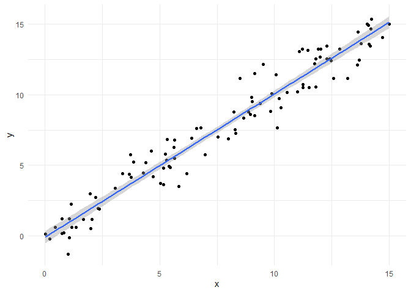
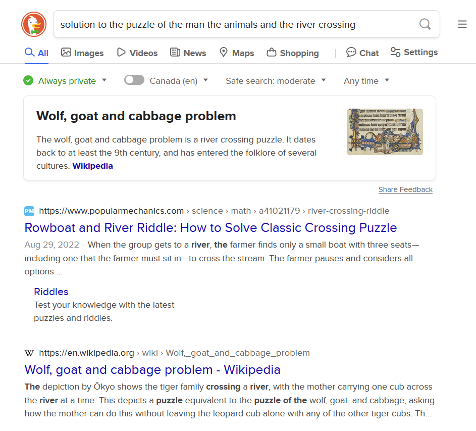
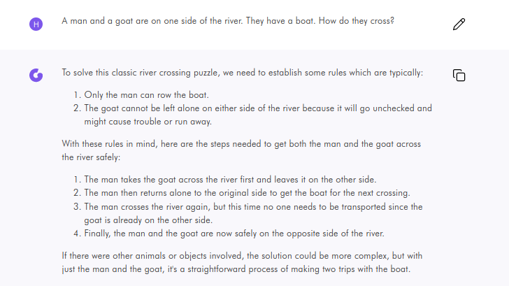

<!-- README.md is generated from README.Rmd. Please edit that file -->

# Use of AI in Teaching and Learning: Some Considerations

<!-- badges: start -->
<!-- badges: end -->

> > Mission Statement  
> > Our organization seeks to level up on all matters related.

## Background: AI roams the World

On November 30, 2022, OpenAI released what has become its flagship
product, [ChatGPT](https://en.wikipedia.org/wiki/ChatGPT), a chatbot
based on \[Large Language Models\] that mimics natural language. The
launch of the chatbot was an impressive feat of marketing (Cowen 2023),
and was rapidly panned as “the best artificial intelligence chatbot ever
released to the general public” (Roose 2023), and able to generate
“impressively detailed” and “human-like” text (Lock 2022).

<!--impressive feat of marketing: think about what it does well, what it does poorly, and how the user interface is essential to obscure its uselessness.-->

Universities have had to respond in a compressed time period to the
release of generative AI tools by a handful of large American
corporations, notoriously
[Meta](https://en.wikipedia.org/wiki/Meta_Platforms) (or were we to
deadname it, facebook), [OpenAI](https://en.wikipedia.org/wiki/OpenAI),
[Google](https://en.wikipedia.org/wiki/Alphabet_Inc.), and
[Microsoft](https://en.wikipedia.org/wiki/Microsoft).

McMaster developed a set of provisional guidelines (when where they
developed and released? It is possible that this was done as a
relatively urgent matter). These
[guidelines](https://provost.mcmaster.ca/office-of-the-provost-2/generative-artificial-intelligence-2/generative-ai-for-staff/provisional-guidelines-on-the-use-of-generative-ai-in-operational-excellence/)
where released under a Creative Commons Licence and have since inspired
those of other post-secondary institutions including Trent University
(2024) and University of Guelph (2023).

There is now an effort underway to update the preliminary guidelines (to
make the permanent?) McMaster [launched a
committee](#ai-committee-announced) to explore the use of AI across
campus. This committee is composed of three sub-committees that examine
the use of AI in 1) teaching and learning, 2) research, and 3)
operational excellence in \[our work\] (the Provost’s words)(probably
meaning the university’s work; not sure if the Provost themself uses
AI).

The sub-committees, in turn, convened panels to:

1.  Provide [provide recommendations](%7B#ai-panel-tasks%7D) on updates
    to the [Provisional
    Guidelines](https://provost.mcmaster.ca/office-of-the-provost-2/generative-artificial-intelligence-2/generative-ai-for-staff/provisional-guidelines-on-the-use-of-generative-ai-in-operational-excellence/)

2.  And also to do (what? consultation?).

3.  Q: What are the terms of reference of the panels? Who will decide
    which recommendations are adopted and which are ignored?

According to the announcement of the AI Committee:

> AI is a powerful tool and I believe that universities have an
> important role to play in its adoption.  
> – Susan Tighe, Provost, McMaster University

Hammers are powerful tools, sometimes even to conduct research or to
teach. Word processors are powerful tools. What makes AI different from
other tools that it requires a pan-university consultation on an
“*ethical approach to shaping policies and developing new ways of using
AI to ensure a responsible and beneficial integration where it makes
sense*”?

- Where does it make sense?

To understand why many organizations, including McMaster University,
have decided to spend considerable resources considering the adoption
and responsible use of AI, it is essential to have a working
understanding of what AI does differently from other tools. We also need
to understand what are the goals of the organization. When does it make
sense for a university like McMaster to “integrate” AI (pressumably as
part of the core mission of the organization)?

More generally, we must be alert to the fact that technologies are never
politically neutral: it is important to ask two questions:

- what does a technology do for whom?

- And what does it do to whom?

**McMaster’s Mission**

<https://president.mcmaster.ca/mission-vision/>

The mission of the university is “the discovery, communication and
preservation of knowledge,” accomplished with a commitment to
“creativity, innovation and excellence”. These are aspirations that must
respond to some underlying values, and indeed, the university values
“integrity, quality, inclusiveness and teamwork”. Ultimately, the
university aims to “inspire critical thinking, personal growth, and a
passion for lifelong learning” and to serve “the social, cultural, and
economic needs of our community and our society.”

From the Overview on Generative AI document:

> Some of those uses in our context could include qualitative and
> quantitative data analysis, writing text (e.g. reference letters,
> grant applications, job descriptions, report summaries), translation,
> captioning, multiple formats for learning and engagement, and
> personalized support.

## What are LLMs?

To understand why many organizations have decided to spend considerable
resources considering the adoption and responsible use of AI, it is
essential to have a working understanding of what AI does differently
from other tools.

Large Language Models are models composed of multiple layers of neural
networks trained on *very* large amounts of textual data ({IBM} 2023).

<!-- 
IBM uses a dataset called Project CodeNet Dataset, which is sourced from two online judge web sites, AIZU Online Judge and AtCoder. https://research.ibm.com/blog/codenet-ai-neurips-2021 According to IBM "[the] end goal of CodeNet is to enable developers to create systems that can modernize existing codebases, as well as fix errors and security vulnerabilities in code." 
&#10;From Aizu Terms of Use: https://onlinejudge.u-aizu.ac.jp/term_of_use
&#10;Handling of Submitted and Registered Codes
&#10;Commercial uses of the registered codes are prohibited.
&#10;You acknowledge and agree that users of this site may use copies or modifications of the public codes only for educational or research purposes.
&#10;You acknowledge and agree that public source codes may be opened collectively to persons authorized to access only for educational or research purposes.
&#10;You acknowledge and agree that source code submitted may be used by University of Aizu and related research institutes only for educational or research purposes.
&#10;IBM studiously avoids the word "commercial" in its posts about LLM, foundational models, and CodeNet. Is IBM doing all this research as a non-commercial effort? Will those developers creating systems, modernizing databases, fixing errors, etc., be able to access this for free? What does "commercial uses" even mean?
-->

What are neural networks? Here are some resources to learn some
elemental facts about neural networks.

<https://medium.com/@asifurrahmanaust/lesson-3-neural-network-is-nothing-but-a-linear-regression-e05a328a0f23>

<https://www.ibm.com/topics/large-language-models>

<https://en.wikipedia.org/wiki/Large_language_model#Further_reading>

Behind all the jargon, neural networks (LLMs are neural networks) are
regression models (Ripley 1994). Regression of course refers to
[regression to the
mean](https://en.wikipedia.org/wiki/Regression_toward_the_mean).
<!-- **NOTE**: also called "reversion to mediocrity". -->

**NOTE**: Labeling data is an essential, yet extremely expensive aspect
of training GenAIs.

## What do GenAI tools do for students at McMaster?

## What do GenAI tools do to students at McMaster?

### Persistence of skills (how long will learning to use a chatbot be useful?)

How useful will be AIs in the future? Think of model poisoning, and the
possibility that we are going to see (or may already have seen) Peak
ChatGPT.

De-duplication of training data improves LLMs (Lee et al. 2022)

No wonder: it amounts to having more different information.

But there is the following implication: once human-generated content is
exhausted and/or has been overwhelmed by chatbot generated content,
de-duplication becomes increasingly challenging.

    #> `geom_smooth()` using formula = 'y ~ x'

<figure>

<figcaption aria-hidden="true">Simple Example of a Regression
Model</figcaption>
</figure>

Predict: 

    #> # A tibble: 2 × 2
    #>   type          variance
    #>   <chr>            <dbl>
    #> 1 model output      15.5
    #> 2 training data     21.3

## What do GenAIs do for the mega-corporations pushing these tools?

## What do GenAIs to to everyone else?

### Use of materials on the web

In relation to the points above (GenAIs require vast amounts of
*human-generated* data to ensure that there is sufficient variability
for the model to train) - (Models trained )

### Copyright issues

LLM are known to regurgitate verbatim chunks of the training datasets.
This is called *memorization*, another choice of words that tends to
antropomorphize what is essentially a statistical model. Memorization,
in fact, is just a fancy way of saying “model overfitting”–in other
words, an extreme regression to the mean that excels at predicting data
in the training set, but is poor at projecting new data points. This
issue can be as high 7% in the cases of some LLMs (Peng, Wang, and Deng
2023, 8).

### Environmental impacts

Microsoft: Here’s how burning the planet will help to save it.

<https://blogs.microsoft.com/on-the-issues/2024/05/15/microsoft-environmental-sustainability-report-2024/>
(Smith and Nagagawa 2024)

<https://blogs.microsoft.com/on-the-issues/2023/11/16/accelerating-sustainability-ai-playbook/>
(Nakagawa 2023)

ChatGPT consumes substantially more than a search…are the results
better?
(**https://www.brusselstimes.com/1042696/chatgpt-consumes-25-times-more-energy-than-google?**)

Compare the results:

<figure>

<figcaption aria-hidden="true">A search using Duck Duck Go</figcaption>
</figure>

<figure>

<figcaption aria-hidden="true">A conversation with
ChatGPT-4</figcaption>
</figure>

<!--
&#10;<iframe src="https://assemblag.es/@hugo/112450401657084750/embed" width="400" allowfullscreen="allowfullscreen" sandbox="allow-scripts allow-same-origin allow-popups allow-popups-to-escape-sandbox allow-forms"></iframe>
&#10;https://assemblag.es/@hugo/112450401657084750 -->

### Replication of unjust structures of power

When using a Generative AI we must ask whose perspectives that tool
represents.

## As an aside

On antropomorphizing GenAI tools. This happens in ways that are barely
perceptively. For example, in the document “Overview of AI at McMaster”
we read that GenAI’s somehow have an “ability to engage in nuanced
conversation”. This phrasing could be simply a literary device, but even
so is indicative of a tendency to ascribe human attributes to a
statistical model. Doing this carelessly risks amplifying existing
biases. The effort to wrap a statistical model in a human-like skin may
actually be more devious, as in the new, sexy ChatGPT interface:

<video width="320" height="240" controls>
<source src="video/open-ai-commercial.mp4" type="video/mp4">
</video>

**NOTES:** Need to research more the argument that UX is so important in
the case of these tools because what they do well is trivial and what
they do poorly is what is being hyped.

## Concluding remarks

ChatGPT was an awesome feat of marketing (Cowen 2023), but much coverage
of the relevant issues in the media has been so credulous it has
stretched credulity past Pluto (Burneko 2024)[^1]. There are now calls
to press pause on the hype (Angwin 2024) but these are still drown by
the credulous coverage.

I suggest that universities should avoid the mistakes of the media.

Why? The reputational risk…universities are under siege from
unsympathetic or actively hostile actors. Universities main source of
power is their reputation as places that preserve and expand knowledge
in a principled way. “This university uses ChatGPT” is a way to say that
the university is redundant…an organization as expensive as an instution
of higher-education is not needed to create spam and dissinformation.

## Loose thoughts

Are GenAI reality-warping machines? Think about the small and large ways
in which these tools can be used to rewrite history, for relatively
banal commercial objectives (monetizing clicks) or worse, for malicious
propaganda campaigns.

**NOTE** Russia copied millions of articles from wikipedia wholesale, to
replace the open encyclopedia with a home-grown version without all the
bits that the current regime finds objectionable (Corfield 2023;
Jankowicz 2023).

> “The first step in liquidating a people,’ said Hubl, ’is to erase its
> memory. Destroy its books, its culture, its history. Then have
> somebody write new books, manufacture a new culture, invent a new
> history. Before long the nation will begin to forget what it is and
> what it was. The world around it will forget even faster.” -― Milan
> Kundera, The Book of Laughter and Forgetting

Potential for weaponization of GenAI. **Farfetched (?) idea** Could it
be that GenAI will be at some point declared a military-grade technology
with restricted applications?

## Notes

### AI Committee announcement

This is the announcement of the launch of the AI Committee (see email
from the Office of the Provost, dated March 20, 2024):

<!--https://app.fastmail.com/mail/search:expert+panels/T2d9b9367655ae218.M6205d28844daa67dfd3432ff-->

> “McMaster launches AI committee
>
> Whether you are a researcher, faculty member, student, administrator,
> or have another role on campus, you are likely thinking about
> Artificial Intelligence (AI) and its challenges and potential.
>
> AI is a powerful tool and I believe that universities have an
> important role to play in its adoption. At McMaster, we are well
> placed to prioritize an ethical approach to shaping policies and
> developing new ways of using AI to ensure a responsible and beneficial
> integration where it makes sense.
>
> I’m pleased to announce that McMaster has launched an AI Advisory
> Committee to explore the use of AI across campus. Three subcommittees
> have also been started to examine the use of AI in teaching and
> learning, research and operational excellence in our work. It is a
> strategy that makes McMaster one of the few institutions taking a
> pan-university approach to AI.
>
> Our earlier work to develop provisional guidelines for the use of
> generative AI in teaching and learning drew interest from other
> post-secondary institutions, which adopted McMaster’s guidelines after
> we made them available through a Creative Commons licence.
>
> The committee will be led by three co-chairs, each bringing different
> expertise. They are Matheus Grasselli, deputy provost, Gayleen Gray,
> associate vice-president and chief technology officer and Gianni
> Parise, acting deputy vice-president, Research. They will be supported
> by Erin Aspenlieder, special advisor to the provost on generative AI.
>
> The three subcommittees will each by led by a subject matter expert.
> Kim Dej, vice-provost, Teaching and Learning, will lead the
> exploration of AI in teaching and learning, Maggie Pooran, executive
> director, Health, Safety, Well-Being & Labour Relations, will explore
> its use in operational excellence, and Martin Horn, associate dean,
> Faculty of Humanities, will look at implications for research.
>
> Each expert subcommittee will have a pool of contributors made up of
> members of the McMaster community. Depending on the initiative, some
> or all members will be invited to complete the specific work based on
> their expertise, interest and availability.
>
> If you would like to be considered for the expert panels, please
> complete this expression of interest form.”

### Panel tasks

The task of the Artificial Intelligence Advisory Committee Expert Panel
on Teaching and Learning was initially defined as follows by the
Vice-Provost Teaching and Learning in an email dated April 16:

<!--https://app.fastmail.com/mail/search:erin/T6fae26856703ef40.Mfe5dff646c6ae452b84ef4bf-->

> \[T\]he first task of this Expert Panel will be to provide
> recommendations to the AI Advisory Committee on updates to the
> Provisional Guidelines on the Use of Generative AI in Teaching and
> Learning.

<!--This does not say anything about what the Committee will do with the recommendations; I cannot find anything about this.-->

## References

Angwin, Julia. 2024. “Press Pause on the Silicon Valley Hype Machine.”
*The New York Times*, May.
<https://www.nytimes.com/2024/05/15/opinion/artificial-intelligence-ai-openai-chatgpt-overrated-hype.html>.

Burneko, Albert. 2024. “If Kevin Roose Was ChatGPT With A Spray-On
Beard, Could Anyone Tell? Defector.” *Defector*.
<https://defector.com/if-kevin-roose-was-chatgpt-with-a-spray-on-beard-could-anyone-tell>.

Corfield, Gareth. 2023. “Russia Launches Wikipedia Rival in New
Censorship Crackdown.” *The Telegraph*, July.
<https://www.telegraph.co.uk/business/2023/07/12/russia-rival-wikipedia-censorship-crackdown-ruwiki/>.

Cowen, Tyler. 2023. “ChatGPT Is Also an Impressive Feat of Marketing.”
*Bloomberg*.
<https://web.archive.org/web/20240218161940/https://www.bloomberg.com/opinion/articles/2023-05-23/chatgpt-is-also-an-impressive-feat-of-marketing>.

Hiskes, Jonathan. 2007. “Woodward: ‘Journalism Is Not Stenography’.”
*The Media School Indiana University Bloomington*.
<https://mediaschool.indiana.edu/news-events/news/item.html?n=woodward-journalism-is-not-stenography/>.

{IBM}. 2023. “What Are Large Language Models (LLMs)?”
<https://www.ibm.com/topics/large-language-models>.

Jankowicz, Mia. 2023. “Russia Has Launched Its Own Version of Wikipedia,
Called Ruwiki, Which Is Notably More Sympathetic to Putin.” *Business
Insider*.
<https://www.businessinsider.com/ruwiki-putin-friendly-version-of-wikipedia-launched-in-russia-2023-7>.

Lee, Katherine, Daphne Ippolito, Andrew Nystrom, Chiyuan Zhang, Douglas
Eck, Chris Callison-Burch, and Nicholas Carlini. 2022. “Deduplicating
Training Data Makes Language Models Better.”
<https://arxiv.org/abs/2107.06499>.

Lock, Samantha. 2022. “What Is AI Chatbot Phenomenon ChatGPT and Could
It Replace Humans?” *The Guardian*.
<https://web.archive.org/web/20230116100346/https://www.theguardian.com/technology/2022/dec/05/what-is-ai-chatbot-phenomenon-chatgpt-and-could-it-replace-humans>.

Nakagawa, Brad Smith, Melanie. 2023. “Accelerating Sustainability with
AI: A Playbook.” *Microsoft On the Issues*.
<https://blogs.microsoft.com/on-the-issues/2023/11/16/accelerating-sustainability-ai-playbook/>.

Office of Teaching and Learning, University of Guelph. 2023.
“Provisional Recommendations for the Use of Generative AI Office of
Teaching and Learning.”
<https://otl.uoguelph.ca/teaching-assessment-resources/teaching-context-ai/provisional-recommendations-use-generative-ai>.

Peng, Zhencan, Zhizhi Wang, and Dong Deng. 2023. “Near-Duplicate
Sequence Search at Scale for Large Language Model Memorization
Evaluation.” *Proceedings of the ACM on Management of Data* 1 (2):
179:1–18. <https://doi.org/10.1145/3589324>.

Ripley, B. D. 1994. “Neural Networks and Related Methods for
Classification.” *Journal of the Royal Statistical Society: Series B
(Methodological)* 56 (3): 409–37.
<https://doi.org/10.1111/j.2517-6161.1994.tb01990.x>.

Roose, Kevin. 2023. “The Brilliance and Weirdness of ChatGPT.” *The New
York Times*.
<https://web.archive.org/web/20230118134332/https://www.nytimes.com/2022/12/05/technology/chatgpt-ai-twitter.html>.

———. 2024. “A.I.’s ‘Her’ Era Has Arrived.” *The New York Times*, May.
<https://www.nytimes.com/2024/05/14/technology/ai-chatgpt-her-movie.html>.

Smith, Brad, and Melanie Nagagawa. 2024. “Our 2024 Environmental
Sustainability Report.” *Microsoft On the Issues*.
<https://blogs.microsoft.com/on-the-issues/2024/05/15/microsoft-environmental-sustainability-report-2024/>.

Trent University. 2024. “Generative Artificial Intelligence, Trent
University Guidelines, 2024.”
<https://otl.uoguelph.ca/teaching-assessment-resources/teaching-context-ai/provisional-recommendations-use-generative-ai>.

[^1]: Bob woodward said “journalism is not stenography” (Hiskes 2007),
    but it is difficult to see what else writing like Roose’s (2024)
    could be called.
