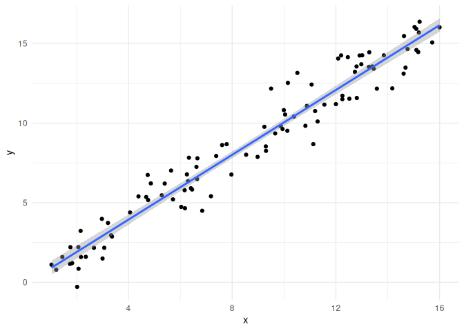
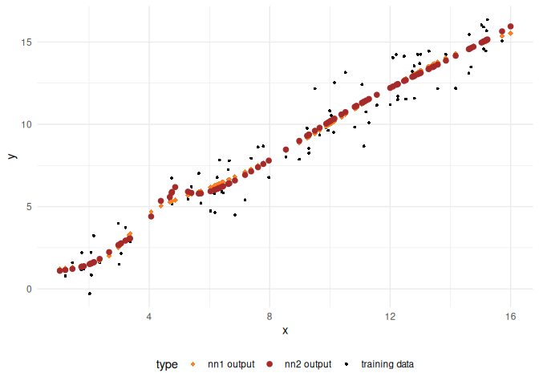

<!-- README.md is generated from README.Rmd. Please edit that file -->

# Use of AI in Teaching and Learning: Some Considerations

<!-- badges: start -->
<!-- badges: end -->

By: Antonio Páez (<paezha@mcmaster.ca>)

Disclaimer: *All opinions expressed here are mine and any resemblance to
those of my employer(s) is purely coincidental*.

## Background: An AI is Haunting Campus[^1]

> Mission Statement: Our organization seeks to level up on all matters
> related.  
> – An Organization Run by its Marketing Department

**NOTICE!**

Thank you for noticing this **new notice**! Your noticing it has been
noted, and *will be reported to the authorities*!

On November 30, 2022, OpenAI released what became its flagship product,
[ChatGPT](https://en.wikipedia.org/wiki/ChatGPT), a chatbot based on
[Large Language
Models](https://en.wikipedia.org/wiki/Large_language_model) (LLMs)
designed and trained to mimic natural language. The launch of the
chatbot was an impressive feat of marketing (Cowen 2023), and it took
less than two weeks for the hype to reach stratospheric levels: by early
December, ChatGPT was being panned as “the best artificial intelligence
chatbot ever released to the general public” (Roose 2023), and a tool
able to generate “impressively detailed” and “human-like” text, leading
some to wonder whether it could “replace humans” (Lock 2022).

Universities, much like every other organization dealing with
information, had to respond in a compressed span of time to the rapid
release of generative AI (GenAI) tools like ChatGPT, most of them
created and unleashed in the wild by a handful of large American
corporations including
[Meta](https://en.wikipedia.org/wiki/Meta_Platforms) (or were we to
deadname it, facebook), [OpenAI](https://en.wikipedia.org/wiki/OpenAI),
[Google](https://en.wikipedia.org/wiki/Alphabet_Inc.), and
[Microsoft](https://en.wikipedia.org/wiki/Microsoft).

GenAI was announced as nothing short of revolutionary. McMaster, for
example,
[states](https://provost.mcmaster.ca/office-of-the-provost-2/generative-artificial-intelligence-2/generative-ai-for-staff/provisional-guidelines-on-the-use-of-generative-ai-in-operational-excellence/):

> Understanding how generative AI works, and how it can support work
> within organizations represents an ongoing area of exploration and
> innovation. The opportunities of generative AI are exciting: creating
> workplace efficiencies to allow for different kinds of work, adding
> capabilities for individuals and teams, and offering personalized
> uses.

AI was quickly perceived as an *innovative* and *exciting* technology,
that moreover can lead to *efficiencies*[^2]. It seemed inevitable that
universities *had to do something* or risk being let behind.

The fear of missing out, combined with a modicum of concern for the
ethical implications of GenAIs[^3], has led to institutional responses
that have been less than coherent. An example is the case of Emory
University, where the university gave a \$10,000 prize to a group of
students who proposed developing an AI tool for an Entrepreneurship
Summit, only for the students to be subsequently suspended by the
school’s Honor Council for the potential of their tool for cheating[^4]
(Koebler 2024b).

For its part, McMaster was a leader in responding to the rapid, and
disruptive, release of these *revolutionary* tools, and its provisional
[guidelines](https://provost.mcmaster.ca/office-of-the-provost-2/generative-artificial-intelligence-2/generative-ai-for-staff/provisional-guidelines-on-the-use-of-generative-ai-in-operational-excellence/)
(released under a Creative Commons Licence) have since inspired those of
other post-secondary institutions in Canada, including the University of
Guelph (2023) and Trent University (2024).

The aim of the provisional guidelines was to inform the university
community about the use of AI in “operational excellence”. But the time
has come to update the guidelines, and the institution, via its Office
of the Provost, [launched a committee](#ai-committee-announced) to
explore the use of AI across campus. This committee is composed of three
sub-committees that examine the use of AI in 1) teaching and learning,
2) research, and 3) operational excellence in “our work” (the Provost’s
words)(probably meaning the university’s work; not sure if the Provost
themself uses AI).

The sub-committees, in turn, convened panels to:

1.  [Provide recommendations](%7B#ai-panel-tasks%7D) on updates to the
    [Provisional
    Guidelines](https://provost.mcmaster.ca/office-of-the-provost-2/generative-artificial-intelligence-2/generative-ai-for-staff/provisional-guidelines-on-the-use-of-generative-ai-in-operational-excellence/)

2.  And also to do (what? consultation?).

3.  Q: What are the terms of reference of the panels? Who will decide
    which recommendations are adopted and which are ignored?

According to the announcement of this AI Committee at McMaster:

> AI is a powerful tool and I believe that universities have an
> important role to play in its adoption.  
> – Susan Tighe, Provost

Accepting that AIs are powerful tools, right off the bat, is consistent
with the hype observed so far (Angwin 2024). Hammers are powerful tools.
Word processors are powerful tools. Lasers are powerful tools. And yet
we do not have high-level committees for each of and every tool that the
university uses. What makes AIs different from other tools that they
require a pan-university consultation on an “*ethical approach to
shaping policies and developing new ways of using AI to ensure a
responsible and beneficial integration where it makes sense*”?

(The last sentence in the statement above carries quite a bit of weight
here: where does adoption of AI make sense? Presumably this is what the
Committee on AI will try to answer.)

<!--As I argue here, AI does not make a lot of sense outside of some limited applications that are nowhere near the scope of the promises of the merchants of hype.-->

To understand why many organizations, including McMaster University,
have decided to spend considerable resources studying the adoption and
responsible use of AI, it is essential to have a working understanding
of what AI does that sets it apart from other tools.

In doing this, we must be alert to the fact that technologies are never
politically neutral: it is important to ask two questions:

- What does a specific technology do for whom?

- And what does it do to whom?

We also need to understand the goals of the organization that considers
the technology. When does it make sense for a university like McMaster
to “integrate” AI as part of the core mission of the organization,
accounting for what it does to some people and what it does for others?

Let us begin with the mission of McMaster as an institution of higher
education.

## The [mission](https://president.mcmaster.ca/mission-vision/)

McMaster’s mission is “the discovery, communication and preservation of
knowledge,” accomplished with a commitment to “creativity, innovation
and excellence”. These aspirations must respond to some underlying
values, and indeed, the university explicitly values “integrity,
quality, inclusiveness and teamwork”. Ultimately, the university aims to
“inspire critical thinking, personal growth, and a passion for lifelong
learning” and to serve “the social, cultural, and economic needs of our
community and our society.”

A mission statement is like an onion, and one needs to peel multiple
layers to try to understand the core principles enunciated there. Why
are things like “integrity” and “critical thought” valued? Or, what
happens when “integrity”, “quality”, and/or “excellence” clash with “the
economic needs of our society” (say, a mandate by democratically elected
governments to spend as little as possible in post-secondary
education[^5])?

Clearly, there will be some tension implicit in the mission of a
university. But being generous, let us take the mission statement at
face value and assume that the highest priorities are those related to
knowledge obtained, preserved, and communicated with integrity and
quality.

## What do AIs do?

At this point, we might as well ask “what do AIs *not* do”?

A possible reason why many organizations have decided to spend
substantial resources considering the adoption of GenAI is that, unlike
most other tools, they are seen as *everything tools*. Indeed, the
release of GenAIs to the masses was accompanied by innumerable lofty
promises, albeit most of them made by entities that had a stake in the
adoption of the technology.

The public was promised that GenAI would “accelerate sustainability”
(Nakagawa 2023); that LLMs would transform sectors as diverse as health
care, finance, human resources, insurance, “and beyond” by “automating
customer self-service, accelerating response times on an increasing
number of tasks as well as providing greater accuracy, enhanced routing
and intelligent context gathering” ({IBM} 2023); according to
Allerin[^6], AI-powered self-driving cars would reduce accidents, car
ownership, pollution and noise, and would automate logistics and make
parking tickets obsolete (Joshi 2022; Garsten 2024). In mental health
care, chatbots could complement human therapists “via comprehensive data
access and \[analysis of\] behavioral patterns” to “mimic practitioner
questions and subsequently make recommendations based on a user’s
inputs” (Silva and Henderson 2023).

The list of promises has grown to encompass pretty much everything, from
saving the planet all the way to micromanaging intimate facets of
individual lives, for example by revolutionizing dating through the use
of chatbots to help “people connect and find potential partners” (who
presumably also use chatbots to do the same) (Khalatian 2023).

Higher-education was not spared the onslaught of promises.

Power (2024),[^7] for example, presents three innovative use cases for
AI in higher education. First, AI could take over manual tasks and
improve the budget by releasing administrative staff[^8]. AI could
evaluate applications for admissions, including assessing traits like
the “grit” and “empathy” of applicants. AI could also personalize the
experience of consumers (also called students) by predicting their final
grade with 60-70% accuracy, and by providing corrective and instructive
feedback.
<!--release them in a very literal sense, as one advantage is to do _more_ with limited resources (which in the current fiscal environment means laying people off). The cases discussed by Mr. Power are questionable: there are already non-AI systems that deploy paperwork; the kind of information needed to identify students at risk of dropping out is probably quite invasive, and therefore impractical or unethical to collect; I very much doubt that it is legal to use AI in hiring and admissions. -->
Mr. Power’s message to the higher-education sector? It is time for
institutions to “level up”: jump on the bandwagon, fellas, don’t let it
let you behind!

In another instance, Hié and Thouary (2023) argue that AIs will likely
be the primary way to access information in the future. For this reason,
institutions must equip students with the skills needed to use AI
competently, in particular to perfect the art of *prompt engineering*,
that is, the ability to craft effective queries that prompt a GenAI to
provide the most useful outputs. Universities will use AIs to improve
learning and challenge the critical thinking of students. Faculty will
also benefit from AI: it will be used to evaluate their students[^9],
and will handle repetitive tasks like writing course syllabi[^10]. Hié
and Thouary (2023)[^11] warn that “AI is here to stay”, that
“\[faculty\] might not be able to stop the AI trend from growing”, and
so they might as well get on with the program and try to shape it as
best they can.

What does McMaster hope to achieve with AI? From the Overview on
Generative AI document:

> Some of \[the uses of AI\] in our context could include qualitative
> and quantitative data analysis, writing text (e.g. reference letters,
> grant applications, job descriptions, report summaries), translation,
> captioning, multiple formats for learning and engagement, and
> personalized support.

## But really, what do AIs do?

GenAIs are *deep learning models* ({IBM} 2021), so called because they
are neural networks with *depth*, meaning many, many hidden layers. As
an example, Large Language Models (such as those behind OpenAI’s
ChatGPT, Microsoft’s Copilot, Google’s Gemini, and facebook’s LLaMA) are
models built with multiple layers of neural networks trained on *very*
large amounts of textual data ({IBM} 2023).

But, what are
[neural](https://en.wikipedia.org/wiki/Large_language_model#Further_reading)
[networks](https://medium.com/@asifurrahmanaust/lesson-3-neural-network-is-nothing-but-a-linear-regression-e05a328a0f23)?

Behind all the jargon, the neural networks that underpin GenAI are
models designed to produce “statistically probable outputs” when
prompted ({IBM} 2021). In more conventional terms, neural networks are
regression models (Ripley 1994)–much more sophisticated and powerful
than linear regression to be sure, but regression models nonetheless.
Here, it is important to note that the term regression refers to
[regression to the
mean](https://en.wikipedia.org/wiki/Regression_toward_the_mean)–regressing
a prompt to a “statistically probable” outcome.

A regression model takes data as inputs, typically a “dependent”
variable $y$ (observations of an outcome of interest) and “independent”
variables $x$ (observations of things thought to correlate with the
dependent variable). With these inputs, the model finds a conditional
mean for the output $\hat{y}$ (i.e., a mean value conditional on the
values of the dependent variables). The process of finding that
conditional mean is to satisfy some critarion (e.g., that the
conditional mean minimizes the error of the model–the distance between
$y$ and $\hat{y}$).

Below is an example of the simplest regression model with only one
independent variable (i.e., a bivariate model). The plot shows the pairs
of $y$ and $x$ values, and the line is the model, the conditional mean
$\hat{y}$. This model needs only two parameters: an intercept (the value
of &\$ when $x = 0$), and the slope of the line, in other words, the
rate of change of $\hat{y}$ with respect to $x$. Each additional
independent variable uses one additional parameter to describe the slope
of the model with respect to that variable.

Simple Example of a Regression Model

Predict:

Training data and model output compared

Neural networks do something similar but using a net-like architecture
that is more flexible at identifying the characteristics of the data.
For instance, the following figure shows a relatively simple neural
network trained using using the same data. This network is not “deep”,
as it has only one so called “hidden layer”, comprised of two neurons
between the input and the output layers. In comparison to the linear
regression and its two parameters, this neural network uses seven
parameters.

Simple Example of a Shallow Neural Network

The plot below illustrates the predictions of this neural network, where
we can see that it is not limited to a linear response; neural networks
are more flexible than linear regression, and they achieve this by being
less parsimonious (they use more parameters).

Training data and model outputs compared: linear regression and shallow
neural network

More complex neural network can be designed. The following plot is of a
deeper network than the previous one, with two hidden layers, each
consisting of five neurons. This model uses forty-six parameters.

Example of a Deeper Neural Network

The increased complexity leads to greater flexibility, and we can see
that the model makes predictions that resemble more closely the actual
data.

Training data and model outputs compared: shallow neural network and
deeper neural network

Indeed, the first neural network is “better” in that it reduces the
typical error by -6.8% compared to the linear regression, whereas the
deeper network reduces the typical error by -6.8%, also with respect to
the linear regression[^12].

There is a limit to how flexible any model can be, and this is as true
of linear regression as it is of neural networks. Each additional
parameter makes the model more flexible, but as a rule we cannot use
more parameters than we have data to train the model. Roughly, every
additional parameter needs a data input to train on, and when there are
as many parameters as data inputs the model is overfit and will predict
each value of the independent variable in the training dataset
perfectly.

<!-- 
IBM uses a dataset called Project CodeNet Dataset, which is sourced from two online judge web sites, AIZU Online Judge and AtCoder. https://research.ibm.com/blog/codenet-ai-neurips-2021 According to IBM "[the] end goal of CodeNet is to enable developers to create systems that can modernize existing codebases, as well as fix errors and security vulnerabilities in code." 
&#10;From Aizu Terms of Use: https://onlinejudge.u-aizu.ac.jp/term_of_use
&#10;Handling of Submitted and Registered Codes
&#10;Commercial uses of the registered codes are prohibited.
&#10;You acknowledge and agree that users of this site may use copies or modifications of the public codes only for educational or research purposes.
&#10;You acknowledge and agree that public source codes may be opened collectively to persons authorized to access only for educational or research purposes.
&#10;You acknowledge and agree that source code submitted may be used by University of Aizu and related research institutes only for educational or research purposes.
&#10;IBM studiously avoids the word "commercial" in its posts about LLM, foundational models, and CodeNet. Is IBM doing all this research as a non-commercial effort? Will those developers creating systems, modernizing databases, fixing errors, etc., be able to access this for free? What does "commercial uses" even mean?
-->

**NOTE**: Labeling data is an essential, yet extremely expensive aspect
of training GenAIs.

## What do GenAI tools do for students at McMaster?

## What do GenAI tools do to students at McMaster?

## Not learning

Words go here.

## Learning the wrong stuff

Words go here.

## Deskilling

Words go here.

### Persistence of skills (how long will learning to use a chatbot be useful?)

How useful will be AIs in the future? Think of model poisoning, and the
possibility that we are going to see (or may already have seen) Peak
ChatGPT.

De-duplication of training data improves LLMs (Lee et al. 2022). No
wonder: it amounts to having more different information.

But there is the following implication: once human-generated content is
exhausted and/or has been overwhelmed by chatbot generated content,
de-duplication becomes increasingly challenging.

The variance of the model’s output is substantially reduced: the output
will, of necessity, be less varied, less diverse, and more
norm-conforming:

    #> # A tibble: 4 × 2
    #>   type              variance
    #>   <chr>                <dbl>
    #> 1 nn1 output            20.2
    #> 2 nn2 output            20.2
    #> 3 regression output     20.1
    #> 4 training data         21.3

## What do GenAIs do for the mega-corporations pushing these tools?

Words go here.

## What do GenAIs to to everyone else?

### Extractive

In relation to the points above (GenAIs require vast amounts of
*human-generated* data to ensure that there is sufficient variability
for the model to train) - (Models trained )

Germain (2023) Norem (2023)

### Exploitative

Above, the ways in which GenAI is exploitative of people all over the
world, but particularly in the Global South were highlighted. But AI
companies do not spare the rich either. OpenAI’s Sam Altman, a
self-avowed admirer of the movie *Her*, featuring Scarlet Johansson as
an AI voice assistant, reportedly tried to hire Ms. Johannson to be the
voice of ChatGPT 4.0 (Kastrenakes 2024). After Ms. Johannson decline,
OpenAI went and used a mimicry of [her voice](@as-an-aside) anyways,
which was retired after Ms. Johansson threatened legal action[^13]
(Allyn 2024). Alas, very few have the social standing of Scarlett
Johansson to challenge OpenAI. Most people in the world lack that power.

Williams, Miceli, and Gebru (2022) (Summary needed)

Perrigo (2023) (Follows summary)

ChatGPT was trained on vast amounts of data scooped from the internet,
where many societal problems are amplified. Trained on horrible content,
it was hard to sell ChatGPT when it was prone to racist, sexist, obscene
outbursts. But companies like facebook, who did not want to pay for
moderation, had hit on a solution of sorts
<!--: train an AI to detect content that was unpalatable.-->

The solution?

> \[F\]eed an AI with labeled examples of violence, hate speech, and
> sexual abuse, and that tool could learn to detect those forms of
> toxicity in the wild. That detector would be built into ChatGPT to
> check whether it was echoing the toxicity of its training data, and
> filter it out before it ever reached the user. It could also help
> scrub toxic text from the training datasets of future AI models.

The key here is “labeled examples”. What are those labels? Many machine
algorithms do not learn by themselves…they learn from humans, and need
what is called “labelled” data: a images that humans have labelled as
“dog”, “cats”, etc. Or bits of text that have been labelled
as…well…questionable. Labelling data is extremely time consuming and
labor intensive. What’s a corporation to do?

> To get those labels, OpenAI sent tens of thousands of snippets of text
> to an outsourcing firm in Kenya, beginning in November 2021. Much of
> that text appeared to have been pulled from the darkest recesses of
> the internet. Some of it described situations in graphic detail like
> child sexual abuse, bestiality, murder, suicide, torture, self harm,
> and incest. ”

What did this mean to the people doing all this labeling in one of the
poorest regions in the world? First of all, an income: “data labelers
employed…on behalf of OpenAI were paid a take-home wage of between
around \$1.32 and \$2 per hour depending on seniority and performance.”
But at what cost?

> One Sama worker tasked with reading and labeling text for OpenAI told
> TIME he suffered from recurring visions after reading a graphic
> description of a man having sex with a dog in the presence of a young
> child. “That was torture,” he said. “You will read a number of
> statements like that all through the week. By the time it gets to
> Friday, you are disturbed from thinking through that picture.”

Hao (2023)

Quotes from Hao’s podcast:

> Karen Hao: One of the reasons why ChatGPT was able to become so
> virally popular and continued to sustain popularity is because it is
> largely not spewing really awful things. People feel comfortable using
> the product knowing that it’s not going to do that.

> Annie Minoff: At least it won’t do it in English. If Alex wanted to
> use ChatGPT in his native language, Swahili, would he be able to do
> that?

> Karen Hao: You can interact with ChatGPT in Swahili, but ChatGPT was
> developed primarily to work in English. So a lot of the scrubbing, the
> content moderation, the important safety measures within the chatbot
> were done in English. So when you prompt it in Swahili, you’ll get
> more misinformation. You’ll get more confusing sentences that don’t
> make sense, and you will potentially get more of this content that
> they worked so hard to filter out because they were only filtering it
> in English.

Think about linguistic hegemony, and how the models are only as good (or
as bad) as their inputs.

### Copyright (and privacy) issues

LLM are known to regurgitate verbatim chunks of the training datasets.
This is called *memorization*, a word that contributes to
antropomorphize what is essentially a statistical model. Memorization,
in fact, is just a fancy way of saying “model overfitting”–in other
words, an extreme regression to the mean that excels at predicting data
in the training set, but is poor at projecting new data points.
Overfitting happens when a model has too many parameters or too few data
inputs (Models have [billions of
parameters](https://en.wikipedia.org/wiki/Large_language_model#Training_cost)
and are trained on [billions of pages of
text](https://www.ibm.com/topics/large-language-models%5D)). Data
memorization–the verbatim or quasi-verbatim output of training data–can
be as high as 7% in the case of some LLMs (Peng, Wang, and Deng 2023,
8).

Where will new data come from? (Murgia 2023)

Note how several organizations have responded to the AIfication of all
the things: by banning it. The concerns cited are seldom ethical or
moral, but mostly about the risk of sensitive information leaking. As
LLMs begin to be increasingly trained on model-produce data, overfitting
(or memorization) can become a larger risk.

And this is just a result of using an overfitted model. What about data
leaks? Some stories regarding Microsoft’s security track record:

<https://www.theregister.com/2024/04/12/microsoft_cisa_order/>

<https://techreport.com/news/microsoft-azure-hit-with-the-largest-data-breach-in-its-history-hundreds-of-executive-accounts-compromised/>

Also, how confident can the public be about assurances that a big tech
corporation will not data mine and commercialize data by the companies
that sell the services of LLMs? Microsoft is so big that it can stand up
to the US government:

<https://www.theregister.com/2024/04/05/microsoft_government_contracts/>

<!-- "Nice operation you have there...be a shame if your systems stopped working all of a sudden."-->

Organization ranging from Free Open Source projects to elements of the
federal government in the United States have limited/restricted the use
of AI.

NetBSD (a project that produces a free, Unix-like Open Source operating
system) states in its commit guidelines (contributions to code) that
“\[c\]ode generated by a large language model or similar technology…is
presumed to be tainted code, and must not be committed without prior
written approval by core.” ({NetBSD} n.d.).

The National Archives and Records Administration (USA) bans use of
ChatGPT (Koebler 2024a)

US Congress bans use of ChatGPT and Copilot for staff (Singh 2024). This
article also note how companies like Samsung and Apple have restricted
the use of chatbots citing concerns with data security.

### Environmental impacts

Microsoft: Here’s how burning the planet will help to save it.

<https://blogs.microsoft.com/on-the-issues/2024/05/15/microsoft-environmental-sustainability-report-2024/>
(Smith and Nagagawa 2024)

<https://blogs.microsoft.com/on-the-issues/2023/11/16/accelerating-sustainability-ai-playbook/>
(Nakagawa 2023)

“Environmental costs of AI are soaring” (Crawford 2024)

ChatGPT consumes substantially more energy than a regular web search, up
to 25 times more, and according to some estimates, the whole of AI may
consume twice as much energy as the whole of France by 2030 (Newsroom
2024).

…are the results better?

Compare the results:

A search using Duck Duck Go

A conversation with ChatGPT-4

The example above may seem like an amusement, but a GenAI is not a toy,
as Air Canada discover when the company was found liable for “negligent
misrepresentation”, after a court denied claims by the airline that the
chatbot was somehow responsible for its own actions as an effectively
separate legal entity (Garcia 2024).

Similar GenAI-generated mishaps abound.

But what when an AI replicates the both-sides perspective of much of the
media when trying to learn about an existential crisis like climate
changes? (Gordon 2024). Or when trying to obtain accurate voting
information in the context of voter supression? (Angwin, Nelson, and
Palta 2024)

### Replication of unjust structures of power

When using a Generative AI we must ask whose perspectives that tool
represents.

## As an aside

On antropomorphizing GenAI tools. This happens mostly in ways that are
barely liminal. For example, in the document “Overview of AI at
McMaster” we read that GenAI’s somehow have an “ability to engage in
nuanced conversation”. This phrasing could be simply a literary device,
but even so it is indicative of a tendency to ascribe human attributes
to a statistical model. Doing this risks amplifying existing biases. But
in other cases, the effort is more blatant. Wrapping a statistical model
in a human-like skin may actually be more devious, as in the new, sexy
ChatGPT interface:

<video width="320" height="240" controls>
<source src="video/open-ai-commercial.mp4" type="video/mp4">
</video>

**NOTES:** Need to research more the argument that the interface is so
important in the case of these tools because what they do well is
trivial and what they do poorly is what is being hyped. Found the
article (Farrugia 2024); see here:
<https://fasterandworse.com/known-purpose-and-trusted-potential/>

## Concluding remarks

ChatGPT was an awesome feat of marketing (Cowen 2023), but much coverage
of the relevant issues in the media has been so credulous it has
stretched credulity past Pluto (Burneko 2024)[^14]. There are now calls
to press pause on the hype (Angwin 2024) but these are still drown by
the credulous coverage.

I suggest that universities should avoid the mistakes of the media, an
industry that has innovated itself [out of the trust of the
public](https://reutersinstitute.politics.ox.ac.uk/news/julia-angwin-fears-public-sphere-about-get-worse-ai-makes-it-easier-flood-zone-misinformation)
(also see the “pivot-to-video” and how tech companies suckered many
media companies, including ).

Why? The reputational risk…universities are under siege from
unsympathetic or actively hostile actors. Universities main source of
power is their reputation as places that preserve and expand knowledge
in a principled way. “This university uses ChatGPT” is a way to say that
the university is redundant…an organization as expensive as an
institution of higher-education is not needed when there are cheaper
alternatives for such an education (“act now before you are laid off!”):

An AI success bundle from the “The Real People of Ligency PR and
Marketing Team”

“McMaster is best known for our pioneering work in problem-based
learning, which began in our medical school in 1969 and has been adopted
across the world.” <https://provost.mcmaster.ca/teaching-learning/>

Do we really want to be best known in 40 years as “McMaster, the
institution that pioneered the use of ChatGPT”?

Recall that [regression to the
mean](https://en.wikipedia.org/wiki/Regression_toward_the_mean) is also
called “reversion to mediocrity” (Barnett 2017).

## Loose thoughts

Are GenAI reality-warping machines? Think about the small and large ways
in which these tools can be used to rewrite history, for relatively
banal commercial objectives (monetizing clicks) or worse, for malicious
propaganda campaigns.

**NOTE** Russia copied millions of articles from wikipedia wholesale, to
replace the open encyclopedia with a home-grown version without all the
bits that the current regime finds objectionable (Corfield 2023;
Jankowicz 2023).

> The first step in liquidating a people,’ said Hubl, ’is to erase its
> memory. Destroy its books, its culture, its history. Then have
> somebody write new books, manufacture a new culture, invent a new
> history. Before long the nation will begin to forget what it is and
> what it was. The world around it will forget even faster.  
> -― Milan Kundera, The Book of Laughter and Forgetting

Potential for weaponization of GenAI. **Farfetched (?) idea** Could it
be that GenAI will be at some point declared a military-grade technology
with restricted applications? (see
<https://www.defenseone.com/technology/2024/05/ai-and-other-tech-creating-special-operations-renaissance/396388/>)

## Notes

### AI Committee announcement

This is the announcement of the launch of the AI Committee (see email
from the Office of the Provost, dated March 20, 2024):

<!--https://app.fastmail.com/mail/search:expert+panels/T2d9b9367655ae218.M6205d28844daa67dfd3432ff-->

> “McMaster launches AI committee
>
> Whether you are a researcher, faculty member, student, administrator,
> or have another role on campus, you are likely thinking about
> Artificial Intelligence (AI) and its challenges and potential.
>
> AI is a powerful tool and I believe that universities have an
> important role to play in its adoption. At McMaster, we are well
> placed to prioritize an ethical approach to shaping policies and
> developing new ways of using AI to ensure a responsible and beneficial
> integration where it makes sense.
>
> I’m pleased to announce that McMaster has launched an AI Advisory
> Committee to explore the use of AI across campus. Three subcommittees
> have also been started to examine the use of AI in teaching and
> learning, research and operational excellence in our work. It is a
> strategy that makes McMaster one of the few institutions taking a
> pan-university approach to AI.
>
> Our earlier work to develop provisional guidelines for the use of
> generative AI in teaching and learning drew interest from other
> post-secondary institutions, which adopted McMaster’s guidelines after
> we made them available through a Creative Commons licence.
>
> The committee will be led by three co-chairs, each bringing different
> expertise. They are Matheus Grasselli, deputy provost, Gayleen Gray,
> associate vice-president and chief technology officer and Gianni
> Parise, acting deputy vice-president, Research. They will be supported
> by Erin Aspenlieder, special advisor to the provost on generative AI.
>
> The three subcommittees will each by led by a subject matter expert.
> Kim Dej, vice-provost, Teaching and Learning, will lead the
> exploration of AI in teaching and learning, Maggie Pooran, executive
> director, Health, Safety, Well-Being & Labour Relations, will explore
> its use in operational excellence, and Martin Horn, associate dean,
> Faculty of Humanities, will look at implications for research.
>
> Each expert subcommittee will have a pool of contributors made up of
> members of the McMaster community. Depending on the initiative, some
> or all members will be invited to complete the specific work based on
> their expertise, interest and availability.
>
> If you would like to be considered for the expert panels, please
> complete this expression of interest form.”

### Panel tasks

The task of the Artificial Intelligence Advisory Committee Expert Panel
on Teaching and Learning was initially defined as follows by the
Vice-Provost Teaching and Learning in an email dated April 16:

<!--https://app.fastmail.com/mail/search:erin/T6fae26856703ef40.Mfe5dff646c6ae452b84ef4bf-->

> \[T\]he first task of this Expert Panel will be to provide
> recommendations to the AI Advisory Committee on updates to the
> Provisional Guidelines on the Use of Generative AI in Teaching and
> Learning.

<!--This does not say anything about what the Committee will do with the recommendations; I cannot find anything about this.-->

## References

Allyn, Bonny. 2024. “Scarlett Johansson Says She Is ’Shocked, Angered’
over New ChatGPT Voice.” *NPR*, May.
<https://www.npr.org/2024/05/20/1252495087/openai-pulls-ai-voice-that-was-compared-to-scarlett-johansson-in-the-movie-her>.

Angwin, Julia. 2024. “Press Pause on the Silicon Valley Hype Machine.”
*The New York Times*, May.
<https://www.nytimes.com/2024/05/15/opinion/artificial-intelligence-ai-openai-chatgpt-overrated-hype.html>.

Angwin, Julia, Alondra Nelson, and Rina Palta. 2024. “Seeking Reliable
Election Information? Don’t Trust AI.” *Proof*.
<https://www.proofnews.org/seeking-election-information-dont-trust-ai/>.

Barnett, Adrian. 2017. “Regression to the Mean, or Why Perfection Rarely
Lasts.” *The Conversation*.
<http://theconversation.com/regression-to-the-mean-or-why-perfection-rarely-lasts-74694>.

Burneko, Albert. 2024. “If Kevin Roose Was ChatGPT With A Spray-On
Beard, Could Anyone Tell? Defector.” *Defector*.
<https://defector.com/if-kevin-roose-was-chatgpt-with-a-spray-on-beard-could-anyone-tell>.

Canada}, Government Of Canada {Statistics. 2022. “College and University
Public Funding as a Percent of Total Revenue.”
<https://www150.statcan.gc.ca/n1/daily-quotidien/220120/cg-c001-eng.htm>.

CAUT. 2024. “Provincial Government Expenditures (Operating) on
Post-Secondary Education as a Share of Total Government Spending.”
<https://www.caut.ca/resources/almanac/2-canada-provinces>.

Corfield, Gareth. 2023. “Russia Launches Wikipedia Rival in New
Censorship Crackdown.” *The Telegraph*, July.
<https://www.telegraph.co.uk/business/2023/07/12/russia-rival-wikipedia-censorship-crackdown-ruwiki/>.

Cowen, Tyler. 2023. “ChatGPT Is Also an Impressive Feat of Marketing.”
*Bloomberg*.
<https://web.archive.org/web/20240218161940/https://www.bloomberg.com/opinion/articles/2023-05-23/chatgpt-is-also-an-impressive-feat-of-marketing>.

Crawford, Kate. 2024. “Generative AI’s Environmental Costs Are Soaring —
and Mostly Secret.” *Nature* 626 (8000): 693–93.
<https://doi.org/10.1038/d41586-024-00478-x>.

Farrugia, Stephen. 2024. “Known Purpose and Trusted Potential.” *Faster
and Worse*.
<https://fasterandworse.com/known-purpose-and-trusted-potential/>.

Garcia, Marisa. 2024. “What Air Canada Lost In ‘Remarkable’ Lying AI
Chatbot Case.” *Forbes*.
<https://www.forbes.com/sites/marisagarcia/2024/02/19/what-air-canada-lost-in-remarkable-lying-ai-chatbot-case/>.

Garsten, Ed. 2024. “What Are Self-Driving Cars? The Technology
Explained.” *Forbes*.
<https://www.forbes.com/sites/technology/article/self-driving-cars/>.

Germain, Thomas. 2023. “Google Says It’ll Scrape Everything You Post
Online for AI.” *Gizmodo*.
<https://gizmodo.com/google-says-itll-scrape-everything-you-post-online-for-1850601486>.

Gordon, Aaron. 2024. “The Multiple Faces of Claude AI: Different
Answers, Same Model.” *Proof*.
<https://www.proofnews.org/email/257dd8df-8ee1-4717-9f3d-6e7c1218b82d/>.

Hao, Karen. 2023. “The Hidden Workforce That Helped Filter Violence and
Abuse Out of ChatGPT - The Journal. - WSJ Podcasts.” *WSJ*.
<https://www.wsj.com/podcasts/the-journal/the-hidden-workforce-that-helped-filter-violence-and-abuse-out-of-chatgpt/ffc2427f-bdd8-47b7-9a4b-27e7267cf413>.

Hié, Anthony, and Claire Thouary. 2023. “How AI Is Reshaping Higher
Education AACSB.” *AACSB*.
<https://www.aacsb.edu/insights/articles/2023/10/how-ai-is-reshaping-higher-education>.

Hiskes, Jonathan. 2007. “Woodward: ‘Journalism Is Not Stenography’.”
*The Media School Indiana University Bloomington*.
<https://mediaschool.indiana.edu/news-events/news/item.html?n=woodward-journalism-is-not-stenography/>.

{IBM}. 2021. “What Is Generative AI?” *IBM Research*.
<https://research.ibm.com/blog/what-is-generative-AI>.

———. 2023. “What Are Large Language Models (LLMs)?”
<https://www.ibm.com/topics/large-language-models>.

Jankowicz, Mia. 2023. “Russia Has Launched Its Own Version of Wikipedia,
Called Ruwiki, Which Is Notably More Sympathetic to Putin.” *Business
Insider*.
<https://www.businessinsider.com/ruwiki-putin-friendly-version-of-wikipedia-launched-in-russia-2023-7>.

Joshi, Naveen. 2022. “5 Ways Autonomous Cars Will Reshape Our World.”
*Forbes*.
<https://www.forbes.com/sites/naveenjoshi/2022/07/22/5-ways-autonomous-cars-will-reshape-our-world/>.

Kastrenakes, Jacob. 2024. “Scarlett Johansson Told OpenAI Not to Use Her
Voice — and She’s Not Happy They Might Have Anyway.” *The Verge*.
<https://www.theverge.com/2024/5/20/24161253/scarlett-johansson-openai-altman-legal-action>.

Khalatian, Igor. 2023. “Matchmaking 2.0: How AI Is Revolutionizing
Online Dating.” *Forbes*.
<https://www.forbes.com/sites/forbestechcouncil/2023/03/17/matchmaking-20-how-ai-is-revolutionizing-online-dating/>.

Koebler, Jason. 2024a. “National Archives Bans Employee Use of ChatGPT.”
*404 Media*.
<https://www.404media.co/national-archives-bans-employee-use-of-chatgpt/>.

———. 2024b. “University Suspends Students for AI Homework Tool It Gave
Them \$10,000 Prize to Make.” *404 Media*.
<https://www.404media.co/university-suspends-students-for-ai-homework-tool-it-paid-them-10-000-to-make/>.

Lee, Katherine, Daphne Ippolito, Andrew Nystrom, Chiyuan Zhang, Douglas
Eck, Chris Callison-Burch, and Nicholas Carlini. 2022. “Deduplicating
Training Data Makes Language Models Better.”
<https://arxiv.org/abs/2107.06499>.

Lock, Samantha. 2022. “What Is AI Chatbot Phenomenon ChatGPT and Could
It Replace Humans?” *The Guardian*.
<https://web.archive.org/web/20230116100346/https://www.theguardian.com/technology/2022/dec/05/what-is-ai-chatbot-phenomenon-chatgpt-and-could-it-replace-humans>.

Murgia, Mahmudita. 2023. “Why Computer-Made Data Is Being Used to Train
AI Models.” *Financial Times*.
<https://www.ft.com/content/053ee253-820e-453a-a1d5-0f24985258de>.

Nakagawa, Brad Smith, Melanie. 2023. “Accelerating Sustainability with
AI: A Playbook.” *Microsoft On the Issues*.
<https://blogs.microsoft.com/on-the-issues/2023/11/16/accelerating-sustainability-ai-playbook/>.

{NetBSD}. n.d. “NetBSD Commit Guidelines.” Accessed May 20, 2024.
<https://www.netbsd.org/developers/commit-guidelines.html>.

Newsroom, {The Brussels Times}. 2024. “ChatGPT Consumes 25 Times More
Energy Than Google.” *The Brussel Times*.
<https://www.brusselstimes.com/1042696/chatgpt-consumes-25-times-more-energy-than-google>.

Norem, Josh. 2023. “Intel’s GPU Drivers Now Collect Telemetry, Including
’How You Use Your Computer’.” *ExtremeTech*.
<https://www.extremetech.com/gaming/intels-gpu-drivers-now-collect-telemetry-including-how-you-use-your-computer>.

O’Connell, Paul. 2012. “Let Them Eat Cake: Socio-Economic Rights in an
Age of Austerity.” In *Human Rights and Public Finance*, Aoife Nolan,
Rory O’Connell, Colin Harvey, eds. Rochester, NY: Hart Publishing.
<https://papers.ssrn.com/abstract=1915221>.

Office of Teaching and Learning, University of Guelph. 2023.
“Provisional Recommendations for the Use of Generative AI Office of
Teaching and Learning.”
<https://otl.uoguelph.ca/teaching-assessment-resources/teaching-context-ai/provisional-recommendations-use-generative-ai>.

Peng, Zhencan, Zhizhi Wang, and Dong Deng. 2023. “Near-Duplicate
Sequence Search at Scale for Large Language Model Memorization
Evaluation.” *Proceedings of the ACM on Management of Data* 1 (2):
179:1–18. <https://doi.org/10.1145/3589324>.

Perrigo, Billy. 2023. “The \$2 Per Hour Workers Who Made ChatGPT Safer.”
*TIME*. <https://time.com/6247678/openai-chatgpt-kenya-workers/>.

Power, Rhett. 2024. “3 Innovative Use Cases For AI In Higher Education.”
*Forbes*.
<https://www.forbes.com/sites/rhettpower/2024/02/04/3-innovative-case-uses-for-ai-in-higher-education/>.

Ripley, B. D. 1994. “Neural Networks and Related Methods for
Classification.” *Journal of the Royal Statistical Society: Series B
(Methodological)* 56 (3): 409–37.
<https://doi.org/10.1111/j.2517-6161.1994.tb01990.x>.

Roose, Kevin. 2023. “The Brilliance and Weirdness of ChatGPT.” *The New
York Times*.
<https://web.archive.org/web/20230118134332/https://www.nytimes.com/2022/12/05/technology/chatgpt-ai-twitter.html>.

———. 2024. “A.I.’s ‘Her’ Era Has Arrived.” *The New York Times*, May.
<https://www.nytimes.com/2024/05/14/technology/ai-chatgpt-her-movie.html>.

Silva, Lauren, and Lisa Henderson. 2023. “4 AI Therapy Options Reviewed:
Do They Work?” *Forbes Health*.
<https://www.forbes.com/health/mind/ai-therapy/>.

Singh, Priya. 2024. “After ChatGPT, US Congress Bans Use of Microsoft’s
AI Tool Copilot for Staff Members.” *Business Today*.
<https://www.businesstoday.in/technology/news/story/after-chatgpt-us-congress-bans-use-of-microsofts-ai-tool-copilot-for-staff-members-423693-2024-04-01>.

Smith, Brad, and Melanie Nagagawa. 2024. “Our 2024 Environmental
Sustainability Report.” *Microsoft On the Issues*.
<https://blogs.microsoft.com/on-the-issues/2024/05/15/microsoft-environmental-sustainability-report-2024/>.

Trent University. 2024. “Generative Artificial Intelligence, Trent
University Guidelines, 2024.”
<https://otl.uoguelph.ca/teaching-assessment-resources/teaching-context-ai/provisional-recommendations-use-generative-ai>.

Williams, Adrienne, Milagros Miceli, and Timnit Gebru. 2022. “The
Exploited Labor Behind Artificial Intelligence.” *Noema Magazine*,
October.
<https://www.noemamag.com/the-exploited-labor-behind-artificial-intelligence>.

[^1]: Karl Marx wrote about a “spectre…haunting Europe–the spectre of
    communism”; GenAI looks awfully like the shade of the spectre of
    unregulated surveillance capitalism.

[^2]: “Efficiencies”, to be clear, is the day’s euphemism for cutting
    costs (O’Connell 2012, 64).

[^3]: Ethical concerns for the most part have had to do with policing
    academic dishonesty among students

[^4]: There was no evidence that cheating had happened.

[^5]: Between 2000-2020, Ontario had the lowest spending on
    post-secondary education of all provinces in Canada, relative to its
    share of spending (CAUT 2024). Public funding of universities in
    Ontario as percent of revenue fell from 45.6% in 2001/2 to 35.5% in
    2019/20 (Canada} 2022). It is little wonder that universities are
    seeking “efficiencies”

[^6]: Curiously, Allerin is not identified as an artificial intelligence
    company in Joshi (2022) but only in the much later article by
    Garsten (2024).

[^7]: Rhett Power is a motivational speaker and executive coach

[^8]: Probably to work on something else, and not for the university,
    hence leading to “efficiencies”

[^9]: A task of dubious legality, and clearly a way to cheat students of
    a learning experience

[^10]: In my 20+ years of experience as an educator, writing syllabi has
    been essential to understand my own courses; automating the task is
    another way of cheapening the quality of the learning experience for
    students

[^11]: Anthony Hié is Chief Innovation and Digital officer at
    [Excelia](https://www.excelia-group.com/about-excelia/our-schools/excelia-business-school).
    Writing in 2022, Mr. Hié predicted that the metaverse would be a
    [revolution in higher
    education](https://www.linkedin.com/pulse/metaverse-dedicated-pedagogy-revolution-higher-education-anthony-hi%C3%A9).
    In October 2023 facebook [slashed its metaverse
    team](https://www.reuters.com/technology/meta-lay-off-employees-metaverse-silicon-unit-wednesday-2023-10-03/).
    Microsoft
    [disbanded](https://www.theinformation.com/articles/microsoft-kills-its-industrial-metaverse-team-after-4-months)
    its Industrial Metaverse Core Team four months after launching it.
    Claire Thouary is the founder of [QACE UP](http://qace-up.fr), a
    consulting firm that supports higher-education institutions in their
    quest for “quality excellence”.

[^12]: The “typical error” here is the mean absolute deviation of the
    predictions.

[^13]: Altman’s denials that OpenAI had not used Ms. Johansson’s voice
    sounded hollow, after he
    [posted](https://x.com/sama/status/1790075827666796666) on social
    media the word “her” at the time the new version of ChatGPT was
    announced.

[^14]: Bob Woodward said “journalism is not stenography” (Hiskes 2007),
    but it is difficult to see what else writing like Roose’s (2024)
    could be called.
