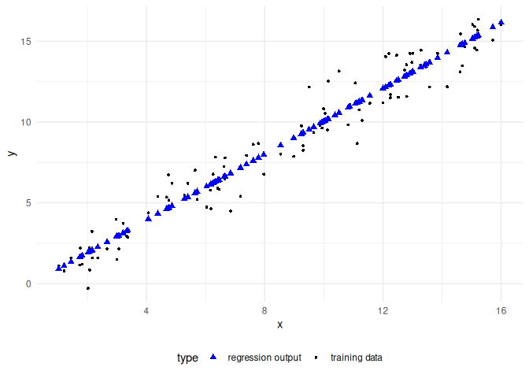

<!-- README.md is generated from README.Rmd. Please edit that file -->

# An AI is haunting campus[^1]: Some considerations about the use of AI for teaching and learning in post-secondary education

<!-- badges: start -->
<!-- badges: end -->

Antonio Páez (<paezha@mcmaster.ca>)

Disclaimer: *All opinions expressed here are mine and any resemblance to
those of my employer(s) is purely coincidental*. *No generative AI tool
was used to research or write this essay, only good old-fashioned
library and internet search skills*.

Note: *This essay was written as an open research project, and it can be
found in the following repository:*
<https://github.com/paezha/University-AI-Panel>

------------------------------------------------------------------------

## Contents

- [Background](#background)  
- [The university’s mission](#the-mission)  
- [What do AIs do?](#what-do-ais-do)  
- [A note on the terms of the conversation](#terms-of-debate)  
- [But really, what do AIs do?](#really-what-do-they-do)  
- [AI in teaching and learning](#ai-in-teaching-and-learning)  
- [What do GenAIs do for students?](#what-do-ais-do-for-students)  
- [What do GenAIs do to students?](#what-can-ais-do-to-students)  
- [What do GenAIs do for the mega-corporations pushing these
  tools?](#what-do-ais-to-corporations)  
- [What do GenAIs do to everyone
  else?](#what-do-ais-do-to-everyone-else)

------------------------------------------------------------------------

## Background

> *Mission Statement: Our organization seeks to level up on all matters
> related.*  
> – An Organization Run by its Marketing Department

On November 30, 2022, OpenAI released what became its flagship product,
[ChatGPT](https://en.wikipedia.org/wiki/ChatGPT), a chatbot based on
[Large Language
Models](https://en.wikipedia.org/wiki/Large_language_model) (LLMs)
designed and trained to mimic natural language. The launch of the
chatbot was an impressive feat of marketing (Cowen 2023), and it took
less than two weeks for the hype to reach stratospheric levels: by early
December, ChatGPT was being panned as “the best artificial intelligence
chatbot ever released to the general public” (Roose 2023), and a tool
able to generate “impressively detailed” and “human-like” text, leading
some to wonder whether it could “replace humans” (Lock 2022).

Universities, much like every other organization dealing with
information, had to respond in a compressed span of time to the rapid
release of generative AI (GenAI) tools like ChatGPT, most of them
created and unleashed in the wild by a handful of large American
corporations including
[Meta](https://en.wikipedia.org/wiki/Meta_Platforms) (or were we to
deadname it, facebook), [OpenAI](https://en.wikipedia.org/wiki/OpenAI),
[Google](https://en.wikipedia.org/wiki/Alphabet_Inc.), and
[Microsoft](https://en.wikipedia.org/wiki/Microsoft).

GenAI was hailed as nothing short of revolutionary. McMaster, for
example,
[stated](https://provost.mcmaster.ca/office-of-the-provost-2/generative-artificial-intelligence-2/generative-ai-for-staff/provisional-guidelines-on-the-use-of-generative-ai-in-operational-excellence/)
that:

> \[u\]nderstanding how generative AI works, and how it can support work
> within organizations represents an ongoing area of exploration and
> innovation. The opportunities of generative AI are exciting: creating
> workplace efficiencies to allow for different kinds of work, adding
> capabilities for individuals and teams, and offering personalized
> uses.

AI was quickly painted as an *innovative* and *exciting* technology,
that moreover can lead to *efficiencies*[^2]. It seemed inevitable that
universities *had to do something* with it, at the risk of being let
behind.

The fear of missing out, combined with a modicum of concern for the
ethical implications of GenAIs[^3], has led to institutional responses
that have been less than coherent. A case in point is Emory University,
where the university gave a \$10,000 prize to a group of students who
proposed developing an AI tool for an Entrepreneurship Summit, only for
the students to be subsequently suspended by the school’s Honor Council
for the potential of their tool for cheating[^4] (Koebler 2024b).

For its part, McMaster was a leader in responding to the rapid, and
disruptive, release of these *revolutionary* tools, and its provisional
[guidelines](https://provost.mcmaster.ca/office-of-the-provost-2/generative-artificial-intelligence-2/generative-ai-for-staff/provisional-guidelines-on-the-use-of-generative-ai-in-operational-excellence/)
(released under a Creative Commons Licence) have since inspired those of
other post-secondary institutions in Canada, including the University of
Guelph (2023) and Trent University (2024).

The aim of the provisional guidelines was to inform the university
community about the use of AI in “operational excellence”. As we
approach the Fall Term of 2024, with almost two years of cohabitation
experience with AI for the masses at our backs, the time has come to
update these guidelines. Pertinently, the institution, via its Office of
the Provost, [launched a committee](#ai-committee-announced) to explore
the use of AI across campus. This committee is composed of three
sub-committees tasked with examining the use of AI in 1) teaching and
learning, 2) research, and 3) operational excellence in “our work”.

The sub-committees, in turn, convened panels to [provide
recommendations](#ai-panel-tasks) on updates to the [Provisional
Guidelines](https://provost.mcmaster.ca/office-of-the-provost-2/generative-artificial-intelligence-2/generative-ai-for-staff/provisional-guidelines-on-the-use-of-generative-ai-in-operational-excellence/).
The [priority initiatives](#ai-panel-tasks) for the members of the AI
Teaching and Learning Panel are to help shape the guidelines for
teaching and learning at McMaster, a consequential task “for how
educators take up generative AI in their course and assessment design
and how students approach the use of this technology”.

According to the announcement of this AI Committee at McMaster:

> AI is a powerful tool and I believe that universities have an
> important role to play in its adoption.  
> – Susan Tighe, Provost

Notice that this statement (like the definition of the work before the
panels above), takes for granted that 1) AIs are powerful tools, and 2)
universities can be leading players in their adoption. This attitude is
almost fatalistic[^5] in its enthusiasm, and perfectly consistent with
the hype observed around AI this time[^6] (Angwin 2024).

To put things in perspective, hammers are powerful tools. Word
processors are powerful tools. Lasers are powerful tools. And yet we do
not have high-level university committees for each and every tool that
is used at the institution. What is it about AIs that, unlike many other
tools, requires a pan-university consultation on an “*ethical approach
to shaping policies and developing new ways of using AI to ensure a
responsible and beneficial integration where it makes sense*”?

(The last part of the statement above carries quite a bit of weight
here: where does adoption of AI make sense? Presumably this is what the
Committee on AI will try to answer.)

To understand why many organizations, including McMaster University,
have decided to spend considerable resources studying the adoption and
responsible use of AIs, it is essential to understand what the
technology claims to do that sets it apart from other tools, and what it
in actuality does.

In doing this, it is essential that we remain alert to the fact that
technologies are *never* politically neutral, and therefore it is
important to ask two questions when considering their adoption:

- What does a specific technology do for whom?

- And what does it do to whom?

We also need to understand the goals of the organization that considers
using the technology. When does it make sense for a university like
McMaster to “integrate” AIs as part of its core mission, accounting for
what the technology does for some people and what it does to others?

Let us begin with the mission of McMaster as an institution of higher
education.

## The university’s mission

McMaster’s [mission](https://president.mcmaster.ca/mission-vision/) is
“the discovery, communication and preservation of knowledge,”
accomplished with a commitment to “creativity, innovation and
excellence”. These aspirations must respond to some underlying values,
and indeed, the university explicitly values “integrity, quality,
inclusiveness and teamwork”. Ultimately, the university aims to “inspire
critical thinking, personal growth, and a passion for lifelong learning”
and to serve “the social, cultural, and economic needs of our community
and our society.”

A mission statement is like an onion, and one needs to peel multiple
layers to try to understand the core principles enunciated there. Why
are things like “integrity” and “critical thought” valued? Or, what
happens when “integrity”, “quality”, and/or “excellence” clash with “the
economic needs of our society” (say, a mandate by democratically elected
governments to spend as little as possible in post-secondary
education[^7])?

Clearly, there is some tension implicit in the mission of a university.
But being generous, we can take the mission statement at face value and
assume that the highest priorities are those related to knowledge
obtained, preserved, and communicated with creativity, integrity,
excellence, and quality.

And so, what do AIs do that can advance the mission of the university?

## What do AIs do?

At this point, we might as well ask “what do AIs *not* do”?

A key reason why many organizations have decided to spend substantial
resources considering the adoption of AIs is that, unlike most other
tools, they have been presented quite deliberately as *everything
tools*[^8]. While hammers are understood to have a limited range of uses
that mostly have to do with concentrating force, and word processors are
generally only used to record words, the release of GenAIs to the masses
was accompanied by innumerable lofty promises[^9].

The public was promised that GenAI would “accelerate sustainability”
(Nakagawa 2023).

Also, that LLMs would transform sectors as diverse as health care,
finance, human resources, insurance, “and beyond” by “automating
customer self-service, accelerating response times on an increasing
number of tasks as well as providing greater accuracy, enhanced routing
and intelligent context gathering” (IBM 2023).

According to Allerin[^10], AI-powered self-driving cars would reduce
accidents, car ownership, pollution and noise, and would automate
logistics and make parking tickets obsolete (Joshi 2022; Garsten 2024).
But why stop at self-driving vehicles? McMaster University’s Canada
Excellence Research Chair Laureate Ali Emadi “hopes to help
revolutionize and influence everything from personal travel to city
planning” by putting AI directly into our transportation systems (Dorey
2023).

In mental health care, chatbots could complement human therapists “via
comprehensive data access and \[analysis of\] behavioral patterns” to
“mimic practitioner questions and subsequently make recommendations
based on a user’s inputs” (Silva and Henderson 2023).

AIs will even write code, perhaps helping themselves to some
self-programming along the way: AIs that write themselves, or AI
self-help?

Figure 1. An example of Atlassian AI writing code

The list of promises about what AI *can* do has grown to encompass
pretty much everything, from saving the planet from ourselves, all the
way down to micromanaging intimate facets of individual lives, for
example by revolutionizing dating through the use of chatbots to help
“people connect and find potential partners” (who presumably also use
chatbots to do the same) (Khalatian 2023). Not even the [bowel movements
of our
pets](https://finance.yahoo.com/news/next-generation-ai-powered-cat-140000795.html)
are beyond the revolutionary all-seeing eye of AI.

Figure 2. Revolutionizing pet health

The forecast that AI will improve everything (from global climate to the
dumps of our cats) was certain to, sooner or later, reach
higher-education, a target-rich environment for selling hype–and indeed,
colleges and universities have not been spared the onslaught of
promises.

Examples of this abound.

Power (2024),[^11], writing for Forbes, presents three innovative use
cases for AI in higher education. First, AI could take over manual tasks
and improve the budget by releasing administrative staff[^12]. AI could
evaluate applications for admissions, including assessing traits like
the “grit” and “empathy” of applicants. AI could also personalize the
experience of consumers (occasionally also called students) by
predicting their final grade with 60-70% accuracy, and by providing
corrective and instructive feedback.

Mr. Power’s message to the higher-education sector? It is time for
institutions to “level up”: jump on the bandwagon, fellas, don’t let it
leave you behind!

In another instance, Hié and Thouary (2023)[^13] argue that AIs will
likely be the primary way to access information in the future. For this
reason, institutions must equip students with the skills needed to use
AI competently, in particular train them to perfect the art of *prompt
engineering* (the ability to craft effective queries that prompt a GenAI
to provide the most useful outputs). Universities will use AIs to
improve learning and challenge the critical thinking of students.
Faculty will also benefit from AI: it will be used to evaluate their
students[^14], and will handle repetitive tasks like writing course
syllabi[^15].

Hié and Thouary (2023) warn that “AI is here to stay”[^16], and that
“\[faculty\] might not be able to stop the AI trend from growing” so
they might as well get on with the program and try to shape it as best
they can.

Similarly hyperbolic claims about AI in higher education can be found
peppered throughout the landscape, including by Johnson (2023)[^17] and
Contact North (2024)[^18]. A fairly comprehensive list (from Johnson
2023) is as follows (notice the use of “can” in the original, not
“could”, or “maybe will”):

- AI can provide personalized learning.  
- AI-powered systems can provide smart tutoring.  
- AI can automate grading.  
- AI can enable virtual classrooms.  
- AI can provide data insights for informed decisions.  
- Natural Language Processing (NLP) can enhance language learning.  
- AI can create interactive and adaptive learning materials.  
- AI can identify early signs of learning difficulties.  
- AI can aid in providing personalised professional development
  opportunities for teachers.
- AI can streamline administrative tasks.

Is it really possible that AIs can do all this?

## A note on the terms of the conversation

A benefit of portraying AI as an *everything tool* (for the proponents
of the technology, at least), is that conversations around it quickly
turn into a [Gish Gallop](https://en.wikipedia.org/wiki/Gish_gallop), a
rhetorical device where a party makes an overwhelming number of
arguments with little regard to their accuracy or strength. To be sure,
AIs can do *some* things well, but critics are forced to respond to
every single propounded use case with in-depth analysis, which usually
is much more time consuming than making the unsubstantiated and/or
misleading claims of the gallop itself[^19]. Proponents of AI can always
admit that, ok, AIs do not actually do *that one thing*, but what about
the myriad of other things that people say they really do do?

A second discursive device deployed by proponents of AI is an informal
fallacy known as [The False
Dilemma](https://en.wikipedia.org/wiki/False_dilemma): adopt AI or fail
to level up.

In what follows, it is not my intention to confront every single
possible use case of AI in teaching and learning, since doing so plays
into the intent of the Gish Gallop[^20], namely to defeat criticism by
flooding the zone. As well, I reject the dilemma posed by the purveyors
of hype, and I remain convinced that there are multiple ways to excel at
teaching and learning that do not require AI, let alone the moral,
environmental, and social compromises demanded by AI[^21].

## But really, what do AIs do?

GenAIs are *deep learning models* (IBM 2021b), so-called because they
are neural networks with *depth*, meaning many, many, *many* hidden
layers. As an example, Large Language Models (such as those behind
OpenAI’s ChatGPT, Microsoft’s Copilot, Google’s Gemini, and facebook’s
LLaMA) are models built with multiple layers of neural networks trained
on *very* large amounts of textual data (IBM 2023).

But, what are
[neural](https://en.wikipedia.org/wiki/Large_language_model#Further_reading)
[networks](https://medium.com/@asifurrahmanaust/lesson-3-neural-network-is-nothing-but-a-linear-regression-e05a328a0f23)?

Behind all the jargon, the neural networks that underpin GenAI are
models designed to produce “statistically probable outputs” when
prompted (IBM 2021b). In more conventional terms, neural networks are
regression models–much more sophisticated and powerful than linear
regression to be sure, but regression models nonetheless (Ripley 1994).
Here, it is important to note that the term regression refers to
[regression to the
mean](https://en.wikipedia.org/wiki/Regression_toward_the_mean)–regressing
an input (e.g., a prompt) to a “statistically probable” outcome.

A regression model takes data as inputs, typically a “dependent”
variable $y$ (observations of an outcome of interest) and “independent”
variables $x$ (observations of things thought to correlate with the
dependent variable). With these inputs, the model finds a conditional
mean that becomes the output of the model, or $\hat{y}$ (i.e., a mean
value conditional on the values of the dependent variables). The process
of finding that conditional mean is to satisfy some criterion (e.g.,
that the conditional mean minimizes the error of the model–the distance
between $y$ and $\hat{y}$).

Below is an example of the simplest regression model with only one
independent variable (i.e., a bivariate model). The plot shows the pairs
of $y$ and $x$ values, and the line is the model, i.e., the conditional
mean $\hat{y}$. This model needs only two parameters: an intercept (the
conditianl mean $\hat{y}$ when $x = 0$), and the slope of the line, in
other words, the rate of change of $\hat{y}$ with respect to $x$. Each
additional independent variable uses one additional parameter to
describe the slope of the model with respect to that variable.

Figure 3. Simple Example of a Regression Model

Figure 4. Training data and model output compared

Neural networks do something similar but using a net-like architecture
that is more flexible at identifying the characteristics of the data.
For instance, the following figure shows a relatively simple neural
network trained using using the same data. This network is not “deep”,
as it has only one “hidden layer” comprised of two neurons between the
input and the output layers. In comparison to the linear regression and
its two parameters, this neural network uses seven parameters. Another
key difference between a linear regression model and a neural network is
that the latter requires an initial set of parameters, which are often
drawn at random, thus making the results of the model contingent on the
starting conditions of the training process.

Figure 5. Simple Example of a Shallow Neural Network

The plot below illustrates the predictions of this neural network, where
we can see that the model is not limited to a linear response. Neural
networks are more flexible than linear regression, and they achieve this
by being less parsimonious (they use more parameters).

Figure 6. Training data and model outputs compared: linear regression
and shallow neural network

More complex neural network can be designed. The following plot is of a
network deeper than the previous one, with two hidden layers, each
consisting of five neurons. This model uses forty-six parameters.

Figure 7. Example of a Deeper Neural Network

The increased complexity leads to greater flexibility, and we can see
that the model’s predictions resemble more closely the actual data.

Figure 8. Training data and model outputs compared: shallow neural
network and deeper neural network

Indeed, the first neural network is “better” than the linear regression
in that it reduces the typical error by 5.6%, whereas the deeper network
reduces the typical error by 6.8%, also with respect to the linear
regression[^22].

There is a limit as to how flexible a model can be, and this is true of
linear regression and of neural networks. Each additional parameter
makes the model more flexible, but as a rule we cannot use more
parameters than the number of data points that exist in the dataset used
to train the model. Roughly, every additional parameter needs one
additional datum to train on, and when there are as many parameters as
data inputs the model becomes overfit and will predict each value of the
independent variable in the training dataset perfectly. The model will
fail to train if there are more parameters than data points.

In a neural network trained to work with natural language, the
“predictors” are the words that come before and after a certain word.
Several approaches exist to *embed* a bag of words, which means using
large text corpora to calculate the frequency of co-occurrence of words.
These frequencies are then converted to numerical vectors that represent
the position of a word in multidimensional space. These “coordinates” in
the space of the vocabulary can then be used to calculate the
“distances” between words. Alas, these vectors are decontextualized,
that is, they only reflect the position of a given word with respect to
other words in the training corpora, and the numeric values are static,
even if the surrounding words in a specific prompt change. A recent
breakthrough in the field of natural language processing is the
development of *transformers*, a network architecture architecture that
updates the numeric values of a word depending on the words that come
before and after in a prompt.

Here are some key ideas to keep in mind when thinking about AIs:

- AIs are neural networks, which is to say, regression models.
- A regression model generates outputs that are regressions to the mean
  (i.e., statistically probable outputs).
- AIs are *very* flexible non-linear regression models.
- Their flexibility comes from using “deep” architectures, which means
  many layers with many, many parameters[^23]. The large number of
  parameters makes these models *extremely* data hungry.
- AIs are trained using an initial set of random values as parameters.
  The same training dataset can result in different models due to the
  randomness in the initial conditions.
- The flexibility of AIs means that outputs will vary seemingly at
  random with relatively small changes in the prompt.
- Also, importantly, since regression models aim for the mean (i.e., a
  statistically probable output), they tend to be bad at *extrapolation*
  (or thinking outside the box, if AIs could think). The further away an
  input (i.e., prompt) is from the space defined by the training
  dataset, the worse the output will tend to be[^24].

## AI in teaching and learning

Next, I lay out some considerations about the use of AI for teaching and
learning, in an attempt to find out where it might make sense to use
this technology. To begin, we must note the number of examples of the
use of AI by students. A Turnitin-sponsored report (Tyton Partners 2023)
of 1,600 post secondary students and 1,000 faculty, found that 50% of
students used GenAI, compared to only 22% faculty. Use of AI by students
is commonly cited as a reason for universities to embrace AI (e.g.,
Power 2024). McMaster’s own internal research (based on a sample of over
1,300 students) indicates that at least 61% of students used AI during
the Fall Term in 2023, 75% of them for school work (Yachouh, Maqbool,
and Rao 2024).

But embracing AI because the students use it is putting the cart before
the horse. After all, smoking is banned on campus, and I do not recall
the university asking the students if they smoked[^25]. A university is
supposed to be a place of education (higher, at that), and not a
fast-food locale where customers get what they want.

So, what does McMaster hope to achieve with AI? From the Overview on
Generative AI document:

> Some of \[the uses of AI\] in our context could include qualitative
> and quantitative data analysis, writing text (e.g. reference letters,
> grant applications, job descriptions, report summaries), translation,
> captioning, multiple formats for learning and engagement, and
> personalized support.

## What do GenAIs do for students?

> *ChatGPT doesn’t give you information. It gives you information-shaped
> sentences.* –Neil Gaiman

According to McMaster’s internal research:

> Anecdotally students at McMaster report wanting to use generative AI
> not to complete assignments for them, but to help enhance learning in
> their courses by having concepts explained differently, by working on
> practice questions or by getting immediate feedback on drafted work.

<!-- From Review Report in private folder: May 6 Review Report_AI Expert Panel on Teaching and Learning.docx -->

- Students want concepts explained to them differently.

There are many traditional ways for students to get different
perspectives on concepts. They can form study groups, attend office
hours to engage with their instructors, ask their Teaching Assistants,
ask relatives and friends, and so on. But even for a student who for
whatever reason cannot or will not do any of these things, the fact
remains that relatively common concepts have already been explained by
humans in dozens if not hundreds of different ways, often in writing
that is available through an excellent university library. A search of
McMaster’s library catalog, looking only for resources available online
(for convenience), reveals that there are hundreds, thousands, and
sometimes tens of thousands of resources available to explore the same
concept from multiple perspectives.

Figure 9. Result of a search for online ‘econometrics’ resources in
McMaster’s Library catalog

Figure 10. Result of a search for online ‘cell biology’ resources in
McMaster’s Library catalog

Figure 11. Result of a search for online ‘euphemism in history’
resources in McMaster’s Library catalogue

Is an AI tool essential to find alternative explanations for common
concepts? Only as a shortcut for a good library search (or to make up
for the lack of an academic network, not taking advantage of office
hours, etc.), and at the expense of research skills. As for more obscure
concepts, given their paucity in training datasets, those would tend to
be uncommon, and therefore improbable outputs (i.e. for reasons of lying
far from the mean). This strongly suggests that any outputs about highly
specialized queries should be treated with caution[^26].

In summary: there is no dearth of resources to learn about relatively
common concepts, and AIs should not be used to try to learn more
specialized concepts.

- Practice questions

Most textbooks already include plenty of practice questions, especially
for relatively common topics. For more specialized topics, asking
interesting questions should be a skill in and of itself. An emphasis on
practice questions, however, signals an underlying weakness of the
process, namely, a focus on learning for the examination, as opposed to
learning for its own sake. A growing body of evidence points towards the
effectiveness of alternative assessment schemes, such as continuous
assessment through course work, and even seen examinations instead of
the traditional unseen examinations (Turner and Briggs 2018). Alas,
unseen examinations continue to dominate the evaluation landscape
(Buckley 2023). Ungrading, in particular, is increasingly recognized for
its potential to help learners internalize the motivation to learn, and
for fostering adaptability, creative thinking, and self-management
(Gorichanaz 2024).

Two issues appear to be relevant.

First, posing interesting questions for students to work on is an
essential part of an instructor’s job, but this part of the job becomes
compromised when instructors are pushed to operate in massive classrooms
with sometimes hundreds of students[^27]. In this case, AI is a
substitute, and demonstrably not a good one, for a qualified instructor
who can intellectually challenge their students.

The second issue is traditional evaluation. As noted, studying for the
examination often detracts from genuine learning. Why are other
assessment approaches seldom considered? Research by Vahed, Walters, and
Ross (2023) suggests that instructors need to develop assessment
literacy, that is, an understanding of “the fundamental assessment
concepts and procedures, and to engage in the ongoing process of
adjusting instructional strategies to enrich students learning
experiences”. There is a indeed a dire need for innovative approaches in
assessment, but it is unlikely that AI is the tool to develop them.

- Immediate feedback on drafted work

This is an utterly unrealistic expectation (also see automated grading
below). Ideally, students should have the opportunity to discuss their
drafted work with instructors before final submission (or again, could
ask members of their study groups to proof-read their work, among many
other ways to get feedback before submission). A conscientious
instructor will invest time reading and understanding the draft work, so
as to be able to provide quality feedback. But there is a more insidious
aspect about getting feedback from an AI…who, actually, provides the
feedback in this case? Whose data are used to train the machine that
provides the feedback? Who fine-tunes the machine that provides the
feedback? Whose perspectives and views are used to provide the feedback,
and can they ever be accountable for the feedback provided[^28]?

- Personalized learning

Is learning really personalized if there is no person on the teaching
side of things? An AI cannot possibly understand the needs of a person,
let alone help to satisfy them. The idea of using AI to somehow
personalize learning is less a plan to provide excellent learning
opportunities, and more a gimmick to put a little lipstick on the
underfunded massification of higher education: a competent instructor,
freed from the task of talking at hundreds of anonymous faces in an
auditorium, can provide excellent personalized learning opportunities to
students in ways that a plausible-sounding machine that regresses to the
mean cannot do.

- Creation of interactive and adaptive learning materials

Mollick and Mollick (2024)[^29] envision a future in which educators are
innovators thanks to their adroit use of prompts for AIs. According to
these authors, GenAI stands alone among educational technologies in that
it can be “‘programmed’ through prompts alone”, which should allow even
instructors “without extensive technology or coding experience” to more
easily create classroom applications.

Leaving the technology fetish about classroom applications aside,
Mollick and Mollick are well aware of the ethical concerns around using
AI (see p. 6), including that “\[m\]odels are trained in ways that may
violate copyright”, exploiting the “efforts of low-wage workers in
precarious conditions for part of their training”, and the fact that
“\[m\]odels are trained on biased data and can produce either subtly or
overtly biased results”. And yet, they choose to ignore every single one
of these concerns for the sake of being innovators[^30]. Machine-washing
plagiarism while exploiting low-wage workers is innovative only in a way
that offends human decency.

But even if the datasets and training processes used to develop GenAIs
were unimpeachable, would the practice of generating learning materials
using AIs be “innovative”? Alas, no. As should be clear by now, any
teaching materials generated in this way can only aspire to be average
given the prompts used to get the machine going. As a shortcut to save
time (and especially money), GenAIs might be of interest, but no one
should buy the delusion that the use of this technology makes them
innovators. In any case, the list of remedial measures required to
verify that the materials produced by the AI algorithm are not nonsense
is so long, that it is hard to see what is being gained (see Mollick and
Mollick 2024, 4–5).

- Automated grading

There is nothing new about automated grading:
[Scantron](https://www.scantron.com/company/) sheets for multiple choice
examinations have existed for over four decades. They work well because
the algorithm needed for grading multiple choices is simple, and
importantly, deterministic (i.e., there is no randomness involved).
There is no reason to use a neural network to grade multiple choice
examinations. But on the flip side, there is also no evidence that a
neural network can perform well at grading anything more complex than a
multiple choice examination, especially since 1) it will tend to
consider things that are closer to the mean as “better”[^31]; and 2) the
amount of training required for a classification task of this nature is
massive[^32].

- Writing reference letters

Using a chatbot to write reference letters must be one of the most
pointless uses of chatbots in higher education, or one of the most
dishonest. Imagine that the reference letter honestly included a
disclosure that ChatGPT was used to write it[^33]. If the objective of a
reference letter is for someone to attest from the vantage point of some
level of expertise as to the skills and qualities of a person, a
chatbot-written letter is probably worse than useless: what message does
the disclaimer send to the recipient of the letter? And how much stock
will anyone place on the veracity of the letter? To avoid this catch,
one would have to occult or obscure the use of AI, and in doing so would
end up passing text written by countless others and filtered through a
machine, as if it was their own.

Equally troublesome is the need to input some personal data, so as to
avoid getting a generic letter from the machine. Does the author of the
letter need consent to share personal information about the subject of
the letter with OpenAI et al.?

- Qualitative and quantitative data analysis

Neural networks have been used for decades to do data analysis. There is
nothing new here. But what is being promised is that we will be able to
do data analysis without having to learn how to do data analysis. That
somehow a chatbot will do it for us. The idea that a chatbot could be
used to do data analysis betrays a profound misunderstanding of what
chatbots do, and almost absolute ignorance of what data analysis
entails. Ask a chatbot to do some arithmetic: it will produce something
that is right on average. But average is not always right. And seeing
how AIs are now being trained on the dregs of the internet, it should
surprise approximately no one when an AI Overview responds to the prompt
“2 + 2” with “potato”.

Figure 12. Data analysis using a chatbot? Maybe not such a good idea

An error like this is easy to spot. But we seldom use computers to do
calculations that can be done by hand, and checking that an AI-generated
response is not wrong is likely to be as time consuming as not using an
AI to do quantitative data analysis in the first place (see Yuan et al.
2023).

From a different perspective, even the average output of an AI should be
treated with caution. As noted [above](#really-what-do-they-do), the
results of a neural network depend on the weights selected at random at
the start of a training process. Change those weights, the results will
change. As well, even small variations in the prompt can be impactful in
models with millions upon millions of parameters. In statistical terms,
the output is but one *realization* of a random process. For the results
to be useful, we should calculate the average of a large number of
responses. Given the cost of training and querying a LLM, this is
prohibitively expensive.

But what about a task that involves logic instead of arithmetic? LLMs
are good for it only if the goat knows how to swim.

Figure 16. ChatGPT-4 makes the goat swim

As research by Nezhurina et al. (2024) demonstrates, relatively simple
natural language puzzles that are easily solved by humans, often result
in confidently expressed nonsense when used to prompt an AI. Wrong
answers, furthermore, are frequently backed up by confabulations, that
is, reasoning-like or plausible sounding explanations that are
illogical. If anything, mathematics should be easy: after all, computers
have been doing mathematics since at least the [Antikythera
mechanism](https://en.wikipedia.org/wiki/Antikythera_mechanism) (ca. 178
BC), which preceded other mechanical machines by centuries–including
Babbage’s [Analytical
Engine](https://en.wikipedia.org/wiki/Analytical_engine), the machine
that [Ada Lovelace](https://en.wikipedia.org/wiki/Ada_Lovelace) used to
code an algorithm to write Bernoulli numbers. Electronic computers have
been doing mathematics reliably for decades now. Computers can do
mathematics well because they are implemented using a crisp, unambiguous
language. Natural language is full of nuances that are not easily
captured using the medium of text alone. The stochastic connections
between words that LLMs produce are simply probabilistic word
salads[^34] that only sound plausible thanks to the billions of data
points used to train them and the billions of parameters that the models
use. But if the objective of qualitative research is to identify
interesting aspects of the human experience, it is certainly not the
case that they will be found in a regression to the mean.

- Identify early signs of learning difficulties.

An AI should not be used to identify signs of learning difficulties for
the same reasons that AIs cannot be trusted to identify text written by
an AI. The false positive rates (blaming the innocent) are out of
proportion compared to the benefits the practice might offer. A vigilant
instructor will be aware of learning difficulties among their students
(but not if the students are an ocean of anonymous faces). But were the
process to become automated, who would decide when an intervention was
warranted, and who qualified for it? Would the intervention be offered
to everyone flagged by the system, including the false positives? And,
could those denied an intervention complain? Importantly, who would fund
any intervention? And who would deliver it? Another AI?

<!--
- AI-powered systems can provide smart tutoring.  
- AI can enable virtual classrooms.  
- AI can provide data insights for informed decisions.  
- Natural Language Processing (NLP) can enhance language learning.  
-->

## What do GenAIs do to students?

The preceding section illustrates how numerous tasks that AIs can
notionally do in higher education are in fact poor replacements for a
human-centered education–and that is even before considering the moral,
ethical, and possibly legal compromises that the use of
corporate-developed AIs demand (non-corporate developed AIs can be
ignored: as VandeHei and Allen (2024) remind us, only a handful of
corporations have the resources needed to create the illusion of
compentence in an AI).

But what about the things that GenAIs can do *to* students?

### Distract from learning and deskilling

Reliance on AI can short-circuit the learning process. Statements like
“in the very near future AIs will likely be the primary way we access
knowledge” (Hié and Thouary 2023) convey the idea that prompt
engineering will become an essential skill; perhaps even the skill to
end all skills[^35].

It is important to note that, even if prompt “engineering” offered some
value to students, the skill is inextricable tied to a singular
technology, with little transferability potential. As Mollick and
Mollick (2024) demonstrate, prompt “engineering” is not even
transferable *between* different LLMs (see p. 5 and p. 36). Good skills
transfer between contexts. Learning how to form an effective
bibliographical query would work at retrieving relevant resources at
McMaster, at the University of Toronto, and at the New York Public
Library. Learning to identify relevant content would work while reading
a novel, a book of history, or a text of econometrics. Writing, the slow
and demanding process of converting thoughts into words, is essential to
create a style of communication that is unique to each person. It might
be argued, in fact, that writing *is* learning (Klein and Boscolo 2016).

In a sense, an AI is like a crutch. It can help someone to accomplish a
task more easily, but it will not help if used constantly. However, what
the public is being promised is not a crutch: it is an All-Terrain
Vehicle that the end user cannot hope to fully master[^36] due to its
blackbox nature–in the sense that 1) neural networks are blackboxes; and
2) the development of AIs itself is a blackbox wherein things can more
easily change based on the interests of their corporate owners[^37] than
in response to the interests of their relatively small customers[^38].

<!--
McMaster: 842,899,000 CAD
Microsoft: 198,000,000,000 USD == 257,776,200,000 CAD
&#10;https://www.exchange-rates.org/exchange-rate-history/usd-cad-2022
Avg. exchange rate in 2022: 1.3019 CAD/US
&#10;This is how much bigger Microsoft is compared to McMaster. 
(198000000000 * 1.3019)/842899000 
&#10;Put another way: If McMaster gave ALL OF ITS REVENUE to Microsoft, it would only account for 842899000 / (198000000000 * 1.3019) or less than one third of a percentage point of Microsoft's revenue.
--->

One could ask whether there is not more value in doing things slowly,
less expertly at the beginning, in order to make the delicate process of
thought work, so that the brain can accomplish genuinely exceptional
things later–perhaps even more efficiently.

However, let us assume for a moment that using AIs in their current form
does becomes an in-demand tool in the short term. What is the expected
longevity of skills like prompt “engineering”?

Apart from a few methodological developments (like transformers),
improvement in the performance of AIs (say, from ChatGPT-2 to the latest
version), mostly are the result of using bigger datasets. This has led
to a rush, as developers try to improve their models by training them on
more and more data[^39]. But, despite the large number of text items and
images available in digital form, there is still only a finite amount of
data to be had.

As of this writing, the few big players that can afford to grab the
data, are mostly done with all the data grabbing, sometimes by morally
dubious, and at times by possibly illegal means (Clark 2024). IBM, for
example, uses data drawn from the Project CodeNet Dataset. The data are
“sourced” from two online judge web sites, AIZU Online Judge and AtCoder
(IBM 2021a). According to IBM “\[the\] end goal of CodeNet is to enable
developers to create systems that can modernize existing codebases, as
well as fix errors and security vulnerabilities in code”. When we
inspect the Terms of Use of AIZU (a Japanese academic project),
“Commercial uses of the registered codes are prohibited”. IBM studiously
avoids the word “commercial” in its posts about LLM, foundational
models, and CodeNet. One might ask if IBM is doing all this research as
a non-commercial effort? Will those developers creating systems,
modernizing databases, fixing errors, etc., be able to access CodeNet
for free, and use the systems for education and research only? What does
“commercial uses” even mean?

As the fountain of human-generated content–generously (one might even
say naively) shared by untold numbers of people over a period of
decades–becomes exhausted by a handful of corporations developing AIs,
there has been a turn towards what might be the last juicy nuggets of
information left on the internet.

OpenAI, a global leader in data grabbing, turned to Stack Overflow for
more data (Stack Overflow 2024). Stack Overflow [bills
itself](https://stackoverflow.com) as “\[a\] community-based space to
find and contribute answers to technical challenges, and one of the most
popular websites in the world”. Said community was
[unhappy](https://favtutor.com/articles/stack-overflow-community-not-happy-openai/)
(to say the least) with the way Stack Overflow dealt with OpenAI, and
has come to believe that the terms were abusive: while Stack Overflow’s
terms of service state that posters cannot revoke permission to use, the
site also operates under a Creative Commons license that requires
attribution, something that AIs notoriously *do not do*. Some members of
the community protested the deal with OpenAI by trying to withdraw or
change their posts, in what Ars Technica unhelpfully termed
[sabotage](https://arstechnica.com/information-technology/2024/05/stack-overflow-users-sabotage-their-posts-after-openai-deal/).
It is an open question how long Stack Overflow will remain a
community-based space, especially after it started treating its members
as unwitting, and even unwilling providers of data for OpenAI (Grimm
2024).

Google, for its part, turned to Reddit for training data to the tune of
\$60 million per year (Roth 2024). As Reddit content begins to creep
into Google’s AI-assisted search, the results of this deal have turned
grotesque, with reports of AI Overview failures that include a
suggestion to put non-toxic glue to pizza sauce to keep the cheese from
sliding (Koebler · 2024)[^40].

Figure 13. Google’s AI Overview result was traced back to a post by
redditor Fucksmith

Other AI Overview results included a recommendation by geologists to eat
at least one small rock a day, a piece of advice tracked back to an
article published by the well-known satirical periodical [The
Onion](https://www.theonion.com/geologists-recommend-eating-at-least-one-small-rock-per-1846655112).

Figure 14. Google’s AI Overview result was traced back to an article in
The Onion

Mind you, these, and numerous other hapless results[^41] are produced by
an AI that Google has already spent tens of billions of dollars
developing (Vynck and Nix 2024). To what extent can more money improve
GenAIs? Probably not by much, since a key constraint is the amount of
data available for training the deep neural networks behind the
technology (Villalobos et al. 2024). And dismal as this is, the outlook
may be even worse than simply a frantic race after more human-generated
data[^42]. As GenAIs become more widely used, they can produce data at a
pace that humans cannot match, much of which is already finding its way
into the internet in the form of text and images–and not only through
clickbait websites[^43] and disinformation (Ruffo et al. 2023), but also
in scientific writing, supposedly the most thoroughly vetted form of
writing in the world (Maiberg 2024a)[^44].

What can we expect as, in what probably is inevitable by now, future
GenAI models begin to be trained using data that was generated by
previous GenAIs? Revisiting the examples in a preceding section ([But
really, what do AIs do?](#really-what-do-they-do)) we can see that the
predictions of the models are more uniform than the original data used
for training. Technically, the variance of a model’s output is
substantially reduced compared to the variance of the training data: the
outputs of a model will necessarily (as they regress towards the mean)
be less varied, less diverse, and more norm-conforming (see Table 1).

| Model             | Variance |
|:------------------|---------:|
| Neural network 1  |    20.17 |
| Neural network 2  |    20.21 |
| Linear regression |    20.10 |
| Training data     |    21.29 |

Table 1. Variance reduction in model outputs

The implication should be clear: training models with the output of
models is a recipe for increasingly bland outputs. We may be witnessing
*Peak ChatGPT*, and future versions of AIs, instead of improving, may
begin to regress to duller versions of their own previous outputs. And
this is before we even consider the possibility of AIs being
deliberately “poisoned”. As backlash against a data rush that is
perceived as exploitative and abusive grows, new tools are being
developed to generate data that are manipulated in ways that are too
subtle to be detectable by a human, but that are deleterious to the
training process of a GenAI (Salman et al. 2023). One such tool is
*PhotoGuard*, developed by a team at MIT to send signals to an AI that
prevents it from manipulating images (Heikkilä 2023). Other examples
include Shan et al. (2024)’s *Nightshade*, an algorithm that works to
corrupt prompts used in text-to-image generation, and that notably
bleeds through to poison related concepts. And more recently, Y. Xu et
al. (2024) presented *Shadowcast*, an algorithm that poisons samples to
trick an AI into misidentifying class labels, and that also can perform
persuasion attacks, leveraging image-to-text generation capabilities to
craft nonsensical narratives.

All in all, the evidence suggests that, as fresh data for training
future GenAIs dries up, the performance of these machines may not
improve drastically from what we have seen so far, that is, flashy
results that bear no relationship to the truth, being in fact the output
of bullshit-producing machines[^45]. In fact, the performance may begin
to deteriorate as the output of GenAIs begins to be used to train other
GenAIs. This effect could easily be compounded if, as is likely the
case, human-generated content is exhausted, and/or is overwhelmed by
GenAI content, and/or is corrupted by purposefully bad data supplied by
actors ranging from outraged creators to adversarial regimes. All of
which begs the following questions. How useful will AIs be in the
future? How persistent will skills like prompt “engineering” be? Will
learning to prompt an AI be worth sacrificing the opportunity to develop
non-AI-powered skills like coding, writing, and thinking? Who, after
all, stands to benefit the most by this form of deskilling, in exchange
for the effort required to develop an ability that may turn out to be of
ephemeral value at best and a dead-end at worst?

<!--
Develop a garbage skill 
&#10;Automation bias: https://en.wikipedia.org/wiki/Automation_bias
&#10;It is likely that there is a similar authority bias in which students tend to be more positive 
&#10;### Persistence of skills (how long will learning to use a chatbot be useful?)
&#10;How useful will be AIs in the future? Think of model poisoning, and the possibility that we are going to see (or may already have seen) Peak ChatGPT.
&#10;De-duplication of training data improves LLMs [@lee2022deduplicating]. No wonder: it amounts to having more different information.
&#10;But there is the following implication: , de-duplication becomes increasingly challenging.
-->

## What do GenAIs do for the Province?

As I argue above, AIs do not seem to do much for students or
instructors, other than distract them from learning and developing
genuinely transferable skills.

But AIs must do something for someone, otherwise why would they be
everywhere? Given history, one could be forgiven to think that the
provincial government is hoping to use GenAIs to further reduce the need
to fund higher education. GenAIs appear on the horizon as an
innovation-sounding rationale (a mandate even!) for the province to
force institutions of higher education to find “efficiencies”. Tom
Goldstein, a computer science professor at the University of Maryland,
thinks that the lure of GenAI will be hard to resist for many,
irrespective of the technology’s flaws…after all, “\[e\]ven though
\[GenAI is\] expensive…it’s still far less expensive than human labor”
(Oremus 2023). Without adjudicating the merits of the argument that
human labor is expensive[^46], one would hav to be blind not to see the
glamour that GenAI will cast on governments that do not seem to believe
in higher education in the first place.

‘I like the look of his cuts’

## What do GenAIs do for the mega-corporations pushing them?

> *Teach a person to use ChatGPT, and they will be in thrall to a
> corporation for as long as that is their skill. Teach them to think,
> and they will be free for life.*  
> – Anonymous

But neither the province nor the university are developing the AIs that
they hope will make them cheaper to operate. So what do AIs do for the
the entities that develop them, namely OpenAI et al.? So far, the
breakneck race to develop AI has soaked immense amounts of venture
capital and other speculative money, in addition to incalculable
resources by many other entities, such as those spent by universities to
support an AI-dedicated committee[^47]. Between 2012 and 2020, venture
capital investments in AI grew twenty five-fold, from \$3 billion (USD)
to \$75 billion (USD)[^48], much of it poured into autonomous vehicles
and related mobility tech, followed by healthcare, biotechnologies and
drugs, with business processes and support services in third place
(Tricot 2021).

<!--
Ministry of Colleges and Universities: 163,482,281 CAD
Venture capitalists: 75,000,000,000 USD == 257,776,200,000 CAD
&#10;https://www.exchange-rates.org/exchange-rate-history/usd-cad-2022
Avg. exchange rate in 2022: 1.3019 CAD/US
&#10;This is how much bigger venture capital in AI is compared to research in Ontario. 
163482281/(75000000000 * 1.3019)
--->

Alas, the industry has not necessarily made money for investors yet.

Berber (2024), for instance, reports that the AI industry spent \$50
billion (USD) in 2023 on chips alone, while bringing in only \$3 billion
in revenue. D. Patel (2023) estimated that incorporating ChatGPT-like
LLMs into search would lead to a loss of \$30 billion (USD) in profit
for Google. At a guess, the industry is running at a loss in almost
every respect: in the same report, D. Patel (2023) calculated the cost
of running a query in ChatGPT at about \$0.36–so it would take just
about 57 monthly queries per user with a “Plus” subscription
([\$20/month](https://openai.com/chatgpt/pricing/)) for OpenAI to begin
losing money on that one customer. And a large number of users are not
even paying subscribers: based on revenue reports (see Perez 2024) there
were at most 210,000 subscribers to the “Plus” plan in 2024, out of a
user base estimated at tens of millions (Tong 2023). The profitability
of AI would look even worse if not for the fact that the cost of labor
is suppressed by outsourcing the most intensive, disturbing, degrading,
and damaging aspects of training AIs to the Global South (Nix 2024). The
fact that the industry is not profitable has not prevented start-ups
from hurriedly pivoting to GenAI, in a shift of focus to this much hyped
technology from whatever they were doing in the first place[^49].

Venture capital is not known for its charitable aims, though, and at
some point investors will want their money back with a heap of profit on
top (Sriram, Nellis, and Sriram 2023). Who will pay to make investors
whole? And how much those who end up paying will need to pay? Or, in the
worst case, *have* to pay, if their skills become inexorably tied to
this one technology? Deskilling, both of individuals and of
organizations, appears to be one of the few pathways to AI
profitability[^50]: once people have failed to learn a skill, and
therefore become dependent on the tool, it becomes possible for the
maker of the tool to turn into a digital rentier (Sadowski 2020). From
this perspective, what is on offer by the AI industry is SaaS–Skill as a
Service[^51].

## What do GenAIs do to everyone and everything else?

### AI is an eminently extractive and exploitative industry

ChatGPT 4.o was announced on May 13, 2024, with great fanfare and a
flashy display of the model’s new capabilities. These included the
chatbot’s ability to respond vocally to prompts, and to identify images
via a mobile device’s camera. 4.o’s voice, in particular, caused some
titillation in the nether parts of even its creators (Roose 2024). The
voice was modeled after the digital personal assistant of the movie
*Her*, played by Scarlett Johannson. By Sam Altman’s own account, this
is one of his favorite movies. The background story of 4.o’s voice is
somewhat sordid: Altman reportedly tried to hire Ms. Johannson to be the
voice of ChatGPT 4.o (Kastrenakes 2024), but when she declined, OpenAI
went and used a mimicry of [her voice](@as-an-aside) anyways. This voice
was retired (probably to the profound sadness of many an AI engineer)
after Ms. Johansson threatened legal action[^52] (Allyn 2024).

Alas, very few have the social standing and wealth of Scarlett Johansson
to challenge OpenAI. Most people in the world lack that power and the AI
industry has not been shy to exploit that imbalance (Roberts 2016), with
Google’s privacy policy for using the whole internet as the source of
data for its AI efforts (Germain 2023), and Adobe landing in hot water
by adopting terms of use widely thought to be confiscatory (Weatherbed
2024).

Besides being extractive, the AI industry is exploitative in darker
ways. ChatGPT was trained on vast amounts of data scooped from the
internet, where many societal problems are amplified. Trained on
horrible content, it was hard to sell ChatGPT when it was prone to
racist, sexist, obscene outbursts. Fortunately (or unfortunately,
depending on perspective) companies like facebook, who did not want to
pay for moderation, had already hit on a solution of sorts, which was
basically to train AIs to detect content that was unpalatable. Indeed,
they had found that feeding an AI with labeled examples of all the worst
that exists on the internet (e.g., violence, hate speech, child sexual
abuse) could produce tools that learned to detect various manifestations
of such toxicity in the wild, to filter it out before it reached users.
However, to obtain the essential labeled inputs, OpenAI sent tens of
thousands of samples to Kenya, with text that described murder, suicide,
bestiality, self-harm, incest, torture, and child sexual abuse
situations in graphic detail.

What did this mean to the people doing all the labeling in one of the
poorest regions in the world? First of all, an income: “data labelers
employed…on behalf of OpenAI were paid a take-home wage of between
around \$1.32 and \$2 per hour depending on seniority and performance.”
But at what cost? As one worker tasked with reading and labeling text
for OpenAI told TIME, “he suffered from recurring visions after reading
a graphic description of a man having sex with a dog in the presence of
a young child. ‘That was torture,’ he said. ‘You will read a number of
statements like that all through the week. By the time it gets to
Friday, you are disturbed from thinking through that picture’” (Perrigo
2023).

<!--
&#10;In relation to the points above (GenAIs require vast amounts of _human-generated_ data to ensure that there is sufficient variability for the model to train) - (Models trained )
&#10;
@norem_intels_2023
&#10;The ways in which GenAI is exploitative of people all over the world, but particularly in the Global South were highlighted.
&#10;@williams_exploited_2022 (Summary needed)
&#10;@hao_hidden_2023
&#10;Quotes from Hao's podcast:
&#10;> Karen Hao: One of the reasons why ChatGPT was able to become so virally popular and continued to sustain popularity is because it is largely not spewing really awful things. People feel comfortable using the product knowing that it's not going to do that.
&#10;> Annie Minoff: At least it won't do it in English. If Alex wanted to use ChatGPT in his native language, Swahili, would he be able to do that?
&#10;> Karen Hao: You can interact with ChatGPT in Swahili, but ChatGPT was developed primarily to work in English. So a lot of the scrubbing, the content moderation, the important safety measures within the chatbot were done in English. So when you prompt it in Swahili, you'll get more misinformation. You'll get more confusing sentences that don't make sense, and you will potentially get more of this content that they worked so hard to filter out because they were only filtering it in English.
-->

### Copyright (and privacy) issues

### Privacy issues

LLM are known to regurgitate verbatim chunks of the training datasets.
This is called *memorization*, a word that contributes to
antropomorphize what is essentially a statistical model. Memorization,
in fact, is just a fancy way of saying “model overfitting”–in other
words, an extreme regression to the mean that excels at predicting data
in the training set, but is poor at projecting new data points.
Overfitting happens when a model has too many parameters or too few data
inputs (Models have [billions of
parameters](https://en.wikipedia.org/wiki/Large_language_model#Training_cost)
and are trained on [billions of pages of
text](https://www.ibm.com/topics/large-language-models%5D)). Data
memorization–the verbatim or quasi-verbatim output of training data–can
be as high as 7% in the case of some LLMs (Peng, Wang, and Deng 2023,
8).

This means that data cannot be presumed to be private once that it has
been used to train an AI. In response organizations such as the National
Archives and Records Administration in the US (Koebler 2024a), and the
US Congress (Singh 2024) have banned the use of ChatGPT and Copilot.
Singh (2024) also notes how companies like Samsung and Apple have
restricted their use of chatbots.

NetBSD (a project that produces a free, Unix-like Open Source operating
system) states in its commit guidelines (contributions to code) that
“\[c\]ode generated by a large language model or similar technology…is
presumed to be tainted code, and must not be committed without prior
written approval by core.” (NetBSD n.d.). The concerns cited are seldom
ethical or moral, but mostly about the risk of sensitive information
leaking. As LLMs begin to be trained on model-produced data (Murgia
2023), overfitting (or memorization) will likely become a larger risk.

And this is just a result of using an overfitted model. What about data
leaks? Microsoft’s data security
[track](https://www.theregister.com/2024/04/12/microsoft_cisa_order/)
[record](https://techreport.com/news/microsoft-azure-hit-with-the-largest-data-breach-in-its-history-hundreds-of-executive-accounts-compromised/)
does not inspire confidence.

### Environmental impacts

<!--
I struggle a bit with this one. For example, I fly more often than the [typical Canadian](https://ourworldindata.org/grapher/air-trips-per-capita?tab=table&time=earliest..latest&country=~CAN) and a little bit less often than the [typical world traveller](https://www.news24.com/news24/around-the-world-in-50-hours-average-person-takes-65-flights-per-year-20180828) (but I have not owned a car in decades). Who am I to dictate how much damage _other people_ have a right to inflict (or not) to the environment.
-->

Every human activity has an environmental impact, and at a time when we
face unprecedented challenges with climate change, we must be discerning
in how we consume resources. The choice is so clear that Microsoft has
basically told us: we need to burn the planet (Smith and Nagagawa 2024)
to create the AIs that will help us save the planet (Nakagawa 2023).

Crawford (2024) has already sounded the alarm: the environmental costs
of AI are soaring, and doing so mostly in secret (Luccioni, Jernite, and
Strubell 2024). It has been estimated that ChatGPT consumes
substantially more energy than a regular web search, up to 25 times
more, and according to some estimates, the whole of AI may consume twice
as much energy as the whole of France by 2030 (Newsroom 2024). As the
examples in the preceding sections illustrate, this is in exchange for
results that are not better than a simple search, and often are worse.
Widespread AI deployment may in fact make the climate crisis worse, not
only by guzzling resources, but also by spreading misinformation (Gordon
2024).

<!--
https://www.theguardian.com/commentisfree/article/2024/may/30/ugly-truth-ai-chatgpt-guzzling-resources-environment
&#10;https://www.wired.com/story/the-generative-ai-search-race-has-a-dirty-secret/
&#10;
...are the results better?
&#10;Compare the results:
&#10;The example above may seem like an amusement, but a . 
&#10;Similar GenAI-generated mishaps abound. 
&#10;But what when an AI replicates the both-sides perspective of much of the media when trying to learn about an existential crisis like climate changes? [@gordon_multiple_2024]. Or when trying to obtain accurate voting information in the context of voter supression? [@angwin_seeking_2024].
-->

### Reproduction of unjust structures of power

When using a Generative AI we must ask whose perspectives the tool will
tend to reproduce and amplify. In this sense, numerous observers (e.g.,
Ahuja 2023; Stross 2023; Gebru and Torres 2024) have noted the
ideological leanings of various actors in the AI scene, an elite world
of tech investors[^53] known for fringe ideologies that combine a
peculiar mix of uber-techno-optimism and existential fright (including
transhumanism, extropianism, singularitarianism, and cosmism)[^54],
paired with extreme theories of justice (including rationalism,
effective altruism[^55], and longtermism[^56]).

One does not need to posit a conspiracy theory[^57] to worry about the
influence (whether coordinated or not) of a small group of men (they are
almost all of them men[^58]) who collectively can muster more than *half
a trillion dollars* as they try to turn their individual convictions
into a reality for all (Stross 2023).

But leaving aside the question of a potential “unadmitted political
agenda” by an ultra-wealthy elite, there is the much more immediate
problem that training data, much like technology, are not politically
neutral. Several processes have been identified that contribute to
reproduce malignant biases, including that of *platformed racism*
(Matamoros-Fernández 2017). Platformed racism results when the
functionalities of platforms (e.g., liking and sharing) are exploited to
create and spread racist ideology, often in a grass-roots fashion, but
more ominously with the assist of bad-faith actors[^59]. Given how cagey
corporations are about the data they use to train their models, it is
anyone’s guess how much dis- and misinformation has been passed to their
AIs[^60]. The second aspect of platformed racism is the implicit
endorsement of racist ideology through vague standards and arbitrary
moderation practices[^61] that exclude some views while allowing others
to thrive (Myers West 2018; Hawkins et al. 2023).

Search engines were already known to reinforce racism (Noble 2018);
given the above, it really is too much to expect that AI-augmented
search engines will do any better[^62]. In another wretched incident,
Google’s AI Overview stated that Barack Obama was the first Muslim
president of the US, a regrettable piece of misinformation that fails to
surprise given the years-long Russian-assisted right-wing propaganda
campaign to otherize Mr. Obama (Tenbarge 2024). Mishaps like this, and
others, are dismissed by Google as attempts “to trip up the technology
with uncommon questions” (Tenbarge 2024). This dismissal, arrogant as it
is, only reinforces the notion that AIs are only ever useful when
[regressing to the mean](#really-what-do-they-do). Responses like
fiddling with the model (fine tuning it) to provide more palatable
outputs[^63] are not reassuring. Who is to say what a handful of
unaccountable corporations will find unpalatable tomorrow given their
insatiable quest for profits, let alone in the face of demands by
powerful authoritarian regimes[^64]?

Figure 17. Google’s AI Overview of Muslim US presidents

## Concluding remarks

<!-- AI is a way to cheapen university education; it compromises the ideals of quality, integrity, and excellence. -->

Neural networks and machine learning are nothing new, and they have
their uses. But those uses have been suffocated, and to some extent
discredited, by the current hype around Generative AI. This hype has
been carefully manufactured (Morrone 2024), and has been amplified by
media tools that have been more than willing to believe in magic beans
(Burneko 2024)[^65]. There are now calls to press pause on the hype
(Angwin 2024) but they are barely audible above the reverberating echos
inside the AI hype chamber.

Universities and colleges would be wise to heed the advice to press the
pause button on the AI hype, as there is a real risk of them falling
prey to a confidence trick. Higher education is often driven by a deeply
ingrained belief in innovation (even, or perhaps particularly, for its
own sake), and this impulse is compounded by the way AI adoption has
been drawn as a false dilemma, thus triggering a fear of missing out.
There are other pressures at work, including a decades-long history of
manufactured crises in education, in Canada as elsewhere (Cizek 1999;
Usher 2023).

In this essay I have tried to describe the many problems with AI as an
*everything tool*. Tall in my mind are the moral and ethical concerns
around an extractive and exploitative technology that promises democracy
but delivers further concentration of wealth and power. GenAI is
environmentally damaging for what it delivers: confidently stated
confabulations. I have little illusion that these arguments will prove
persuasive, since the university is already aware of them because they
usually appear in the last slides of every presentation about–and yet
here we are, asking not whether, but where it makes sense to adopt AI.

I would still appeal, though, to the university’s self-regard and sense
of self-preservation.

It has now been 55 years since Howard S. Barrows and Robyn M. Tamblyn
pioneered [problem-based
learning](https://en.wikipedia.org/wiki/Problem-based_learning#History)
at McMaster, an accomplishment that the university [still touts
today](https://provost.mcmaster.ca/teaching-learning/). Problem-based
learning was not and is still not high tech, and yet remains a
remarkable pedagogical breakthrough, an approach that has stayed
influential for decades. Developing problem-based learning took human
ingenuity and insight. What the university is considering today is which
of our core missions can we hitch to an expensive technology of
questionable value today, of dubious longevity, and that in the here and
now advances an agenda in education that can only be squared with
“integrity, quality, and excellence” via fabulous contortions of the
imagination.

Does the university imagine that it will be best known in half a century
as “McMaster, the institution that pioneered the use of ChatGPT”? Is
that what it really wants? All that AIs offer, after all, is a very
sophisticated [regression to the
mean](https://en.wikipedia.org/wiki/Regression_toward_the_mean), which
not by coincidence is also called a “reversion to mediocrity” (Barnett
2017). We would do our students an unforgivable disservice by offering a
skill that reversed them to mediocrity. “This university uses ChatGPT to
teach” is simply a way of saying that we are too cheap to offer a
human-centered education. But in truth, a university is too expensive an
institution to be attractive under such conditions, when there are far
cheaper alternatives for an AI-based education (“for only \$9.99 proof
yourself against layoffs”).

A trail-blazing bundle: ChatGPT for data science and data analysis in
Python

Going down this path would be a regrettable mistake at a time when
universities are under siege from unsympathetic or actively hostile
actors, a university’s main source of authority is its reputation as a
place that preserves and expands knowledge in a principled way.

I suggest that universities would do well to avoid the mistakes of other
sectors, including those in the media that have contributed to hype AI.
The media is an industry that has innovated itself [out of the trust of
the
public](https://reutersinstitute.politics.ox.ac.uk/news/julia-angwin-fears-public-sphere-about-get-worse-ai-makes-it-easier-flood-zone-misinformation)
\[also see the “pivot-to-video” and how tech companies suckered many
media companies into giving them money in exchange for fake engagement
statistics (Hazard Owen 2021).\]. Tech corporations (or at least some of
them), can still hope to recoup some of the fabulous ammounts they have
poured into AI. But a university gambles its most important asset when
betting on AI: its reputation as a place were knowledge is created, and
as a custodian of knowledge. AIs already have a reputation for producing
mis- and disinformation–from the very titans of the field[^66] to the
unaware[^67], and beyond, to bad-faith actors[^68].

In my view, there are no efficiencies, no questionable promises of
future excellence, that can compensate the one thing that makes a
university stand tall among other institutions–its pursuit of
innovation, yes, but above all of the truth, because what else is worth
discovering, preserving, and communicating?

<!--
> Instead of working with cohorts of learners in grades or classes, individual learning agendas are developed based on an assessment of the skills, competencies and capabilities the learner already has as well as ongoing conversations about the purpose of the learning. Where does the student want the learning to take them? AI systems, coupled with coaching, mentoring and some instruction and peer support networks then ensure the learner is supported on the carefully mapped learning journey. Teaching can still take place: Students challenged with a set of related issues can be brought together for a boot camp or focused period of instruction before returning to their individualized study activities.
&#10;>An end to “time” as a learning metric. Currently, undergraduate courses are described in terms of credit hours. Learning and assessment on demand, fast-tracking or slow-tracking using adaptive assessment, and modular learning when the student is ready liberates learners from the time-based metric.
&#10;> An end to exams as we know them. Exams are an efficient way to judge the output of batch teaching but are not good indicators of learner knowledge, skills and capabilities. With AI-enabled assessment generation, automated marking and assessment on demand, exams are no longer needed. More authentic assessments that are project-based, team challenges, work-based learning activities, and student self-directed projects can become the norm.
&#10;>Increased feedback and advising. AI systems do not have “office hours.” They are available 24x7 and never tire of finding new ways of responding to student queries and needs.Subject focused chatbots which have been “fed” all necessary information about a subject will do an excellent job of subject-matter advising and teaching.  Analytics suggest that some students need to be supported by teachers or others with special skills, such as writing coaches, statistical support workers and numeracy advisors. The aim will be to ensure every learner follows and is successful in the learning journey they have contracted to complete.
&#10;> Greater accessibility. Higher education systems are organized around blocks of time: semesters or terms. There is no longer good reason for this. Students should be able to begin their learning at any time and be assessed when they are ready. A four-year undergraduate degree could easily be completed in 16 months by a diligent student, for example, or in even less time by someone arriving in the program with substantial life and work experience. AI systems can also leverage technologies to ensure the resources and supports for learners reflect who they are (culture, language, experience and skill) and what challenges they face (disabilities, learning styles, etc.).
&#10;
&#10;## As an aside {#as-an-aside}
&#10;On antropomorphizing GenAI tools. This happens mostly in ways that are barely liminal. For example, in the document "Overview of AI at McMaster" we read that GenAI's somehow have an "ability to engage in nuanced conversation". This phrasing could be simply a literary device, but even so it is indicative of a tendency to ascribe human attributes to a statistical model. Doing this risks amplifying existing biases. But in other cases, the effort is more blatant. Wrapping a statistical model in a human-like skin may actually be more devious, as in the new, sexy ChatGPT interface:
&#10;<video width="320" height="240" controls>
<source src="video/open-ai-commercial.mp4" type="video/mp4">
</video>
&#10;**NOTES:** Need to research more the argument that the interface is so important in the case of these tools because what they do well is trivial and what they do poorly is what is being hyped. Found the article [@farrugia_known_2024]; see here: https://fasterandworse.com/known-purpose-and-trusted-potential/ 
&#10;
&#10;Are GenAI reality-warping machines? Think about the small and large ways in which these tools can be used to rewrite history, for relatively banal commercial objectives (monetizing clicks) or worse, for malicious propaganda campaigns. 
&#10;**NOTE** Russia copied millions of articles from wikipedia wholesale, to replace the open encyclopedia with a home-grown version without all the bits that the current regime finds objectionable [@corfield_russia_2023; @jankowicz_russia_2023].
&#10;>The first step in liquidating a people,' said Hubl, 'is to erase its memory. Destroy its books, its culture, its history. Then have somebody write new books, manufacture a new culture, invent a new history. Before long the nation will begin to forget what it is and what it was. The world around it will forget even faster.  
>-― Milan Kundera, The Book of Laughter and Forgetting
&#10;Potential for weaponization of GenAI. **Farfetched (?) idea** Could it be that GenAI will be at some point declared a military-grade technology with restricted applications? (see https://www.defenseone.com/technology/2024/05/ai-and-other-tech-creating-special-operations-renaissance/396388/)
&#10;Peter Thiel on "AI is a military technology" https://www.businessinsider.com/peter-thiel-claim-ai-primarily-military-technology-experts-disagree-2019-8
&#10;AI industry and the military: @haskins_im_2024
-->

## Appendices

### AI Committee announcement

This is the announcement of the launch of the AI Committee (see email
from the Office of the Provost, dated March 20, 2024):

<!--https://app.fastmail.com/mail/search:expert+panels/T2d9b9367655ae218.M6205d28844daa67dfd3432ff-->

> “McMaster launches AI committee
>
> Whether you are a researcher, faculty member, student, administrator,
> or have another role on campus, you are likely thinking about
> Artificial Intelligence (AI) and its challenges and potential.
>
> AI is a powerful tool and I believe that universities have an
> important role to play in its adoption. At McMaster, we are well
> placed to prioritize an ethical approach to shaping policies and
> developing new ways of using AI to ensure a responsible and beneficial
> integration where it makes sense.
>
> I’m pleased to announce that McMaster has launched an AI Advisory
> Committee to explore the use of AI across campus. Three subcommittees
> have also been started to examine the use of AI in teaching and
> learning, research and operational excellence in our work. It is a
> strategy that makes McMaster one of the few institutions taking a
> pan-university approach to AI.
>
> Our earlier work to develop provisional guidelines for the use of
> generative AI in teaching and learning drew interest from other
> post-secondary institutions, which adopted McMaster’s guidelines after
> we made them available through a Creative Commons licence.
>
> The committee will be led by three co-chairs, each bringing different
> expertise. They are Matheus Grasselli, deputy provost, Gayleen Gray,
> associate vice-president and chief technology officer and Gianni
> Parise, acting deputy vice-president, Research. They will be supported
> by Erin Aspenlieder, special advisor to the provost on generative AI.
>
> The three subcommittees will each by led by a subject matter expert.
> Kim Dej, vice-provost, Teaching and Learning, will lead the
> exploration of AI in teaching and learning, Maggie Pooran, executive
> director, Health, Safety, Well-Being & Labour Relations, will explore
> its use in operational excellence, and Martin Horn, associate dean,
> Faculty of Humanities, will look at implications for research.
>
> Each expert subcommittee will have a pool of contributors made up of
> members of the McMaster community. Depending on the initiative, some
> or all members will be invited to complete the specific work based on
> their expertise, interest and availability.
>
> If you would like to be considered for the expert panels, please
> complete this expression of interest form.”

### AI Teaching and Learning Panel priority initiatives

The [Terms of
Reference](https://provost.mcmaster.ca/office-of-the-provost-2/generative-artificial-intelligence-2/ai-advisory-committee/)
of the Artificial Intelligence Advisory Committee identify the following
priority initiatives for the Expert Panel on Teaching and Learning:

- Provide recommendations to the AI Advisory Committee on updates to the
  Provisional Guidelines on the Use of Generative AI in Teaching and
  Learning.  
- Review and recommend training, resources and professional development
  on AI literacy for both educators and students (e.g. grants,
  microcredentials, guidebooks).  
- Engage in dialogue with both students and educators to understand
  their perspectives on AI in learning.  
- Endorse ethical standards and guidelines for AI usage in teaching
  environments.  
- Review and provide insights into assessments or tools that leverage AI
  for student evaluation.  
- Engage in cross-institutional dialogues to share insights and learn
  from global best practices.  
- Advocate for student involvement in the design and critique of
  AI-enabled teaching tools.

## References

Ahuja, Anjana. 2023. “We Need to Examine the Beliefs of Today’s Tech
Luminaries.” *FT.com*, May.
<https://www.proquest.com/docview/2811471979/citation/F05B77F242DE43DEPQ/1>.

Allyn, Bonny. 2024. “Scarlett Johansson Says She Is ’Shocked, Angered’
over New ChatGPT Voice.” *NPR*, May.
<https://www.npr.org/2024/05/20/1252495087/openai-pulls-ai-voice-that-was-compared-to-scarlett-johansson-in-the-movie-her>.

Alsaif, Norah A. M., Hanan Al-Ghamdi, Hesham M. H. Zakaly, M. H. Nasr,
Y. S. Rammah, and A. S. Abouhaswa. 2024. “Nd2O3- Doped Borate/Phosphate
Glasses for Optical and Radiation Shielding Applications: Fabrication,
Physical, Optical as Well as Gamma-Ray Attenuation Capacity.” *Optical
and Quantum Electronics* 56 (4): 552.
<https://doi.org/10.1007/s11082-023-06194-6>.

Al-Worafi, Yaser Mohammed. 2023. “Pharmacy Education, Practice, and
Research in Egypt.” In *Handbook of Medical and Health Sciences in
Developing Countries: Education, Practice, and Research*, edited by
Yaser Mohammed Al-Worafi, 1–48. Cham: Springer International Publishing.
<https://doi.org/10.1007/978-3-030-74786-2_488-1>.

Angwin, Julia. 2024. “Press Pause on the Silicon Valley Hype Machine.”
*The New York Times*, May.
<https://www.nytimes.com/2024/05/15/opinion/artificial-intelligence-ai-openai-chatgpt-overrated-hype.html>.

Barnett, Adrian. 2017. “Regression to the Mean, or Why Perfection Rarely
Lasts.” *The Conversation*.
<http://theconversation.com/regression-to-the-mean-or-why-perfection-rarely-lasts-74694>.

Bender, Emily M., Timnit Gebru, Angelina McMillan-Major, and Shmargaret
Shmitchell. 2021. “On the Dangers of Stochastic Parrots: Can Language
Models Be Too Big? 🦜.” In *Proceedings of the 2021 ACM Conference on
Fairness, Accountability, and Transparency*, 610–23. FAccT ’21. New
York, NY, USA: Association for Computing Machinery.
<https://doi.org/10.1145/3442188.3445922>.

Berber, Jin. 2024. “A Peter Thiel-Backed AI Startup, Cognition Labs,
Seeks \$2 Billion Valuation; Funding Round Could Increase Startup’s
Valuation Nearly Sixfold in a Matter of Weeks, Reflecting AI Frenzy.”
*Wall Street Journal (Online)*, March.
<https://www.proquest.com/docview/3018882932/citation/86B97E2076C54014PQ/1>.

Buckley, Alex. 2023. “Are We Answering the Question That Has Been Set?
Exploring the Gap Between Research and Practice Around Examinations in
Higher Education.” *Studies in Higher Education* 0 (0): 1–17.
<https://doi.org/10.1080/03075079.2023.2283784>.

Burke, Renee Dudley, Doris. 2024. “Microsoft Refused to Fix Security
Flaw That Russians Later Used to Hack U.S. Government.” *ProPublica*.
<https://www.propublica.org/article/microsoft-solarwinds-golden-saml-data-breach-russian-hackers>.

Burneko, Albert. 2024. “If Kevin Roose Was ChatGPT With A Spray-On
Beard, Could Anyone Tell? Defector.” *Defector*.
<https://defector.com/if-kevin-roose-was-chatgpt-with-a-spray-on-beard-could-anyone-tell>.

Cabanac, Guillaume, Cyril Labbé, and Alexander Magazinov. 2021.
“Tortured Phrases: A Dubious Writing Style Emerging in Science. Evidence
of Critical Issues Affecting Established Journals.” arXiv.
<https://doi.org/10.48550/arXiv.2107.06751>.

Carter, Adam. 2017. “McMaster University Banning Smoking on All
Campuses.” *CBC News*, September.
<https://www.cbc.ca/news/canada/hamilton/mcmaster-smoking-ban-1.4294924>.

CAUT. 2024. “Provincial Government Expenditures (Operating) on
Post-Secondary Education as a Share of Total Government Spending.”
<https://www.caut.ca/resources/almanac/2-canada-provinces>.

Center for Countering Digital Hate. 2021. “Failure to Protect.” Center
for Countering Digital Hate.
<https://counterhate.com/research/failure-to-protect/>.

———. 2023. “Google’s New Bard AI Generate Lies.” *Center for Countering
Digital Hate CCDH*.
<https://counterhate.com/research/misinformation-on-bard-google-ai-chat/>.

Cizek, Gregory J. 1999. “Give Us This Day Our Daily Dread: Manufacturing
Crises in Education.” *The Phi Delta Kappan* 80 (10): 737–43.
<https://www.jstor.org/stable/20439557>.

Clark, Lindsay. 2024. “Ex-Amazon AI Exec Claims She Was Asked to Ignore
IP Law.” *The Register*.
<https://www.theregister.com/2024/04/22/ghaderi_v_amazon/>.

Contact North, Contact Nord. 2024. “Five Ways AI Is Challenging the
Model of Higher Education Welcome to TeachOnline.” *Teachonline.com*.
<https://teachonline.ca/tools-trends/five-ways-ai-challenging-model-higher-education>.

Cook, Jodie. 2024. “5 ChatGPT Prompts To Sell Anything (a \$10,000 Sales
Script).” *Forbes*.
<https://www.forbes.com/sites/jodiecook/2024/06/04/5-chatgpt-prompts-to-sell-anything-a-10000-sales-script/>.

Cowen, Tyler. 2023. “ChatGPT Is Also an Impressive Feat of Marketing.”
*Bloomberg*.
<https://web.archive.org/web/20240218161940/https://www.bloomberg.com/opinion/articles/2023-05-23/chatgpt-is-also-an-impressive-feat-of-marketing>.

Crawford, Kate. 2024. “Generative AI’s Environmental Costs Are Soaring —
and Mostly Secret.” *Nature* 626 (8000): 693–93.
<https://doi.org/10.1038/d41586-024-00478-x>.

Crook, Clive. 2023. “Effective Altruism Is as Bankrupt as Sam
Bankman-Fried’s FTX.” *Bloomberg.com*, October.
<https://www.bloomberg.com/opinion/articles/2023-10-18/effective-altruism-is-as-bankrupt-as-samuel-bankman-fried-s-ftx>.

Davis, Dominic-Madori, Amanda Silberling, and Kyle Wiggers. 2024.
“Meta’s New AI Council Is Composed Entirely of White Men.” *TechCrunch*.
<https://techcrunch.com/2024/05/22/metas-new-ai-council-is-comprised-entirely-of-white-men/>.

Dorey, Jesse. 2023. “Driving Change: Rethinking Mobility to Build the
Transportation System of the Future.”
<https://brighterworld.mcmaster.ca/articles/emadi-marc-cubic-partnership/>.

Farag, Wael A., and Magdy Helal. 2023. “Exploring Key Aspects:
Structure, Properties, Production, and Oil & Gas Applications of
Graphene and Its Nanoribbons − A Comprehensive Review.” *Geoenergy
Science and Engineering* 231 (December): 212416.
<https://doi.org/10.1016/j.geoen.2023.212416>.

Frankfurt, Harry G. 2005. *On Bullshit*. Princeton University Press.

Garcia, Marisa. 2024. “What Air Canada Lost In ‘Remarkable’ Lying AI
Chatbot Case.” *Forbes*.
<https://www.forbes.com/sites/marisagarcia/2024/02/19/what-air-canada-lost-in-remarkable-lying-ai-chatbot-case/>.

Garsten, Ed. 2024. “What Are Self-Driving Cars? The Technology
Explained.” *Forbes*.
<https://www.forbes.com/sites/technology/article/self-driving-cars/>.

Gatell, Ignacio S., and Lucia Avella. 2024. “Impact of Industry 4.0 and
Circular Economy on Lean Culture and Leadership: Assessing Digital Green
Lean as a New Concept.” *European Research on Management and Business
Economics* 30 (1): 100232.
<https://doi.org/10.1016/j.iedeen.2023.100232>.

Gebru, Timnit, and Émile P. Torres. 2024. “The TESCREAL Bundle: Eugenics
and the Promise of Utopia Through Artificial General Intelligence.”
*First Monday*, April. <https://doi.org/10.5210/fm.v29i4.13636>.

Germain, Thomas. 2023. “Google Says It’ll Scrape Everything You Post
Online for AI.” *Gizmodo*.
<https://gizmodo.com/google-says-itll-scrape-everything-you-post-online-for-1850601486>.

Goel, Shubhangi. 2024. “Meta Names Four Men to a New Tech Advisory
Council Months After Disbanding Its Responsible AI Division.” *Business
Insider*.
<https://www.businessinsider.com/meta-new-advisory-group-four-men-tech-executives-diversity-representation-2024-5>.

Gordon, Aaron. 2024. “The Multiple Faces of Claude AI: Different
Answers, Same Model.” *Proof*.
<https://www.proofnews.org/email/257dd8df-8ee1-4717-9f3d-6e7c1218b82d/>.

Gorichanaz, Tim. 2024. “‘It Made Me Feel Like It Was Okay to Be Wrong’:
Student Experiences with Ungrading.” *Active Learning in Higher
Education* 25 (1): 67–80. <https://doi.org/10.1177/14697874221093640>.

Griffith, Eric. 2023. “GPT-4 Vs. ChatGPT-3.5: What’s the Difference?”
*PCMAG*.
<https://www.pcmag.com/news/the-new-chatgpt-what-you-get-with-gpt-4-vs-gpt-35>.

Grimm, Dallin. 2024. “Stack Overflow Bans Users En Masse for Rebelling
Against OpenAI Partnership — Users Banned for Deleting Answers to
Prevent Them Being Used to Train ChatGPT.” *Tom’s Hardware*.
<https://www.tomshardware.com/tech-industry/artificial-intelligence/stack-overflow-bans-users-en-masse-for-rebelling-against-openai-partnership-users-banned-for-deleting-answers-to-prevent-them-being-used-to-train-chatgpt>.

Hawkins, Ian, Jessica Roden, Miriam Attal, and Haleemah Aqel. 2023.
“Race and Gender Intertwined: Why Intersecting Identities Matter for
Perceptions of Incivility and Content Moderation on Social Media.”
*Journal of Communication* 73 (6): 539–51.
<https://doi.org/10.1093/joc/jqad023>.

Hazard Owen, Laura. 2021. “Facebook’s Pivot to Video Didn’t Just Burn
Publishers. It Didn’t Even Work for Facebook.” *Nieman Lab*.
<https://www.niemanlab.org/2021/09/well-this-puts-a-nail-in-the-news-video-on-facebook-coffin/>.

Heikkilä, Melissa. 2023. “This New Tool Could Protect Your Pictures from
AI Manipulation.” *MIT Technology Review*.
<https://www.technologyreview.com/2023/07/26/1076764/this-new-tool-could-protect-your-pictures-from-ai-manipulation/>.

Henderson, Peter, Ben Klayman, and Steve Scherer. 2022. “Elon Musk
Tweets, Then Deletes, Meme Comparing Trudeau to Hitler.” *Reuters*,
February.
<https://www.reuters.com/world/elon-musk-tweets-then-deletes-meme-comparing-trudeau-hitler-2022-02-17/>.

Hié, Anthony, and Claire Thouary. 2023. “How AI Is Reshaping Higher
Education AACSB.” *AACSB*.
<https://www.aacsb.edu/insights/articles/2023/10/how-ai-is-reshaping-higher-education>.

Hill, Kashmir. 2022. “Accused of Cheating by an Algorithm, and a
Professor She Had Never Met.” *The New York Times*, May.
<http://global.factiva.com/redir/default.aspx?P=sa&an=NYTFEED020220527ei5r001s1&cat=a&ep=ASE>.

Hiskes, Jonathan. 2007. “Woodward: ‘Journalism Is Not Stenography’.”
*The Media School Indiana University Bloomington*.
<https://mediaschool.indiana.edu/news-events/news/item.html?n=woodward-journalism-is-not-stenography/>.

Hunter, Ellen. 2023. “Did Ancient Rome Have Windows? - Ancient Rome.”
*Ancient Rome*.
<https://www.learnancientrome.com/did-ancient-rome-have-windows/>.

IBM. 2021a. “Automatic AI Code Development with the CodeNet Dataset.”
*IBM Research*. <https://research.ibm.com/blog/codenet-ai-neurips-2021>.

———. 2021b. “What Is Generative AI?” *IBM Research*.
<https://research.ibm.com/blog/what-is-generative-AI>.

———. 2023. “What Are Large Language Models (LLMs)?”
<https://www.ibm.com/topics/large-language-models>.

Johnson, Olivia. 2023. “AI in Education: How AI Will Empower Education,
Not Discredit It Gridserve.”
<https://www.gridserve.co.uk/ai-in-education-how-ai-will-empower-education-not-discredit-it/>.

Joshi, Naveen. 2022. “5 Ways Autonomous Cars Will Reshape Our World.”
*Forbes*.
<https://www.forbes.com/sites/naveenjoshi/2022/07/22/5-ways-autonomous-cars-will-reshape-our-world/>.

Kastrenakes, Jacob. 2024. “Scarlett Johansson Told OpenAI Not to Use Her
Voice — and She’s Not Happy They Might Have Anyway.” *The Verge*.
<https://www.theverge.com/2024/5/20/24161253/scarlett-johansson-openai-altman-legal-action>.

Kelner, Braden. 2022. “Level Up Your Learning.” *Wharton Magazine*.
<https://magazine.wharton.upenn.edu/issues/fall-winter-2022/level-up-your-learning/>.

Khalatian, Igor. 2023. “Matchmaking 2.0: How AI Is Revolutionizing
Online Dating.” *Forbes*.
<https://www.forbes.com/sites/forbestechcouncil/2023/03/17/matchmaking-20-how-ai-is-revolutionizing-online-dating/>.

Klein, Perry D., and Pietro Boscolo. 2016. “Trends in Research on
Writing as a Learning Activity.” *Journal of Writing Research* 7 (3):
311–50. <https://doi.org/10.17239/jowr-2016.07.03.01>.

Koebler ·, Jason. 2024. “Google Is Paying Reddit \$60 Million for
Fucksmith to Tell Its Users to Eat Glue.” *404 Media*.
<https://www.404media.co/google-is-paying-reddit-60-million-for-fucksmith-to-tell-its-users-to-eat-glue/>.

Koebler, Jason. 2024a. “National Archives Bans Employee Use of ChatGPT.”
*404 Media*.
<https://www.404media.co/national-archives-bans-employee-use-of-chatgpt/>.

———. 2024b. “University Suspends Students for AI Homework Tool It Gave
Them \$10,000 Prize to Make.” *404 Media*.
<https://www.404media.co/university-suspends-students-for-ai-homework-tool-it-paid-them-10-000-to-make/>.

Komljenovic, Janja. 2021. “The Rise of Education Rentiers: Digital
Platforms, Digital Data and Rents.” *Learning, Media and Technology* 46
(3): 320–32. <https://doi.org/10.1080/17439884.2021.1891422>.

Lambert, Fred. 2024. “Tesla Reveals Cybertruck’s Finger-Pinching Frunk
Is Using a ’Learning Algorithm’.” *Electrek*.
<https://electrek.co/2024/05/03/tesla-cybertrucks-finger-pinching-frunk-learning-algorithm/>.

Li, Kangyan, and Hada Yao. 2023. “Revitalizing Our Earth: Unleashing the
Power of Green Energy in Soil Remediation for a Sustainable Future.”
*Environmental Science and Pollution Research* 30 (50): 109007–20.
<https://doi.org/10.1007/s11356-023-29672-6>.

Lock, Samantha. 2022. “What Is AI Chatbot Phenomenon ChatGPT and Could
It Replace Humans?” *The Guardian*.
<https://web.archive.org/web/20230116100346/https://www.theguardian.com/technology/2022/dec/05/what-is-ai-chatbot-phenomenon-chatgpt-and-could-it-replace-humans>.

Luccioni, Sasha, Yacine Jernite, and Emma Strubell. 2024. “Power Hungry
Processing: Watts Driving the Cost of AI Deployment?” In *Proceedings of
the 2024 ACM Conference on Fairness, Accountability, and Transparency*,
85–99. FAccT ’24. New York, NY, USA: Association for Computing
Machinery. <https://doi.org/10.1145/3630106.3658542>.

Maclean’s. 2022. “Canada’s Best Universities 2023: Average Class Size.”
*Macleans.ca*.
<https://macleans.ca/education/canadas-best-universities-2023-average-class-size/>.

Maiberg, Emanuel. 2024a. “The AI Peer-Review Crisis.” *404 Media*.
<https://www.404media.co/email/c36519c0-0930-47a2-808d-48631b597dc1/?ref=daily-stories-newsletter&action=signin&success=true>.

———. 2024b. “Google Researchers Say AI Now Leading Disinformation Vector
(and Are Severely Undercounting the Problem).” *404 Media*.
<https://www.404media.co/google-says-ai-now-leading-disinformation-vector-and-is-severely-undercounting-the-problem/>.

Matamoros-Fernández, Ariadna. 2017. “Platformed Racism: The Mediation
and Circulation of an Australian Race-Based Controversy on Twitter,
Facebook and YouTube.” *Information, Communication & Society* 20 (6):
930–46. <https://doi.org/10.1080/1369118X.2017.1293130>.

Matthews, Dylan. 2022. “How Effective Altruism Went from a Niche
Movement to a Billion-Dollar Force.” *Vox*.
<https://www.vox.com/future-perfect/2022/8/8/23150496/effective-altruism-sam-bankman-fried-dustin-moskovitz-billionaire-philanthropy-crytocurrency>.

Mollick, Ethan R., and Lilach Mollick. 2024. “Instructors as Innovators:
A Future-Focused Approach to New AI Learning Opportunities, With
Prompts.” {SSRN} {Scholarly} {Paper}. Rochester, NY.
<https://doi.org/10.2139/ssrn.4802463>.

Morrone, Megan. 2024. “Signal’s Meredith Whittaker Sees AI as Another
Big Data Grab.” *Axios*.
<https://www.axios.com/2024/06/05/artificial-intelligence-meredith-whittaker-signal-telegram>.

Murgia, Mahmudita. 2023. “Why Computer-Made Data Is Being Used to Train
AI Models.” *Financial Times*.
<https://www.ft.com/content/053ee253-820e-453a-a1d5-0f24985258de>.

Myers West, Sarah. 2018. “Censored, Suspended, Shadowbanned: User
Interpretations of Content Moderation on Social Media Platforms.” *New
Media & Society* 20 (11): 4366–83.
<https://doi.org/10.1177/1461444818773059>.

Nakagawa, Brad Smith, Melanie. 2023. “Accelerating Sustainability with
AI: A Playbook.” *Microsoft On the Issues*.
<https://blogs.microsoft.com/on-the-issues/2023/11/16/accelerating-sustainability-ai-playbook/>.

NetBSD. n.d. “NetBSD Commit Guidelines.” Accessed May 20, 2024.
<https://www.netbsd.org/developers/commit-guidelines.html>.

Newsroom, The Brussels Times. 2024. “ChatGPT Consumes 25 Times More
Energy Than Google.” *The Brussel Times*.
<https://www.brusselstimes.com/1042696/chatgpt-consumes-25-times-more-energy-than-google>.

Nezhurina, Marianna, Lucia Cipolina-Kun, Mehdi Cherti, and Jenia Jitsev.
2024. “Alice in Wonderland: Simple Tasks Showing Complete Reasoning
Breakdown in State-Of-the-Art Large Language Models.” arXiv.
<https://doi.org/10.48550/arXiv.2406.02061>.

Nix, Naomi. 2024. “Analysis Tech Firms’ Kenyan Contractors Lobby Biden
for Labor Protections.” *Washington Post*, May.
<https://www.washingtonpost.com/politics/2024/05/23/meta-kenya-contractors-ruto-biden/>.

Noble, Safiya Umoja. 2018. “Algorithms of Oppression: How Search Engines
Reinforce Racism.” In *Algorithms of Oppression*. New York University
Press. <https://doi.org/10.18574/nyu/9781479833641.001.0001>.

O’Connell, Paul. 2012. “Let Them Eat Cake: Socio-Economic Rights in an
Age of Austerity.” In *Human Rights and Public Finance*, Aoife Nolan,
Rory O’Connell, Colin Harvey, eds. Rochester, NY: Hart Publishing.
<https://papers.ssrn.com/abstract=1915221>.

Office of Teaching and Learning, University of Guelph. 2023.
“Provisional Recommendations for the Use of Generative AI Office of
Teaching and Learning.”
<https://otl.uoguelph.ca/teaching-assessment-resources/teaching-context-ai/provisional-recommendations-use-generative-ai>.

Ontario Ministry of Colleges and Universities. 2023. “Expenditure
Estimates for the Ministry of Colleges and Universities (2023–24)
Ontario.ca.”
<http://www.ontario.ca/page/expenditure-estimates-ministry-colleges-and-universities-2023-24>.

Oremus, Will. 2023. “ChatGPT Has a Problem No One Wants to Talk About.”
*The Washington Post*, June, NA–.
<https://go.gale.com/ps/i.do?p=AONE&sw=w&issn=01908286&v=2.1&it=r&id=GALE%7CA751811902&sid=googleScholar&linkaccess=abs>.

Patel, Dylan. 2023. “The Inference Cost Of Search Disruption – Large
Language Model Cost Analysis.” *SemiAnalysis*.
<https://www.semianalysis.com/p/the-inference-cost-of-search-disruption>.

Patel, Nilay. 2024. “Google CEO Sundar Pichai on AI-Powered Search and
the Future of the Web.” *The Verge*.
<https://www.theverge.com/24158374/google-ceo-sundar-pichai-ai-search-gemini-future-of-the-internet-web-openai-decoder-interview>.

Paul, Katie, Jessica DiNapoli, and Jessica DiNapoli. 2024. “Former Meta
Engineer Sues Company Saying He Was Fired over Handling of Gaza
Content.” *Reuters*, June.
<https://www.reuters.com/technology/former-meta-engineer-sues-company-saying-he-was-fired-over-handling-gaza-content-2024-06-05/>.

Peng, Zhencan, Zhizhi Wang, and Dong Deng. 2023. “Near-Duplicate
Sequence Search at Scale for Large Language Model Memorization
Evaluation.” *Proceedings of the ACM on Management of Data* 1 (2):
179:1–18. <https://doi.org/10.1145/3589324>.

Perez, Sarah. 2024. “ChatGPT’s Mobile App Revenue Saw Its Biggest Spike
yet Following GPT-4o Launch.” *TechCrunch*.
<https://techcrunch.com/2024/05/20/chatgpts-mobile-app-revenue-saw-biggest-spike-yet-following-gpt-4o-launch/>.

Perrigo, Billy. 2023. “The \$2 Per Hour Workers Who Made ChatGPT Safer.”
*TIME*. <https://time.com/6247678/openai-chatgpt-kenya-workers/>.

Power, Rhett. 2024. “3 Innovative Use Cases For AI In Higher Education.”
*Forbes*.
<https://www.forbes.com/sites/rhettpower/2024/02/04/3-innovative-case-uses-for-ai-in-higher-education/>.

Remzan, Nihal, Younes El Hachimi, Karim Tahiry, and Abdelmajid Farchi.
2024. “Ensemble Learning Based-Features Extraction for Brain Mr Images
Classification with Machine Learning Classifiers.” *Multimedia Tools and
Applications* 83 (19): 57661–84.
<https://doi.org/10.1007/s11042-023-17213-9>.

Reuters. 2024. “OpenAI’s Altman in Talks to Raise Funds for Chips, AI
Initiative - WSJ.” *Reuters*, February.
<https://www.reuters.com/technology/openais-altman-talks-raise-funds-chips-ai-initiative-wsj-2024-02-09/>.

Ripley, B. D. 1994. “Neural Networks and Related Methods for
Classification.” *Journal of the Royal Statistical Society: Series B
(Methodological)* 56 (3): 409–37.
<https://doi.org/10.1111/j.2517-6161.1994.tb01990.x>.

Roberts, Sarah T. 2016. “Commercial Content Moderation: Digital
Laborers’ Dirty Work.” In *The Intersectional Internet : Race, Sex,
Class and Culture Online*, Noble, Safiya Umoja and Tynes, Brendesha M.
(eds.). Peter Lang Publishing.

Robertson, Katie. 2024. “Axios Sees Artificial Intelligence Coming, and
Shifts Its Strategy.” *The Seattle Times*.
<https://www.seattletimes.com/business/axios-sees-artificial-intelligence-coming-and-shifts-its-strategy/>.

Roose, Kevin. 2023. “The Brilliance and Weirdness of ChatGPT.” *The New
York Times*.
<https://web.archive.org/web/20230118134332/https://www.nytimes.com/2022/12/05/technology/chatgpt-ai-twitter.html>.

———. 2024. “A.I.’s ‘Her’ Era Has Arrived.” *The New York Times*, May.
<https://www.nytimes.com/2024/05/14/technology/ai-chatgpt-her-movie.html>.

Roth, Emma. 2024. “Google Cut a Deal with Reddit for AI Training Data.”
*The Verge*.
<https://www.theverge.com/2024/2/22/24080165/google-reddit-ai-training-data>.

Ruffo, Giancarlo, Alfonso Semeraro, Anastasia Giachanou, and Paolo
Rosso. 2023. “Studying Fake News Spreading, Polarisation Dynamics, and
Manipulation by Bots: A Tale of Networks and Language.” *Computer
Science Review* 47 (February): 100531.
<https://doi.org/10.1016/j.cosrev.2022.100531>.

Sadowski, Jathan. 2020. “The Internet of Landlords: Digital Platforms
and New Mechanisms of Rentier Capitalism.” *Antipode* 52 (2): 562–80.
<https://doi.org/10.1111/anti.12595>.

Salman, Hadi, Alaa Khaddaj, Guillaume Leclerc, Andrew Ilyas, and
Aleksander Madry. 2023. “Raising the Cost of Malicious AI-Powered Image
Editing.” arXiv. <https://doi.org/10.48550/arXiv.2302.06588>.

Salmon, Felix. 2024. “What Sam Altman’s Chimerical Trillions Say about
AI Hype.” *Axios*.
<https://www.axios.com/2024/02/17/sam-altman-openai-7trillion>.

Sennesh, Eli, and James J. Hughes. 2023. “Conspiracy Theories, Left
Futurism, and the Attack on TESCREAL.” *Institute for Ethics and
Emerging Technologies*.
<https://medium.com/institute-for-ethics-and-emerging-technologies/conspiracy-theories-left-futurism-and-the-attack-on-tescreal-456972fe02aa>.

Shafiq, Muhammad, Zhihong Tian, Yuan Liu, Ahamed Aljuhani, and Yang Li.
2023. “ESC&RAO: Enabling Seamless Connectivity Resource Allocation in
Tactile IoT for Consumer Electronics.” *IEEE Transactions on Consumer
Electronics*, 1–1. <https://doi.org/10.1109/TCE.2023.3327136>.

Shan, Shawn, Wenxin Ding, Josephine Passananti, Stanley Wu, Haitao
Zheng, and Ben Y. Zhao. 2024. “Nightshade: Prompt-Specific Poisoning
Attacks on Text-to-Image Generative Models.” In, 212–12. IEEE Computer
Society. <https://doi.org/10.1109/SP54263.2024.00182>.

Siegel, Eric. 2023. “The AI Hype Cycle Is Distracting Companies.”
*Harvard Business Review*, June.
<https://hbr.org/2023/06/the-ai-hype-cycle-is-distracting-companies>.

Silva, Lauren, and Lisa Henderson. 2023. “4 AI Therapy Options Reviewed:
Do They Work?” *Forbes Health*.
<https://www.forbes.com/health/mind/ai-therapy/>.

Singh, Priya. 2024. “After ChatGPT, US Congress Bans Use of Microsoft’s
AI Tool Copilot for Staff Members.” *Business Today*.
<https://www.businesstoday.in/technology/news/story/after-chatgpt-us-congress-bans-use-of-microsofts-ai-tool-copilot-for-staff-members-423693-2024-04-01>.

Smith, Brad, and Melanie Nagagawa. 2024. “Our 2024 Environmental
Sustainability Report.” *Microsoft On the Issues*.
<https://blogs.microsoft.com/on-the-issues/2024/05/15/microsoft-environmental-sustainability-report-2024/>.

Sriram, Akash, Stephen Nellis, and Akash Sriram. 2023. “AI Lesson for
Microsoft and Google: Spend Money to Make Money.” *Reuters*, July.
<https://www.reuters.com/technology/ai-lesson-microsoft-google-spend-money-make-money-2023-07-25/>.

Stack Overflow. 2024. “Stack Overflow and OpenAI Partner to Strengthen
the World’s Most Popular Large Language Models - Press Release - Stack
Overflow.”
<https://stackoverflow.co/company/press/archive/openai-partnership/>.

Statistics Canada, Government Of Canada. 2022. “College and University
Public Funding as a Percent of Total Revenue.”
<https://www150.statcan.gc.ca/n1/daily-quotidien/220120/cg-c001-eng.htm>.

Stross, Charles. 2023. “Tech Billionaires Need to Stop Trying to Make
the Science Fiction They Grew Up on Real.” *Scientific American*.
<https://www.scientificamerican.com/article/tech-billionaires-need-to-stop-trying-to-make-the-science-fiction-they-grew-up-on-real/>.

Sumit, Rajender Singh Chhillar, Sandeep Dalal, Surjeet Dalal, Umesh
Kumar Lilhore, and Sarita Samiya. 2024. “A Dynamic and Optimized Routing
Approach for VANET Communication in Smart Cities to Secure Intelligent
Transportation System via a Chaotic Multi-Verse Optimization Algorithm.”
*Cluster Computing*, March.
<https://doi.org/10.1007/s10586-024-04322-9>.

Švedkauskas, Žilvinas, Chonlawit Sirikupt, and Michel Salzer. 2020.
“Analysis Russia’s Disinformation Campaigns Are Targeting African
Americans.” *Washington Post*, July.
<https://www.washingtonpost.com/politics/2020/07/24/russias-disinformation-campaigns-are-targeting-african-americans/>.

Swain, Debabrata, Viral Rupapara, Amro Nour, Santosh Satapathy,
Biswaranjan Acharya, Shakti Mishra, and Ali Bostani. 2023. “A Deep
Learning Framework for the Classification of Brazilian Coins.” *IEEE
Access* 11: 109448–61. <https://doi.org/10.1109/ACCESS.2023.3321428>.

Temkin, Marina. 2024. “VCs Are Selling Shares of Hot AI Companies Like
Anthropic and xAI to Small Investors in a
Wild SPV Market.” *TechCrunch*.
<https://techcrunch.com/2024/06/01/vcs-are-selling-shares-of-hot-ai-companies-like-anthropic-and-xai-to-small-investors-in-a-wild-spv-market/>.

Tenbarge, Kate. 2024. “Glue on Pizza? Google’s AI Faces Social Media
Mockery.” *NBC News*.
<https://www.nbcnews.com/tech/tech-news/google-ai-im-feeling-depressed-cheese-not-sticking-to-pizza-error-rcna153301>.

Thiel, Peter. 2009. “The Education of a Libertarian.” *Cato Unbound*.
<https://www.cato-unbound.org/2009/04/13/peter-thiel/education-libertarian>.

Tong, Anna. 2023. “Exclusive: ChatGPT Traffic Slips Again for Third
Month in a Row.” *Reuters*, September.
<https://www.reuters.com/technology/chatgpt-traffic-slips-again-third-month-row-2023-09-07/>.

Trent University. 2024. “Generative Artificial Intelligence, Trent
University Guidelines, 2024.”
<https://otl.uoguelph.ca/teaching-assessment-resources/teaching-context-ai/provisional-recommendations-use-generative-ai>.

Treyger, Elina, Joe Cheravitch, and Raphael S. Cohen. 2022. “Russian
Disinformation Efforts on Social Media.” RAND Corporation.
<https://www.rand.org/pubs/research_reports/RR4373z2.html>.

Tricot, R. 2021. “Venture Capital Investments in Artificial Intelligence
: Analysing Trends in VC in AI Companies from 2012 Through 2020 En
OECD.” 319. Paris: OECD Publishing.
<https://doi.org/10.1787/f97beae7-en>.

Turner, Jim, and Gemma Briggs. 2018. “To See or Not to See? Comparing
the Effectiveness of Examinations and End of Module Assessments in
Online Distance Learning.” *Assessment & Evaluation in Higher Education*
43 (7): 1048–60. <https://doi.org/10.1080/02602938.2018.1428730>.

Tyrangiel, Josh. 2024. “Opinion How Will Apple’s New AI Change Your
Phone? I Asked Tim Cook.” *Washington Post*, June.
<https://www.washingtonpost.com/opinions/2024/06/11/tim-cook-apple-interview/>.

Tyton Partners. 2023. “Generative AI in Higher Education: Fall 2023
Update of Time For Class Study.”
<https://tytonpartners.com/app/uploads/2023/10/GenAI-IN-HIGHER-EDUCATION-FALL-2023-UPDATE-TIME-FOR-CLASS-STUDY.pdf>.

U.S. Department of State. 2024. “GEC Special Report: Russia’s Pillars of
Disinformation and Propaganda.”
<https://www.state.gov/russias-pillars-of-disinformation-and-propaganda-report/>.

Usher, Alex. 2023. “State of Postsecondary Education in Canada 2023.”
*HESA*. <https://higheredstrategy.com/spec-2023/>.

Vahed, Anisa, Matthys Michielse Walters, and Ashley Hilton Adrian Ross.
2023. “Continuous Assessment Fit for Purpose? Analysing the Experiences
of Academics from a South African University of Technology.” *Education
Inquiry* 14 (2): 267–83.
<https://doi.org/10.1080/20004508.2021.1994687>.

VandeHei, Jim, and Mike Allen. 2024. “Behind the Curtain: AI’s Ominous
Scarcity Crisis.” *Axios*.
<https://www.axios.com/2024/05/28/ai-power-energy-data-chips-talent>.

Verma, Pranshu, and Will Oremus. 2023. “ChatGPT Invented a Sexual
Harassment Scandal and Named a Real Law Prof as the Accused.”
*Washington Post*, April.
<https://www.washingtonpost.com/technology/2023/04/05/chatgpt-lies/>.

Villalobos, Pablo, Anson Ho, Jaime Sevilla, Tamay Besiroglu, Lennart
Heim, and Marius Hobbhahn. 2024. “Position: Will We Run Out of Data?
Limits of LLM Scaling Based on Human-Generated Data.” In.
<https://openreview.net/forum?id=ViZcgDQjyG>.

Vinsel, Lee. 2023. “Don’t Get Distracted by the Hype Around Generative
AI.” *MIT Sloan Management Review*.
<https://sloanreview.mit.edu/article/dont-get-distracted-by-the-hype-around-generative-ai/>.

Vynck, Gerrit De, and Naomi Nix. 2024. “After Spending Billions on AI,
Big Tech Plans More Huge Investments in It.” *The Washington Post*,
April, A13.
<http://global.factiva.com/redir/default.aspx?P=sa&an=WP00000020240427ek4r00007&cat=a&ep=ASE>.

Weatherbed, Jess. 2024. “Adobe’s TOS ‘Update’ Isn’t the Problem — It’s
Trust.” *The Verge*.
<https://www.theverge.com/2024/6/7/24173838/adobe-tos-update-firefly-generative-ai-trust>.

Wilson, Jason, and Ali Winston. 2024. “Sam Bankman-Fried Funded a Group
with Racist Ties. FTX Wants Its \$5m Back.” *The Guardian*, June.
<https://www.theguardian.com/technology/article/2024/jun/16/sam-bankman-fried-ftx-eugenics-scientific-racism>.

Xu, Yuancheng, Jiarui Yao, Manli Shu, Yanchao Sun, Zichu Wu, Ning Yu,
Tom Goldstein, and Furong Huang. 2024. “Shadowcast: Stealthy Data
Poisoning Attacks Against Vision-Language Models.” arXiv.
<https://doi.org/10.48550/arXiv.2402.06659>.

Xu, Ziwei, Sanjay Jain, and Mohan Kankanhalli. 2024. “Hallucination Is
Inevitable: An Innate Limitation of Large Language Models.” arXiv.
<https://doi.org/10.48550/arXiv.2401.11817>.

Yachouh, Christine, Samarah Maqbool, and Surbhi Rao. 2024. “Student
Perspectives on Generative AI in Teaching and Learning.”

Yang, Jinghang, Yuanyuan Xing, and Yuanyuan Han. 2023. “Utilization of
E-Commerce for Fossil Fuels Allocation and Green Recovery.” *Resources
Policy* 85 (August): 103980.
<https://doi.org/10.1016/j.resourpol.2023.103980>.

Yuan, Zheng, Hongyi Yuan, Chuanqi Tan, Wei Wang, and Songfang Huang.
2023. “How Well Do Large Language Models Perform in Arithmetic Tasks?”
arXiv. <https://doi.org/10.48550/arXiv.2304.02015>.

Zhang, Manshu, Liming Wu, Tao Yang, Bing Zhu, and Yangai Liu. 2024.
“RETRACTED: The Three-Dimensional Porous Mesh Structure of Cu-Based
Metal-Organic-Framework - Aramid Cellulose Separator Enhances the
Electrochemical Performance of Lithium Metal Anode Batteries.” *Surfaces
and Interfaces* 46 (March): 104081.
<https://doi.org/10.1016/j.surfin.2024.104081>.

[^1]: Karl Marx wrote about a “spectre…haunting Europe–the spectre of
    communism”; GenAI looks awfully like the shade of the spectre of
    unregulated surveillance capitalism.

[^2]: “Efficiencies”, to be clear, is the day’s euphemism for cutting
    costs (O’Connell 2012, 64). Cost-cutting is usually implemented by
    finding “redundancies” rather than finding better things for people
    to do.

[^3]: Ethical concerns for the most part have had to do with policing
    academic dishonesty among students.

[^4]: There was no evidence that cheating had happened.

[^5]: In the sense of “fated to”.

[^6]: The pattern of cyclical hypes around AI even has a name: [AI
    winters](https://en.wikipedia.org/wiki/AI_winter); the current one,
    with chatbots playing the loudest horn atop the bandwagon, is just
    the most recent of several cycles of hype (see Siegel
    2023)–fundamentally a vastly overblown tech bubble (Vinsel 2023).

[^7]: Between 2000-2020, Ontario had the lowest spending on
    post-secondary education of all provinces in Canada, relative to its
    share of spending (CAUT 2024). Public funding of universities in
    Ontario as percent of revenue fell from 45.6% in 2001/2 to 35.5% in
    2019/20 (Statistics Canada 2022). As noted by Usher (2023), Ontario
    is “a province where underfunding \[higher-education\] institutions
    is a pan-partisan affair”. Is it any wonder that universities in the
    province are pushed to find “efficiencies”?

[^8]: Almost as flexible as, well, a naturally intelligent human, but
    faster and supposedly cheaper.

[^9]: Quite a few of them made by entities and individuals that had a
    stake in the adoption of the technology, ranging from “AI is
    inevitable, and I will sell it to you” to “AI is inevitable, and for
    a consulting fee I will tell you how to level up with it”.

[^10]: Curiously, Allerin is not identified as an artificial
    intelligence company in Joshi (2022) but only in the much later
    article by Garsten (2024).

[^11]: Rhett Power is a motivational speaker and executive coach.

[^12]: Probably to work on something else, and not for the university,
    hence leading to “efficiencies”.

[^13]: Anthony Hié is Chief Innovation and Digital officer at
    [Excelia](https://www.excelia-group.com/about-excelia/our-schools/excelia-business-school),
    a top business school in France. Claire Thouary is the founder of
    [QACE UP](http://qace-up.fr), a consulting firm that supports
    higher-education institutions in their quest for “quality
    excellence”, whatever that means.

[^14]: A task of dubious legality, and clearly a way to cheat students
    of a learning experience.

[^15]: In my 20+ years of experience as an educator, writing syllabi has
    been an activity essential to understand my own courses, what I
    teach and how I teach it; automating the task of writing syllabi is
    another way of degrading the quality of instruction that students
    can expect to receive.

[^16]: Writing in 2022, Mr. Hié predicted that the metaverse would be a
    [revolution in higher
    education](https://www.linkedin.com/pulse/metaverse-dedicated-pedagogy-revolution-higher-education-anthony-hi%C3%A9).
    It did not take long for this prediction to turn sourer than beans
    in August: on February, 2023, Microsoft
    [disbanded](https://www.theinformation.com/articles/microsoft-kills-its-industrial-metaverse-team-after-4-months)
    its Industrial Metaverse Core Team scantly four months after
    launching it. Shortly after that, Meta, the main cheerleader of the
    eponymous metaverse, [slashed its own metaverse
    team](https://www.reuters.com/technology/meta-lay-off-employees-metaverse-silicon-unit-wednesday-2023-10-03/)
    in October, 2023.

[^17]: [Gridserve](https://www.gridserve.co.uk/about-us/) is a UK
    company “dedicated to enhancing the technological capabilities of
    the education sector through customised information and
    communication technology (ICT) services”.

[^18]: teachonline.ca by [Contact North/Contact
    Nord](https://teachonline.ca), is “a resource for post-secondary
    faculty and instructors…to find the latest information on new
    technology and new developments in online learning, as well as
    practical tools and resources to help them integrate technology in
    their teaching in a way that improves the learning experience for
    their students”. Contact North/Contact Nord is a not-for-profit
    corporation funded by the Government of Ontario, the province that
    has underfunded its post-secondary education sector for decades
    (Usher 2023).

[^19]: This communication strategy is what Trump’s erstwhile and
    possibly future advisor Steve Bannon termed [“flooding the zone with
    shit”](https://www.vox.com/policy-and-politics/2020/1/16/20991816/impeachment-trial-trump-bannon-misinformation).
    Perhaps not coincidentally, AI is now a major vector of
    disinformation, flooding the zone at a rate that humans cannot hope
    to counteract (Maiberg 2024b).

[^20]: I have already spent more than 90 hours working on this essay,
    and it is still nowhere in the vicinity of being an exhaustive
    apology or indictment of AI.

[^21]: Most discussions of AI as an everything tool acknowledge that the
    use of AIs is not without problems. For instance, Mollick and
    Mollick (2024) note that “Large Language Models are trained in ways
    that may violate copyright, and often rely on the efforts of
    low-wage workers in precarious conditions for part of their
    training. Models are trained on biased data and can produce either
    subtly or overtly biased results. And because these biases seem to
    come from an objective machine, they can be especially pernicious.
    Using AI systems can mean sharing private data with the for-profit
    companies developing LLMs, and that data may be used to train
    further AIs.” Therefore, “educators may want to consider before
    deciding whether to use these systems”. This disclaimer, consuming
    fully one third of a page in a 76-page document dedicated to
    extolling an AI-enabled future in education, highlights the
    important role of institutions to provide the moral and ethical
    clarity that may elude individual instructors working under
    desperately under-resourced conditions, or simply willing to win a
    race to the bottom.

[^22]: The “typical error” here is the mean absolute deviation of the
    predictions.

[^23]: According to reports (see Griffith 2023), GPT-1 had 117 million
    parameters, GPT-2 1.5 billion, and GPT-3 175 billion parameters.
    OpenAI no longer reports the number of parameters of its newer
    models, but in the latest version this is estimated to be in the
    trillions.

[^24]: Which is possibly why so-called hallucinations became less common
    as more and more data were used to train AIs. The increasingly large
    datasets essentially expand the space where the model can
    interpolate.

[^25]: “A tobacco and smoke-free campus is the next important step
    towards fulfilling our responsibilities as educators, healthcare
    professionals and to the communities we serve” said then-president
    Patrick Deane (Carter 2017).

[^26]: The Overview on Generative AI notes that “if you ask \[a
    chatbot\] about yourself or a more obscure topic, \[it\] will almost
    certainly make up nonsense.” This is true even when asking about a
    person with an extensive online presence (the internet being the
    likely source of the training datasets). As recently as 2023, a
    famous law professor discovered that he was being named as a sexual
    harasser by ChatGPT, when in reality he had never been accused of
    such conduct (Verma and Oremus 2023).

[^27]: Average class sizes at McMaster (with a full time under-graduate
    student population of 30,400) are 127.8 in first/second year, and
    52.3 in third/fourth year; this places McMaster dead last among all
    Canadian institutions in terms of class sizes in first/second year,
    and second to last after UBC in third/fourth year (Maclean’s 2022).

[^28]: [Automation bias](https://en.wikipedia.org/wiki/Automation_bias),
    the human inclination to favor suggestions made by automated
    decision-making systems, means that even when a human takes
    responsibility for decisions, AI companies remain unaccountable for
    their role in influencing outcomes[^69]. A poignant example
    involving AI-based face recognition and online proctoring is related
    by Hill (2022).

[^29]: Drs. Eric Mollick and Lilach Mollick are members of Wharton
    Interactive in the business school of the University of
    Pennsylvania. Wharton Interactive offers to “democratize education”
    to help you level up your learning! (Discounts of up to 50% are
    available to alumni) (Kelner 2022).

[^30]: The title of the paper is “Instructors as Innovators: A
    future-focused approach to new AI learning opportunities, with
    prompts”.

[^31]: My own unpublished experiments with grading written reflections
    were underwhelming, missing the human-assigned grade over 30% of the
    time

[^32]: Labeling data is an essential, yet extremely expensive aspect of
    training GenAIs. The algorithm needs a “dependent” variable for
    training, in this case a grade assigned to a piece of work: this is
    called a label. Grading assignments manually is the process of
    labeling. Given all the possible variations of assignments (by year,
    by subject, by instructor), a general grading machine would require
    vast volumes of *labelled* training data, and even so there is no
    guarantee that the results would be adequate, let alone appropriate.

[^33]: As it should, according to McMaster’s guidelines for
    acknowledging the use of AI.

[^34]: Z. Xu, Jain, and Kankanhalli (2024) use a formal approach to show
    that LLMs are inherently incapable of mapping outputs to a ground
    truth, and thus their results will only ever resemble a ground truth
    purely by chance. Recent reporting strongly hints that industry
    leaders like Sundar Pichai and Tim Cook understand this well (N.
    Patel 2024; Tyrangiel 2024)

[^35]: Prompt engineering is a pompous name for a task that more closely
    resembles reading the entrails of a Large Language Model than actual
    engineering. It is a task that cannot possibly be performed in a
    systematic way, and that offers no guarantees that it will work in
    the same way again, especially after a model is updated. No genuine
    engineer would do their work in such fashion–and calling the
    activity of writing prompts “engineering” is a blatant attempt to
    steal the competence and reputation of actual engineering.

[^36]: Reports of people getting their fingers crushed by Tesla’s
    cybertruck could be a result of 1) people trusting the technology
    more than they should; and 2) not understanding the technology:
    apparently the algorithm uses increasing force to close the trunk if
    it fails to latch on back-to-back cycles. Hence, the trunk will not
    slash a banana on its first attempt to latch, but will crush a
    finger on the second attempt (Lambert 2024).

[^37]: Sometimes said interest may be relatively benign, like avoiding
    reputational damage [by correcting a
    wrong](https://www.bbc.com/news/technology-65202597), but there is
    no guarantee that corporate interests will always align with those
    of the public, and in fact, they seldom will as long as there are
    only a handful of American companies that offer an “essential”
    service.

[^38]: And this refers not only to individuals whose skills become yoked
    to ChatGPT and MidJourney. In 2022, McMaster University operated on
    revenues of less than [\$843
    million](https://financial-affairs.mcmaster.ca/app/uploads/2023/06/2023-24-Consolidated-Budget-FINAL.pdf)
    (CAD). Microsoft, in contrast, operated on revenues of approximately
    [\$198,000
    millions](https://www.microsoft.com/investor/reports/ar22/) (USD) in
    2022. To put things in perspective (and using the average exchange
    rate of 2022), if McMaster used *all* of its 2022 revenue to pay
    Microsoft, that would leave McMaster with zero dollars and still
    account for less than *one third of one percent point* of
    Microsoft’s revenue. A mid-sized Canadian university is like an ant
    scuttling under the economic boot of Microsoft. In truth, Microsoft
    is so incredibly large, that it feels like it can stand up to even
    the US Government. As revealed by the case of Solar Winds, Microsoft
    refused to fix a known security flaw that left the US Government
    vulnerable to a Russian hack, and probably did so with little fear
    of ever facing accountability (Burke 2024).

[^39]: A rush that feels at least as frenetic as any gold rush in the
    past. And, while the gold rushes of the 19th century were relatively
    democratic due to their low entry costs–both in terms of immigration
    and tools–the current data rush has enormous entry costs and is
    largely dominated by large corporations and venture capital (that
    is, equity investments that support pre-launch, launch, and early
    stages of a business).

[^40]: The headline of the 404 Media report was “Google Is Paying Reddit
    \$60 Million for Fucksmith to Tell Its Users to Eat Glue”.

[^41]: Including AI overviews with misinformation about depression
    (Tenbarge 2024).

[^42]: A disturbing idea in and of itself, given the appetite for risky
    behaviors by corporate actors, and the potential for abuse of
    nominally private and confidential information. It would be too
    naive to expose even a morsel of juicy data to transmission over the
    internet, and expect Google et al., not to see it as fair game.

[^43]: A blog post on a website called *Ancient Rome* by a certain Ellen
    Hunter (whose profile picture is likely the output of a generative
    AI and who does not seem to exist elsewhere) discusses the topic of
    windows in classical Rome and Greece (Hunter 2023). Under subheading
    4.1 (*What Existed Before Windows?*), the blog explains that “MS-DOS
    was a disk operating system that was developed by Microsoft. It was
    the predecessor to the Windows operating system and was used on IBM
    PC compatible computers. MS-DOS was first released in 1981 and was
    the most popular operating system for personal computers during the
    1980s”. Clearly, the text is the output of a chatbot, and was posted
    to the internet without regard to its accuracy; but why waste time
    on even a cursory check, when the objective of the blog is not to
    inform, but to attract clicks for monetizing ads?

[^44]: And let us not fool ourselves with the idea that this will be
    limited to smaller, scammy paper mills, when examples begin to crop
    up in publications by IEEE, Elsevier, and Springer, as evidenced by
    the telltale use of “tortured phrases” (Cabanac, Labbé, and
    Magazinov 2021) and chatbot stock expressions like “\[a\]s of my
    last knowledge update…”, “\[a\]s of my knowledge cutoff…”,
    “\[c\]ertainly! Here are…”, and “\[r\]egenerate response” (e.g.,
    Al-Worafi 2023; Farag and Helal 2023; Li and Yao 2023; Shafiq et al.
    2023; Swain et al. 2023; Alsaif et al. 2024; Gatell and Avella 2024;
    Remzan et al. 2024; Sumit et al. 2024; Zhang et al. 2024). One
    particularly egregious example straight out includes the phrase
    “\[p\]lease note that as an AI language model, I am unable to
    generate specific tables or conduct tests, so the actual results
    should be included in the table” (Yang, Xing, and Han 2023).

[^45]: American philosopher Harry G. Frankfurt defines *bullshit* as
    speech intended to persuade without regards to the truth (Frankfurt
    2005). AIs, lacking intent, do not lie–but they do bullshit.

[^46]: When the alternative is substandard quality of life for many of
    our fellow citizens, and/or higher unemployment.

[^47]: Some observers have even wondered whether the AI fever has not
    actually become detrimental to innovation (Siegel 2023; Vinsel
    2023).

[^48]: For perspective, Ontario’s Ministry of Colleges and Universities,
    whose mission includes supporting “research and innovation to help
    the province compete and thrive in the global economy”, spent
    \$163,482,281 (CAD) on its research program in 2021-2022 (Ontario
    Ministry of Colleges and Universities 2023), a mere blip (~0.0017%)
    that barely registers compared to venture capital investments in AI
    in 2020 alone.

[^49]: As if any other signs were needed of the scammy environment in
    which GenAI tech thrives, Berber (2024) also reports how Cognition,
    a startup backed by Peter Thiel, pivoted from cryptocurrency to AI,
    coincidentally as cryptocurrency was going sour after the frauds at
    FTX were revealed. Barely disguised grift has grown abundant in the
    vicinity of AI at almost every level (Cook 2024).

[^50]: And, with profitability increasingly looking like a distant
    possibility, there is always the option for large investors to
    cosmically inflate the hype (Salmon 2024) in order to convince
    bigger suckers to give them money (Reuters 2024) and/or to fleece
    retail investors (Temkin 2024).

[^51]: Universities, rather than being innovators, have increasingly
    become renters in the land of the platform economy (Komljenovic
    2021).

[^52]: Altman’s denials that OpenAI had not used Ms. Johansson’s voice
    sounded hollow, after he
    [posted](https://x.com/sama/status/1790075827666796666) on social
    media the word “her” at the time the new version of ChatGPT was
    announced.

[^53]: A group that author Charles Stross colorfully
    [characterizes](https://www.antipope.org/charlie/blog-static/2024/04/the-radiant-future-of-1995.html)
    as “fascist-adjacent straight white males with an unadmitted
    political agenda”. This characterization is somewhat unfair: both
    [Sam
    Altman](https://www.advocate.com/news/sam-altman-openai-exclusive)
    and [Peter
    Thiel](https://www.npr.org/2016/07/21/486966882/i-am-proud-to-be-gay-tech-investor-peter-thiel-tells-gop-convention)
    are openly gay. On the other hand, their political agenda hides in
    plain sight. Thiel (2009) has written about how he “no longer
    believe\[s\] that freedom and democracy are compatible”. Sam
    Bankman-Fried’s FTX donated millions to a group with racist ties
    (Wilson and Winston 2024). And Elon Musk? Well, Elon Musk once
    shared a meme comparing Canada’s PM Justin Trudeau to Hitler while
    defending the vandals who terrorized Ottawa in 2022 (Henderson,
    Klayman, and Scherer 2022).

[^54]: A quick summary of these beliefs is that humans (or at lest some
    of them, those who can afford to do so) are destined to use
    technology to indefinitely extend life and conquer the stars…but
    maybe not before super-intelligent AIs destroy humanity. Just in
    case, wealthy tech barons like Peter Thiel and Sam Altman, have made
    suitable [escape
    plans](https://www.theguardian.com/news/2018/feb/15/why-silicon-valley-billionaires-are-prepping-for-the-apocalypse-in-new-zealand).

[^55]: A movement exposed to the harsh light of public opinion for being
    the philosophy espoused by convicted fraudster and money launderer
    Sam Bankman-Fried (Crook 2023).

[^56]: A drastic form of utilitarianism convinced that the well-being of
    trillions of humans in an imagined distant, star-faring future, is
    well worth the sacrifices of a few billions of humans today.
    Curiously, the contribution of the titans of technology promoting AI
    is not to sacrifice themselves: as evidence of the abuses inflicted
    in the name of innovation continues to pile up, it is clear that
    some of us will suffer and die–but that is a sacrifice that wealthy
    and well connected longtermists are willing to make.

[^57]: Accusing the critics of being conspiracy theorists, as Sennesh
    and Hughes (2023) do, distracts from the fact that there is no
    dearth of leftist ideas for a more just future; intellectual poverty
    is not what is at stake, instead a key difference is that
    progressive and humanistic ideas seldom have the power of money
    behind them. This is in contrast to, say, effective altruism
    (Matthews 2022).

[^58]: After Meta disbanded its Responsible AI Division, the company
    formed an AI advisory council composed of four very wealthy white
    men (Davis, Silberling, and Wiggers 2024; Goel 2024).

[^59]: Online Russian disinformation has already had a wide reach
    (Treyger, Cheravitch, and Cohen 2022) and furthermore is known to
    operate by seeding distrust between ethnic communities (Švedkauskas,
    Sirikupt, and Salzer 2020). A U.S. Department of State report notes
    that Russian intelligence is known to exploit “all kinds of
    separatism and ethnic, social and racial conflicts, actively
    supporting all dissident movements–extremist, racist, and sectarian
    groups” to destabilize internal U.S. politics (U.S. Department of
    State 2024, 51).

[^60]: This is part of the Unfathomable Data problem discussed by Bender
    et al. (2021). In this way, AIs, rather than contributing to online
    safety, may end up amplifying the legacy of Russian interference
    (Švedkauskas, Sirikupt, and Salzer 2020).

[^61]: According to the Center for Countering Digital Hate, platforms
    like facebook, Instagram, Tiktok, Twitter, and YouTube, failed to
    act 84% of the time on hundreds of posts that had millions of views,
    with facebook being the worst performer (Center for Countering
    Digital Hate 2021). This is not a bug of the system, but rather a
    feature, as Meta’s supression of information about Gaza in 2024
    shows (Paul, DiNapoli, and DiNapoli 2024).

[^62]: A report by the Center for Countering Digital Hate found that
    Google’s Bard generated wrong and/or hateful outputs in 78 out of
    100 tests (Center for Countering Digital Hate 2023). In addition to
    being misleading to the unadvised, AI is also a fantastic tool ripe
    for abuse by those who are advised *and* have an agenda. Google’s
    own researchers have come to the inevitable conclusion that it is
    easier to produce disinformation with AI, than it is to use AI to
    combat it (Maiberg 2024b).

[^63]: Like in the case of [Google’s
    response](https://blog.google/products/search/ai-overviews-update-may-2024/)
    to the poor quality of its recently launched AI overviews.

[^64]: VandeHei and Allen (2024) write in Axios about an “ominous
    scarcity” of inputs that threatens America’s AI superiority over
    China. These authors, whose one true expertise is access journalism,
    never stop to consider why an authoritarian regime might want to
    have powerful pattern recognition machines. To compound things, they
    neglect to disclose the stake that Axios, the website they founded,
    has on AI. VandeHei has not been timid to express himself otherwise,
    and is on record stating that AI “will eviscerate the weak, the
    ordinary, the unprepared in media” (Robertson 2024). Who is
    concerned about maintaining an edge?

[^65]: Bob Woodward said “journalism is not stenography” (Hiskes 2007),
    but it is difficult to see what else writing like Roose’s (2024)
    could be called, besides hagiography.

[^66]: Entities like Google and Amazon could not care less about their
    reputation. They are [too
    big](https://www.businessinsider.com/ex-amazon-ghaderi-exec-suing-ai-race-copyright-allegations-2024)
    [to
    care](https://pluralistic.net/2024/04/04/teach-me-how-to-shruggie/).

[^67]: Like a B.C. lawyer who was
    [reprimanded](https://www.cbc.ca/news/canada/british-columbia/lawyer-chatgpt-fake-precedent-1.7126393)
    for using AI hallucinations in a legal filing. This was not even the
    first time that supposedly highly skilled professionals were
    castigated for
    [using](https://www.washingtonpost.com/technology/2023/11/16/chatgpt-lawyer-fired-ai/)
    [chatbots](https://www.reuters.com/legal/new-york-lawyers-sanctioned-using-fake-chatgpt-cases-legal-brief-2023-06-22/).

[^68]: Like rival geopolitical powers that are relatively impervious to
    propaganda themselves for reason of being [authoritarian
    countries](https://www.theatlantic.com/magazine/archive/2024/06/china-russia-republican-party-relations/678271/).
